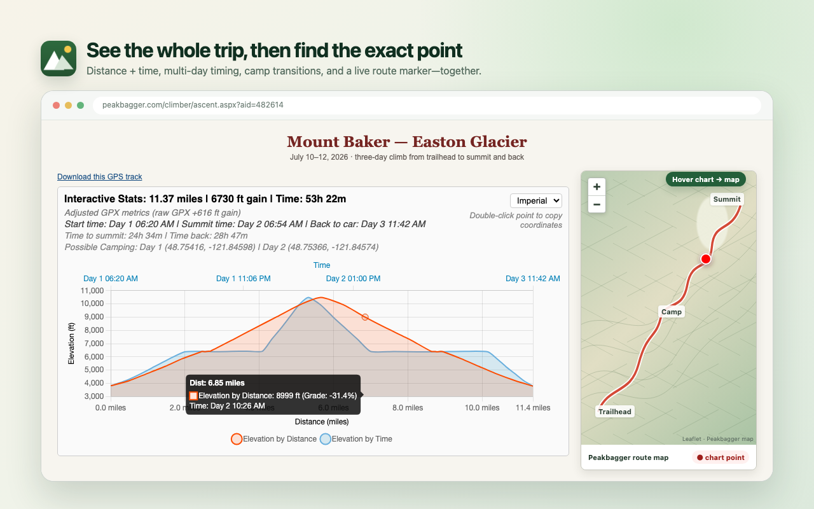

# Better Peakbagger

**Spend less time wrestling with Peakbagger and more time planning the next summit.**

Better Peakbagger turns your Garmin and Strava activities into review-ready
ascent drafts, makes GPS tracks easier to understand, surfaces the trip reports
that matter, and adds a polished dark mode to
[Peakbagger](https://www.peakbagger.com/).

[](https://chromewebstore.google.com/detail/better-peakbagger/kndjohodnpdoejmjkiiakejfehoodedn)
[](https://addons.mozilla.org/en-US/firefox/addon/better-peakbagger/)

Works with Chrome, Edge, Brave, and Firefox. No userscript manager required.
No analytics or telemetry.


---

## Install

Choose the official listing for your browser:

- [Chrome Web Store](https://chromewebstore.google.com/detail/better-peakbagger/kndjohodnpdoejmjkiiakejfehoodedn) — Chrome, Edge, and Brave
- [Firefox Add-ons](https://addons.mozilla.org/en-US/firefox/addon/better-peakbagger/) — Firefox

Most features appear automatically when you visit Peakbagger. To capture an
activity, open an activity you own on Garmin Connect or Strava and click the
Better Peakbagger icon. Settings are available from the extension's Details or
Preferences page.

---

## Feature tour

### Turn an activity into ascent drafts

Open an activity you recorded on Garmin Connect or Strava, then click Better
Peakbagger. The extension finds likely summit encounters and labels them
**Strong** or **Probable** with the evidence behind each match. Strong matches
are ready to open; Probable matches remain your choice.

Selected ascents open together as prefilled Peakbagger drafts with GPS Preview
already prepared. Review the details, make any corrections, and save when you
are satisfied.

### Understand every mile of a GPS track

Peakbagger ascent pages gain an interactive elevation chart with distance and
time views, route metrics, grades, timing, and multi-day camping details. Hover
over the chart to follow the same point on Peakbagger's map, or double-click a
point to copy its coordinates.



### Find useful ascent beta faster

Filter long ascent lists to trips with a report, GPS track, or external link.
Filters combine naturally, show live result counts, and remember what you mean
by “has beta.” Sortable columns reorder instantly without reloading the page.

### Make Peakbagger easier on the eyes

Use a site-wide dark theme that follows your system or stays light or dark.
Shared settings also control units, the GPX chart's default view, and which
signals count as ascent beta. Changes apply to open Peakbagger tabs immediately.

## Privacy by design

There is no Better Peakbagger account, analytics, or telemetry. The raw Garmin
or Strava GPX is processed on the activity page and is never stored or sent to
the extension developer. Peakbagger receives a reduced, coordinate-only track
only after you choose **Open drafts**; health, device, timing, and elevation data
are excluded.

## FAQ

### Why doesn't Better Peakbagger update Peakbagger automatically?

Summit matching is strong evidence, not certainty, and an ascent log is your
record. Automatically saving could publish the wrong summit, date, times, or
notes without your knowledge. Better Peakbagger does the repetitive work—finding
matches, filling fields, and running GPS Preview—then stops before Save so you
can review every ascent.

### Can it capture any Garmin or Strava activity?

No. You must be signed in, the activity must belong to your account, and the
page must provide unambiguous ownership signals. Better Peakbagger fails closed
if it cannot verify those conditions. It also needs you to click the toolbar
icon for each capture; it does not keep permanent access to Garmin or Strava.

### What do Strong and Probable mean?

They summarize how closely the recorded route, elevation, summit shape, and
track quality support a summit encounter. Strong matches are selected by
default. Probable matches are always opt-in, and both still require your review.

### Is this an official Peakbagger extension?

No. Better Peakbagger is an independent passion project. Ideas and bug reports
are welcome in [GitHub Issues](https://github.com/wilmtang/better-peakbagger/issues)
and the [discussion board](https://github.com/wilmtang/better-peakbagger/discussions).

---

## Developer guide

- [Architecture at a glance](#architecture-at-a-glance)
- [Deep dive: Garmin/Strava activity capture](#deep-dive-garminstrava-activity-capture)
- [Deep dive: content-script worlds](#deep-dive-content-script-worlds)
- [Deep dive: the settings system and the bridge](#deep-dive-the-settings-system-and-the-bridge)
- [Deep dive: the GPX Analyzer](#deep-dive-the-gpx-analyzer)
- [Deep dive: the Leaflet map-hover injection](#deep-dive-the-leaflet-map-hover-injection)
- [Deep dive: the Ascent Beta Filter](#deep-dive-the-ascent-beta-filter)
- [Deep dive: site-wide dark mode](#deep-dive-site-wide-dark-mode)
- [Cross-browser notes](#cross-browser-notes)
- [Project layout](#project-layout)
- [Development & packaging](#development--packaging)
- [Privacy](#privacy)
- [License](#license)
- [Acknowledgements](ACKNOWLEDGEMENTS.md)

---

## Architecture at a glance

```
                          chrome.storage.sync  ({ units, theme, chartDefaultSeries, beta* })
                                   ▲   │  onChanged
                 ┌─────────────────┼───┼──────────────────────────────────────────┐
   options page  │                 │   ▼                                            │
  options.js ────┘        ┌────────┴────────────────┐                              │
                          │  ISOLATED content world  │  (chrome.storage available) │
                          │  settings.js  (shared)   │                             │
                          │  theme.js  → data-bpb-theme on <html>                  │
                          │  bridge.js  ←── postMessage ──┐                        │
                          │  ascent-filter.js             │                        │
                          └───────────────────────────────┼────────────────────────┘
                                                           │  window.postMessage
                          ┌────────────────────────────────┼───────────────────────┐
                          │  MAIN (page) world              ▼                        │
                          │  chart.umd.min.js  +  gpx-analyzer.js                    │
                          │  (needs page globals: map iframe, Chart, clipboard)      │
                          └──────────────────────────────────────────────────────────┘
```

Activity capture is a separate, short-lived pipeline:

```
toolbar click (`activeTab`) ──▶ inject provider adapter in MAIN world
                                      │
                         ownership gate + Peakbagger login gate
                                      │
                         provider GPX parsed on the activity page
                                      │  analysis fields only
                                      ▼
     Peakbagger corridor lookup ──▶ score encounters ──▶ reduce to ≤ 3,000 points
                                                               │
                                                    `storage.session` (30 min)
                                                               │
                                                               ▼
                  grouped ascent tabs ◀── verified handshake ── fill + Preview once
```

Three boundaries do most of the work:

1. **Content scripts run in two different JavaScript "worlds,"** and each feature is placed in the world it needs. The GPX Analyzer and the on-demand activity-provider adapter run in the page's own world; form filling and extension UI run in the isolated extension world.
2. Because the MAIN-world analyzer can't touch `chrome.storage`, a tiny **bridge** relays settings across the world boundary over `window.postMessage`.
3. Activity capture is a **gated transaction**, not a persistent provider integration: the extension receives temporary access only after a toolbar click, refuses ambiguous ownership, keeps only a privacy-reduced draft payload in session storage, and never activates Peakbagger's Save controls.

---

## Deep dive: Garmin/Strava activity capture

The capture feature treats an activity track as sensitive data. Its pipeline is intentionally fail-closed: an uncertain ownership result, missing Peakbagger login, incomplete summit lookup, invalid draft identity, or changed Peakbagger form stops the operation instead of silently weakening a privacy or correctness check.

### 1. On-demand access and ownership

There are no permanent Garmin or Strava host permissions. Clicking the toolbar action grants `activeTab` access to that one page, and the background worker injects `src/provider-page.js` into the **MAIN world**. Running in the page realm lets the adapter inspect the signed-in page state and make the provider's authenticated, same-origin GPX export request without collecting provider credentials.

Before requesting the GPX, the adapter requires two independent owner signals:

1. The signed-in viewer profile ID must equal the activity-author profile ID.
2. The page must expose that activity's owner-only edit control.

Missing or changed DOM is not treated as proof of ownership. The popup reports signed-out, not-owner, and ownership-unavailable states separately; each ownership-gate failure also gets an action badge so closing the popup cannot hide it. The background then verifies the Peakbagger login and obtains the climber ID (`cid`) **before** asking the provider page for coordinates.

Garmin and Strava remain isolated behind separate adapters because their page DOM and export requests are undocumented dependencies. For example, the current Garmin path uses its session-authenticated GPX download service plus the page's CSRF/app-version headers. If either provider changes, that adapter should fail with a provider-specific export error; it must not bypass the ownership gate.

### 2. Two track representations, one privacy boundary

The source XML never leaves the activity page and is never persisted. The parser ignores everything except ordered track points and segment boundaries, producing two successively narrower representations:

| Representation | Fields | Lifetime and purpose |
| --- | --- | --- |
| Full-resolution analysis | latitude, longitude, optional elevation, optional timestamp, segment boundaries | In memory while validating the track, finding summits, and calculating ascent fields. |
| Peakbagger upload | latitude, longitude, segment boundaries | Reduced to at most 3,000 original points, kept in `storage.session`, and uploaded only after **Open drafts**. |

The upload serializer constructs new GPX rather than deleting selected nodes from the source. Its allowlist is deliberately tiny: `<gpx>`, `<trk>`, `<trkseg>`, and `<trkpt lat="…" lon="…">`. A second validator on the Peakbagger draft page rejects anything outside that shape, more than 3,000 points, or more than 50 segments before attaching the file. Names, descriptions, metadata, waypoints, routes, timestamps, elevation, device fields, heart rate, cadence, temperature, power, and all extensions therefore have no path into the upload.

Timestamps and elevation are optional analysis inputs, not assumptions about a provider export. If timestamps are absent, the extension does not invent them: it uses the provider's displayed local start date when available, leaves the encounter time empty, calculates durations as zero, and lowers the track-quality evidence.

### 3. Track validation and summit lookup

Points are processed in recorded order; they are never sorted and gaps are never bridged. Invalid coordinates or timestamps create segment breaks. So do reversed clocks, implied speeds over 100 m/s, a gap over 10 minutes that also spans over 300 m, a spatial jump over 10 km, or an untimed jump over 1 km. Besides preventing invented straight lines across bad data, these breaks feed a track-quality score used by matching.

The validated path is split into chunks whose path length and spatial span stay within 10 km, padded by 300 m, and converted into bounding-box requests to Peakbagger's nearby-summit endpoint. Requests run four at a time and retry once. The capture fails if any required box still fails: presenting a partial response as "no other peaks" would be misleading. Bounding boxes are used for discovery; the reduced coordinate track is not uploaded at this stage.

Every returned summit is projected onto the original track segments. Nearby projections of the same summit are treated as one encounter unless they are separated by more than 300 m along the activity or five minutes in time.

### 4. Confidence is evidence, not a claim of certainty

The confidence percentage is a weighted score with smooth cubic decay between each full-credit and zero-credit distance:

| Evidence | Weight | Full credit | Zero credit |
| --- | ---: | ---: | ---: |
| Horizontal proximity to the route | 50% | ≤ 10 m | ≥ 100 m |
| Recorded vs. summit elevation | 20% | ≤ 10 m difference | ≥ 80 m difference |
| Near a local high point | 15% | ≤ 5 m below it | ≥ 40 m below it |
| Climb-before / descend-after shape | 10% | route-shape evidence | no evidence |
| Track quality | 5% | clean track | degraded by breaks/missing time |

A **Strong match** is at least 80% confidence and within 30 m of the route; it is selected by default. A **Probable match** is 60–79% and is opt-in. Possible (35–59%) and Weak results are intentionally hidden. A match without usable elevation is capped at 69%, and anything farther than 150 m is Weak. When several nearby summits describe the same encounter, they are capped at Probable unless the top candidate leads the runner-up by at least ten percentage points.

The popup pairs the percentage with route distance, elevation difference when available, and track quality. The percentage ranks the evidence in this activity; it does not prove that the user stood on a summit, which is why saving remains manual.

### 5. How the track is reduced to 3,000 points

All dates, durations, distances, elevations, and gain are calculated from the full-resolution analysis track **before** reduction. Reduction affects only the privacy upload.

The reducer is segment-aware and uses a globally prioritized Ramer–Douglas–Peucker-style process:

1. Protect every segment's first and last point, its minimum and maximum elevation points, and the two original vertices that bracket each detected summit projection.
2. Between protected points, find the original vertex with the greatest perpendicular path error and put that interval into a global max-heap.
3. Repeatedly keep the highest-error vertex across *all* segments, split its interval, and enqueue the two new candidates until 3,000 points are retained or no candidates remain.
4. Serialize retained points in their original segment and recording order, then measure the largest distance from every omitted point to its retained line segment.

This global priority matters: a winding section receives more of the fixed budget than a nearly straight section, regardless of which segment appeared first. The reducer never invents or moves a coordinate and never connects separate segments. It reports original count, retained count, and maximum measured deviation. If protected anchors alone exceed 3,000—or the sanitized track exceeds Peakbagger's 50-segment limit—the capture fails instead of dropping a required point.

### 6. Draft handoff and exactly-once Preview

Ready jobs contain only the reduced GPX, public match evidence, calculated form values, selection state, and identifiers in `storage.session`, with a 30-minute expiry. Closing the popup does not cancel background work, and repeated clicks for the same activity reuse the in-flight or completed job.

Selected matches are sorted by confidence and opened as inactive tabs in the **Peak Drafts** group. Each blank tab is assigned a private `{ jobId, tabId, pid, cid }` identity before navigation. On the ascent editor, `src/ascent-draft.js` sends a ready handshake; the background checks the sender tab plus `pid` and `cid` before returning any payload. The content script verifies the expected form and the coordinate-only GPX, fills both metric and imperial fields, attaches the file, records a Preview-start acknowledgement, and clicks `GPXPreview` exactly once.

After Peakbagger reloads with the Preview result, the second handshake sees that Preview already started and shows a short-lived, dismissible Strong/Probable confidence notice instead of submitting again. When all drafts finish Preview, the background clears the stored GPX. No code path clicks either Save control: the user must review Peakbagger's result and save each ascent manually.

---

## Deep dive: content-script worlds

A browser extension can inject a content script into either of two JavaScript execution contexts on a page:

- **Isolated world** (the default). The script shares the page's *DOM* but gets its **own** `window`/global scope, and it *can* call extension APIs (`chrome.storage`, messaging, …). Crucially, it **cannot see JavaScript variables the page itself defined** — the page's globals live in a separate realm.
- **MAIN world** (`"world": "MAIN"` in the manifest). The script runs in the page's own realm, exactly like a `<script>` tag the site shipped. It **can** read the page's JS globals and shares the page's `window`, but it **cannot** use extension APIs.

This split is the single most important design constraint in the extension. Here's how each piece lands:

| Script | World | Why |
| --- | --- | --- |
| `gpx-analyzer.js` | **MAIN** | Needs page-realm access: the map iframe's Leaflet globals (see below), the bundled `Chart` global, and page clipboard/`localStorage` semantics identical to a userscript. |
| `chart.umd.min.js` | **MAIN** | Loaded immediately before the analyzer so the `Chart` UMD global lands in the same realm the analyzer reads. |
| `provider-page.js` | **MAIN**, injected on demand | Needs the activity page's signed-in state and authenticated same-origin export; exposes only the narrow ownership/capture adapter to the background. |
| `theme.js`, `bridge.js`, `ascent-filter.js`, `settings.js` | isolated | They only touch the DOM and `chrome.storage`; no page globals needed. |
| `ascent-draft.js` | isolated | Uses extension messaging to verify a prepared draft, then fills the Peakbagger DOM and starts Preview. |

A subtle point about **shared scope**: all content scripts from the *same* extension injected into the *same* frame and world share one global scope. That's why listing `["src/settings.js", "src/ascent-filter.js"]` in a single manifest entry lets `ascent-filter.js` use the `window.BPBSettings` object that `settings.js` defined — and why `settings.js` guards with `if (window.BPBSettings) return;`, since a page that matches several manifest entries will inject it more than once into that one shared world.

The heritage here matters: these two features started as Tampermonkey userscripts (`@grant none`, i.e. running in the page's MAIN world). Porting the analyzer to a MAIN-world content script preserves its behavior *exactly*; the map-hover trick below is why "just run it in the isolated world" was never an option.

---

## Deep dive: the settings system and the bridge

Settings live in **`chrome.storage.sync`** under a single key (`bpbSettings`). `sync` means they roam across a signed-in user's browsers; the payload is a handful of fields, far under the quota.

`src/settings.js` is the shared core, loaded into every isolated content script and the options page. It exposes `window.BPBSettings` with:

- `get()` / `set(patch)` — promise-based, with input **sanitisation** (`clean()`), so a corrupt or partial stored object can never crash a consumer; unknown values fall back to defaults (`{ units: 'auto', theme: 'system', … }`).
- `subscribe(cb)` — wraps `chrome.storage.onChanged` so any context is notified when settings change in another (the options page, another tab).
- `resolveTheme(pref)` — turns the `'system'` preference into a concrete `'light' | 'dark'` via `matchMedia('(prefers-color-scheme: dark)')`.

### The bridge

The GPX Analyzer runs in the MAIN world and therefore **cannot** read `chrome.storage` at all. To give it settings, `src/bridge.js` runs in the isolated world on the *same* ascent pages and relays across the boundary using `window.postMessage` — the one channel both worlds share on a single `window`:

```
page (analyzer)  ── { __bpb, dir:'toCS',  kind:'get' | 'set', patch } ──▶  bridge (isolated)
bridge           ── { __bpb, dir:'toPage', settings } ──────────────────▶  page (analyzer)
```

Flow:

1. On load the analyzer posts `{ dir:'toCS', kind:'get' }` and `await`s the first `toPage` reply (with an 800 ms fallback to defaults, so a missing/slow bridge never hangs the chart).
2. The bridge answers `get` by reading storage and posting the settings back.
3. When the user flips the in-chart unit dropdown, the analyzer posts `{ kind:'set', patch:{ units } }`; the bridge writes storage. `storage.onChanged` then fires, the bridge re-broadcasts, and the chart re-renders — so the inline control and the options page edit **one** source of truth.
4. Any external change (options page, another tab) reaches the chart the same way: `onChanged` → bridge push → analyzer re-render.

Every message is validated (`event.source === window`, `event.origin === location.origin`, an `__bpb` tag, and a direction). The data — units, a theme name, a small integer — is non-sensitive, so exposure on the shared `window` is harmless; the checks exist to ignore unrelated page traffic, not to protect secrets.

---

## Deep dive: the GPX Analyzer

### 1. Extraction
The script finds the "Download this GPS track" anchor, `fetch`es the GPX (same-origin, so no host permission needed), and parses it with `DOMParser` into `<trkpt>` nodes → `{ lat, lon, rawEleM, ms }`. Because it parses raw XML on the client, it's fast and private.

### 2. Chronological sort
GPX editors and Peakbagger's own merging can emit track segments out of order (Day 3 before Day 1, reversed tracks). Every trackpoint is sorted by its `<time>` first, so distance and time accumulate chronologically. Points without valid coordinates/elevation are dropped up front.

### 3. Adjusted metrics
Raw GPX totals are noisy. The analyzer applies several client-side corrections to land near Garmin/Strava numbers, with **no external service**:

- **Distance — confirmed movement.** Naively summing Haversine steps inflates distance because a stationary receiver jitters by a few metres. Naively dropping every sub-5 m step *under*-counts dense switchbacks. So steps accumulate into a **pending buffer**; the buffer's full path length is committed only once the anchor-to-current displacement clears **5 m** (`DIST_CONFIRM_M`). This keeps real switchbacks while suppressing standstill drift. A long pause with tiny displacement (`PAUSE_RESET_SECONDS`) resets the anchor so a lunch stop doesn't slowly accrue phantom metres.
- **Bad-jump rejection.** When timestamps exist, a step whose implied speed exceeds `MAX_REASONABLE_SPEED_MPS` (10 m/s) is discarded from the adjusted mileage — GPS teleports don't count.
- **Elevation gain — smoothed hysteresis.** Elevations are first cleaned with a 5-point median then a short distance-window average. Gain is then counted by a small **state machine** (`unknown → rising → falling`) that only banks a climb once it's confirmed by `ELEVATION_GAIN_THRESHOLD_M` (3 m), so minor dips don't reset the climb and flat noise doesn't manufacture gain.
- **Grade.** Computed over a **distance baseline** (`GRADE_WINDOW_M`, with a lookback cap) rather than point-to-point, which tames wild spikes between closely spaced points.
- **Honest labelling.** The panel calls these "Adjusted GPX metrics" and only surfaces the raw-vs-adjusted delta when it's material (≥3 % distance or ≥5 %/100 ft gain).

### 4. Timing, multi-day, camping
`Start` = first chronological point, `Summit` = timestamp of the highest *adjusted* elevation, `Back to car` = last point; `Time to summit` / `Time back` follow. A *relative-day* helper converts each timestamp to local midnight and diffs against the start date; if the trip spans >1 calendar day it prefixes tooltips/axes/stats with `Day N`. **Camping** detection is purely chronological: whenever a point lands on a later calendar day than its predecessor, the *predecessor's* coordinates are the camp for that night. Being chronological (not spatial), it's immune to overnight GPS drift.

### 5. The chart and its interaction quirks
The chart plots two datasets on one shared Y (elevation) with **two X axes** — distance (bottom) and time (top). Three interaction problems were solved deliberately:

- **The jittering problem.** Two datasets on two X scales confuse "which line am I hovering?" and the tooltip flickers between them. Fix: `interaction: { mode: 'nearest', intersect: true, axis: 'xy' }` — proximity is judged in *both* axes at once, giving a stable focus on the physically nearest line.
- **Disappearing focus.** `hitRadius: 40` + `intersect: true` create a 40 px interactive halo around the lines; move outside it and the tooltip and map marker cleanly vanish instead of sticking to the chart edge.
- **Dynamic interaction mode.** A custom legend `onClick` toggles dataset visibility, and when only *one* line remains it switches to `{ mode: 'index', intersect: false }` so you can scrub the X axis from anywhere in the plot's vertical space; re-enabling the second line restores strict `xy` proximity.

Theming is applied per-render: a `PALETTES[light|dark]` object (resolved from the current theme) colors the panel (inline styles) and the chart (`scales.*.ticks/grid/title.color`, legend label color). Because the analyzer paints its own panel with inline styles, the site-wide dark stylesheet deliberately leaves it alone — the analyzer is the single owner of its own colors and re-themes live on a settings push.

---

## Deep dive: the Leaflet map-hover injection

This is the feature that forces the whole MAIN-world design, and the most fragile thing in the extension — documented here in full because it depends on Peakbagger internals we don't control.

**The goal:** as your cursor moves along the 2-D elevation chart, a dot glides along the *actual geographic route* on Peakbagger's topo map, so you can see *where* on the mountain a given grade or elevation happens.

Peakbagger renders that map inside an `<iframe src="…/MasterMap.aspx">`. Inside that iframe, Peakbagger's own scripts create a [Leaflet](https://leafletjs.com/) map and — usefully for us — leave two values as globals on the iframe's `window`:

- `mapsPlaceholder` — the Leaflet map instance.
- `L` — the Leaflet library itself.

The injection works in three steps, inside Chart.js's `onHover` callback:

1. **Iframe interception.** Find the map iframe and grab its `contentWindow`:
   ```js
   const mapIframe = document.querySelector('iframe[src*="MasterMap.aspx"], iframe[src*="mastermap.aspx"]');
   const iframeWin = mapIframe && mapIframe.contentWindow;
   ```
   This only works because the analyzer runs in the **MAIN world**. An isolated content script can reach a same-origin iframe's *DOM*, but **not** the JavaScript globals (`mapsPlaceholder`, `L`) the iframe's own scripts defined — those live in that frame's page realm. Reading them requires being in the page realm ourselves. *This is the concrete reason the analyzer is a MAIN-world script.* (The iframe is same-origin — both are `peakbagger.com` — so the cross-frame property access is permitted; a cross-origin iframe would throw.)

2. **Leaflet hooking.** The hovered chart point carries the original `{ lat, lon }` (stashed on each datum as `_raw`). Using the iframe's `L` and map instance, the analyzer creates or moves a high-visibility `L.circleMarker` on the real map — red when hovering the distance line, blue for the time line:
   ```js
   const L = iframeWin.L, map = iframeWin.mapsPlaceholder;
   hoverMarker = L.circleMarker([d.lat, d.lon], { radius: 9, color: '#fff', fillColor, weight: 2, fillOpacity: 1 }).addTo(map);
   // subsequent hovers just: hoverMarker.setLatLng([d.lat, d.lon])
   ```
   The marker is recreated if it no longer belongs to the current map instance (the iframe can reload underneath us).

3. **Real-time sync.** `onHover` fires continuously, so `setLatLng` moves the dot in lockstep with the cursor. When the cursor leaves the 40 px hit halo, `activeElements` is empty and the marker is faded to `opacity: 0`.

**Why it's fragile, and how it fails.** `mapsPlaceholder` and `L` are undocumented Peakbagger internals. If Peakbagger renames them, restructures the iframe, or changes origin, the guard `iframeWin && iframeWin.mapsPlaceholder && iframeWin.L` simply goes false and the marker is skipped. **The failure is closed**: the chart, tooltips, and every other feature keep working; you just lose the moving dot. No exception, no console spam. That's the intended contract for a feature built on someone else's private globals.

---

## Deep dive: the Ascent Beta Filter

Runs in the isolated world on `PeakAscents.aspx` and personal `ClimbListC.aspx` ascent lists.

- **Column resolution.** Peakbagger renders a *different* column set per URL variant (all-years vs. single-year vs. metric), so the script never assumes fixed positions — it resolves the TR-Words / GPS / Link columns from the header row's text on every load. Cells that "look empty" can contain a literal `&nbsp;` (` `), which the parser normalises before testing.
- **The data model.** Each data row becomes `{ words, gps, link, beta }`. Year-separator rows (single-cell) are tracked as sections so they can be hidden when empty.
- **A user-defined "has beta".** `beta` is computed from the shared settings: an ascent qualifies if it has any *enabled* signal — a trip report of at least `betaTrMinWords` words (`betaTr`), a GPS track (`betaGps`), or a link (`betaLink`). The chip's count and tooltip recompute live when the definition changes in the options page, and `clean()` guarantees the definition can never be empty (all-off resets to all-on).
- **Stackable AND filters.** Each chip is an independent predicate; a row is visible only if it passes *every* active chip. Toggling recomputes visibility, updates the live "Showing x of y" count, hides now-empty year headers, and reveals a **Show all** escape hatch.
- **State split.** The filter's per-page UI state — chip on/off states *and* the Trip report `≥ N words` threshold — persists together in the page's `localStorage` (`pbAscentBetaFilter.v1`), so it is remembered across visits without touching the synced settings. The shared `chrome.storage` settings own only the cross-cutting **"has beta" definition** (`betaTr`/`betaTrMinWords`/`betaGps`/`betaLink`); a `subscribe` re-applies it live when the options page changes it.
- **Compact view.** Views whose table lacks the TR-Words / GPS / Link columns have nothing to filter; there the bar degrades to a one-click link to the full "all years, full details" view (`y=9999`), preserving the existing `sort`/unit params.

### Instant table sort

Peakbagger's sortable table headers are backend links, so changing Climber, Date, GPS, TR-Words, Route, metrics, icons, quality, or Link normally reloads the whole page. On `PeakAscents.aspx` and personal `ClimbListC.aspx` pages, the script replaces every one of those native sort links with a persistent ▲/▼ control and answers in the DOM:

- **Type-aware, stable sorting.** Text uses case-insensitive natural ordering; numbers, presence flags, and icon sequences use values already present in each cell. Equal values keep their original relative order.
- **Exact date reversal.** On a page that is already date-sorted, the opposite direction is the served order reversed: year sections reverse along with the rows inside them. The sorter does not reinterpret `Unknown`, partial dates (`1915-06`), typos (`1941 l`), or red parenthesised variants. If Date is selected from a flat non-date response, a conservative year/month/day fallback is used because the backend order is not present in the DOM.
- **Honest grouping.** Year separators are date grouping metadata, so they are hidden during any non-date sort and restored exactly when the user returns to Date.
- **Persistent controls.** A ▲/▼ arrow marks the active column and direction. Each button exposes `aria-sort`, a next-action label, keyboard activation, and a visible focus state.
- **No premature reload.** The sorter wires up synchronously, *before* the awaited settings read, and a capture-phase click guard installed at `document_start` holds any native header-sort click made while a large table is still parsing. It replays that click in the DOM once ready; year-jump and metric-toggle links remain untouched.
- **Current rows are the invariant.** Default views may have backend sort links that add `y=`/`j=`/`u=` parameters. The sorter never follows or copies those links and reorders only the `<tr>` nodes already present. Date toggles update only the URL's `sort` parameter because Peakbagger has distinct ascending/descending date keys.
- **Composes with the filters.** Rows keep their visibility through a reorder, and the chips keep their live references to the moved `<tr>` nodes.

Development against this table doesn't touch the live site: `test/fixtures/peakascents/` holds real captures (a ~4,145-row Mount Rainier page plus smaller Wayback captures), **masked** for the capturer's identity (see the fixtures README and `test/fixtures-privacy.test.mjs`), and `npm test` runs the content script against them in jsdom (golden chip counts, type-aware sort toggling, grouping restoration, and click guards).

---

## Deep dive: site-wide dark mode

Dark mode is delivered by a **stylesheet plus an attribute toggle**, both injected synchronously at `document_start` — the way Dark Reader does it, so there's no flash of the native light page:

- `src/site-dark-css.js` holds the dark rules as a string (`window.BPBDarkCSS`); every rule is scoped under `html[data-bpb-theme="dark"]`, so it's **inert** until that attribute exists.
- `src/theme.js` (isolated, `document_start`) injects that string as a `<style>` straight into `<html>` (which exists this early; `<head>` doesn't yet) and sets `data-bpb-theme` — **both in one synchronous tick**. It resolves `'system'` via `matchMedia`, and re-applies on `storage.onChanged` and on OS light/dark changes (while following the system). See [`docs/dark-mode-flash.md`](docs/dark-mode-flash.md) for why this beats a manifest `css` entry.

The dark palette is derived from Peakbagger's native `pb.css` (navy links, purple visited, maroon `h1`, navy `h2`, `table.gray` borders, the `mewallp.gif` body wallpaper) and maps each to a readable dark equivalent, plus higher-specificity overrides for the filter bar (`html[data-bpb-theme="dark"] #pbaf-bar …`, which outrank the bar's own `#pbaf-bar` rules). **Images and the map iframe are left untouched** so photos and topo maps render normally (the theme script uses `all_frames: false`, so it never darkens the map iframe).

One consequence of leaving images alone: the header banner sits on the light `header.jpg` photo, and its title + nav links carry inline `color:black`. The global link recolor would override that black with the light-on-dark link color, washing the links out over the photo — so `.mainbanner a` / `.mainmenu a` are re-darkened back to `#000`.

Every text/background pair in the theme is held to **WCAG 2.1 AA** contrast (4.5:1 normal, 3:1 large) by `test/dark-contrast.test.mjs`, which parses the shipped stylesheet (the single source of truth for colors) and checks each pairing against the captured fixtures — so a future color edit that fails contrast fails the build.

Trade-offs, stated honestly:

- **Coverage.** Peakbagger is a large, old-school site; the stylesheet targets the common structural elements (body, tables, links, headings, form controls, legacy `bgcolor` cells). A rarely-visited page may show a stray light element — file it and it's a one-line addition.
- **Stacking with other dark extensions.** If you also run a global dark-mode extension (e.g. Dark Reader), whitelist Peakbagger there so the two don't double up.

The options page themes itself with the same `data-bpb-theme` mechanism (CSS variables under `:root[data-bpb-theme="dark"]`).

---

## Cross-browser notes

- **Manifest V3** for both engines. Chrome uses a service worker; Firefox uses the background-scripts fallback from the same source files.
- **`"world": "MAIN"`** for the analyzer requires **Chrome 111+** and **Firefox 128+**.
- **`browser_specific_settings.gecko`** provides the Firefox add-on `id`, `strict_min_version: "140.0"`, and the required `locationInfo` disclosure. This is a disclosure that activity coordinates are sent to Peakbagger for lookup/Preview, not permission to access device geolocation.
- **Storage promises.** `chrome.storage.*` returns promises in MV3 on both engines; `settings.js` also prefers `browser.*` when present, so it's native on Firefox and works via the `chrome.*` alias on Chromium.
- **Match patterns.** `*://*.peakbagger.com/*` covers `www` and the bare host; the ascent/peak-ascent entries list both `ascent.aspx` and `Ascent.aspx` casings since match-pattern paths are case-sensitive.
- **No remote code.** [Chart.js](https://www.chartjs.org/) 4.5.1 is vendored at `vendor/chart.umd.min.js` (MIT) rather than pulled from a CDN — required by MV3, and better for privacy and reliability.

---

## Project layout

```
manifest.json            MV3 manifest (permissions, options_ui, content scripts)
popup/                   activity capture, confidence list, and draft selection UI
options/
  options.html           settings UI
  options.css            themed via data-bpb-theme + CSS variables
  options.js             load/save + self-theming
src/
  settings.js            shared chrome.storage core (window.BPBSettings)
  theme.js               injects the dark <style> + sets data-bpb-theme on <html>
  site-dark-css.js       dark rules as a string (window.BPBDarkCSS), theme-scoped
  bridge.js              relays settings to the MAIN-world analyzer (postMessage)
  gpx-analyzer.js        elevation/time chart + map-hover (MAIN world)
  ascent-filter.js       ascent-list filter and instant table sort (isolated world)
  provider-page.js       on-demand Garmin/Strava ownership + minimal GPX extraction
  capture-core.js        segment validation, summit scoring, metrics, GPX reduction
  background.js          session jobs, Peakbagger lookup, draft tabs and grouping
  ascent-draft.js        fail-closed ascent form filling + one Preview submission
vendor/
  chart.umd.min.js       Chart.js 4.5.1, bundled (MIT)
icons/                   16/32/48/128 px
test/
  fixtures/peakascents/  PeakAscents.aspx captures, PII-masked (see its README)
  fixtures/pages/        whole-page captures (home, peaks, climber), masked (see its README)
  helpers/load-page.mjs  jsdom + chrome.storage stub harness
  ascent-filter.test.mjs fixture-driven filter/sort tests (npm test)
  dark-contrast.test.mjs WCAG AA contrast guard for the dark theme
  theme-inject.test.mjs  dark-theme sheet-injection invariant
  options.test.mjs       options page end-to-end (populate/save/clean)
  provider-page.test.mjs provider ownership/export adapters and privacy parsing
  capture-core.test.mjs  track validation, scoring, metrics, and reduction
  background-capture.test.mjs  session jobs, lookup, grouping, and handshakes
  ascent-draft.test.mjs  form/privacy validation and exactly-once Preview
  popup.test.mjs         confidence labels and selection defaults
  fixtures-privacy.test.mjs  fails if a fixture leaks the capturer's identity
```

Settings shape (`chrome.storage.sync`, key `bpbSettings`):
```js
{ units: 'auto' | 'imperial' | 'metric',
  theme: 'system' | 'light' | 'dark',
  chartDefaultSeries: 'both' | 'distance' | 'time',  // GPX chart's initial series
  betaTr: boolean,                  // "has beta" counts a trip report…
  betaTrMinWords: number,           //   …of at least this many words
  betaGps: boolean,                 // "has beta" counts a GPS track
  betaLink: boolean }               // "has beta" counts an external link
```

---

## Development & packaging

```
npm test                fixture-driven tests (jsdom, no network needed)
npm run lint            web-ext lint (0 errors expected)
npm run build           zip to web-ext-artifacts/ for Chrome Web Store / AMO
npm run start:firefox   launch a temp Firefox with the extension
npm run start:chromium  same for Chromium
```

No build step for development — load the folder unpacked. `npm run build` just zips the shippable files (`manifest.json`, `src/`, `vendor/`, `icons/`, `popup/`, `options/`, README, LICENSE, and ACKNOWLEDGEMENTS); `node_modules`, the lockfile, `CHANGELOG.md`, and `test/` are excluded.

Version tags submit verified packages to both browser stores after their one-time
publisher setup. See [Browser store releases](docs/releasing.md) for credentials,
first-release constraints, and the release checklist.

Automated tests do not require live Garmin, Strava, or Peakbagger accounts. Peakbagger page features run against PII-masked captures in `test/fixtures/`; the capture pipeline uses synthetic provider DOM/GPX data, mocked network responses, and stubbed extension APIs. This makes the privacy and failure-path invariants repeatable, but current provider DOM/export behavior still needs manual browser verification before a release.

---

## Privacy

No analytics or telemetry. The existing GPX Analyzer only fetches the GPX already linked on a Peakbagger ascent page.

Activity capture verifies provider ownership before fetching the activity GPX.
The raw GPX is parsed in the activity page and is never persisted. Peakbagger
receives small track-corridor bounding boxes for summit discovery. Clicking
**Open drafts** sends Peakbagger Preview a reduced GPX containing only latitude,
longitude, and segment boundaries. Heart rate, cadence, power, temperature,
timestamps, elevation, device metadata, routes, waypoints, names, and extensions
are removed before session storage or transmission. Prepared data lives only in
`storage.session` and expires after 30 minutes.

Preferences live in `chrome.storage.sync` (or page `localStorage` for filter
chip state) and leave the browser only through the user's browser-sync account.

## License

[AGPL-3.0-or-later](LICENSE). Third-party license notices and project credits
are in [ACKNOWLEDGEMENTS.md](ACKNOWLEDGEMENTS.md).
