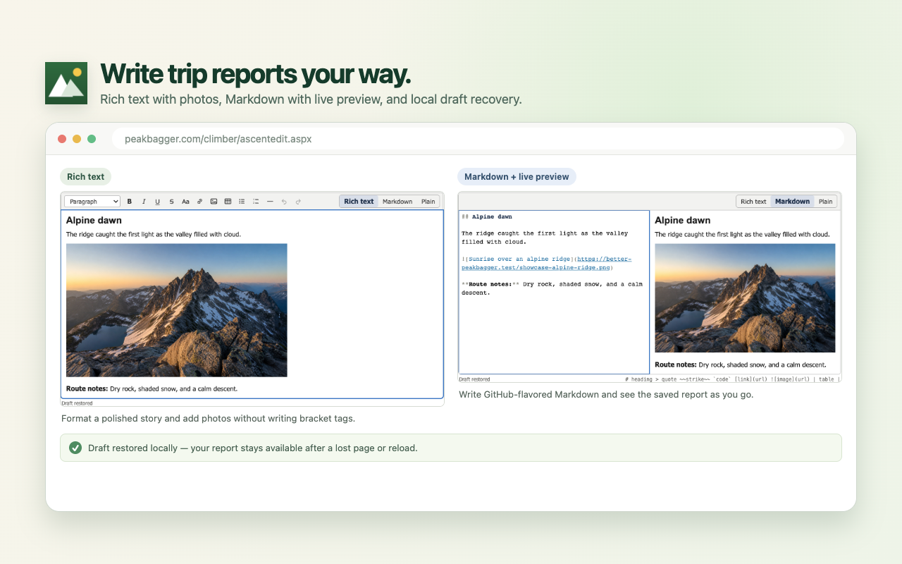
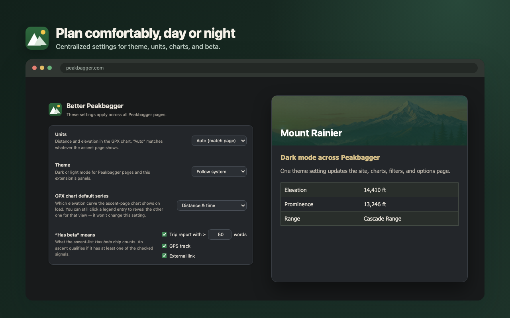

# Better Peakbagger

**Spend less time wrestling with Peakbagger and more time planning the next summit.**

Better Peakbagger turns your Garmin and Strava activities into review-ready
ascent drafts, makes GPS tracks easier to understand, surfaces the trip reports
that matter, lets you write trip reports in rich text or Markdown with local
draft autosave, adds location-aware forecast and satellite-imagery links, and
provides a polished dark mode for
[Peakbagger](https://www.peakbagger.com/).

[](https://chromewebstore.google.com/detail/better-peakbagger/kndjohodnpdoejmjkiiakejfehoodedn)
[](https://addons.mozilla.org/en-US/firefox/addon/better-peakbagger/)

Works with Chrome, Edge, Brave, and Firefox. No userscript manager required.
No analytics or telemetry.


## Install

Choose the official listing for your browser:

- [Chrome Web Store](https://chromewebstore.google.com/detail/better-peakbagger/kndjohodnpdoejmjkiiakejfehoodedn) — Chrome, Edge, and Brave
- [Firefox Add-ons](https://addons.mozilla.org/en-US/firefox/addon/better-peakbagger/) — Firefox

Most features appear automatically when you visit Peakbagger. To capture an
activity, open an activity you own on Garmin Connect or Strava and click the
Better Peakbagger icon. Settings are available from the extension's Details or
Preferences page.

## Feature tour

### Open-source free 3D mapping


User-uploaded GPX tracks on Peakbagger ascent pages and Full Screen GPS maps
become full 3D terrain views at true vertical scale. Peak pages get the same
toggle on their Dynamic Map, centered on the summit even when no GPX track is
present. The elevation model comes from
[Mapterhorn](https://mapterhorn.com/), an open-data elevation tile project;
Peakbagger's compatible 2D basemaps — CalTopo, ArcGIS, OpenTopoMap, and more —
are offered in an on-map picker and draped over the terrain; an experimental
OpenFreeMap vector style built from OpenStreetMap data is available there too.
The feature is opt-in: no tile requests occur before you enable it through the
first-use confirmation or Settings. After 3D is enabled, choosing **3D** opens
the map; hovering or keyboard-focusing its toggle may warm a small elevation-
tile set so it opens faster.

> Special thanks to [Mapterhorn](https://mapterhorn.com/) for providing
> free, open-access global elevation data that makes this possible.

### Turn an activity into ascent drafts

Open an activity you recorded on Garmin Connect or Strava, then click Better
Peakbagger. The extension finds likely summit encounters and labels them
**Strong** or **Probable** with the evidence behind each match. Strong matches
are ready to open; Probable matches remain your choice.

Selected ascents open together as prefilled Peakbagger drafts with GPS Preview
already prepared. Review the details, make any corrections, and save when you
are satisfied. If multiple selected summits fall on the same date, their drafts
receive Peakbagger's `a`, `b`, … suffixes in track order so the ascents remain
distinct. While a capture is working, **Cancel** immediately discards its
short-lived job and ignores any provider or summit result that finishes later.


### Or just upload a GPX

No Garmin or Strava page? Open a peak's **Add Ascent** form — the date is
already set to today — and pick a GPX from your watch, a friend, or CalTopo in
Peakbagger's own GPS Track field. A **✦ Process** button appears in place of
Preview: one click reads the file right on the page, finds the summits along
your track, and fills the form with the same date, elevation, distance, time,
and gain details capture computes — with a privacy-reduced copy of the track
(at most 3,000 points, so large files stop being rejected) attached and GPS
Preview already run. A traverse over several peaks shows a summit picker that
can open the other ascents as prepared drafts too. As always, you review and
click Save yourself.

### Chart-synced map and track customization


Ascent pages gain an interactive elevation chart with distance and time views,
route metrics, grades, timing, and multi-day camping details. Hover over the
chart to follow the same point on the map. The map route uses a configurable
line and casing while Peakbagger's native route and markers remain on top, and
Full Screen GPS maps honor the same width and casing.

### Find useful ascent beta faster

Filter long ascent lists to trips with a report, GPS track, or external link.
Filters combine naturally, show live result counts, and remember what you mean
by “has beta.” The **Favorites** filter starts with your Peakbagger Buddy List,
or you can switch to a custom list of up to 1,500 climbers and add people from
their profile pages. Settings shows the total and fuzzy-searches that custom
list. Adding a Peakbagger Buddy also adds them to custom favorites; removing a
Buddy keeps the favorite unless you explicitly enable synced removals. Combine
it with Trip report or GPS track to see useful beta from people you follow.
Sortable columns reorder instantly without reloading the page.


### Write trip reports, not bracket tags

The ascent form's trip report box becomes a real editor. Write in rich text —
with live formatting states, tables, images, and markdown-style typing
shortcuts — or in GitHub-flavored Markdown with syntax highlighting and a live
side-by-side preview. Saving produces
Peakbagger's square-bracket format. In Rich and Markdown modes, device-local
draft autosave offers your work back after an interrupted editing session.
Plain mode keeps the exact native textarea one click away, does not participate
in draft autosave, and is the safe choice for an existing report that uses
markup outside the editor's supported syntax. See the
[supported syntax and safety contract](https://github.com/wilmtang/better-peakbagger/blob/main/docs/trip-report-editor.md).



### Back up ascents to GitHub

Keep your own copy of every ascent in a GitHub repository you control. Connect
GitHub once in Settings — you sign in with a short device code, then create a
prefilled private backup repository on GitHub or grant the app access to one you
already have. No tokens are ever typed or pasted. Enable **Ascent backup** to
show a **Back up to GitHub** button after you save an ascent;
one click commits a clearly named mountain folder at the repository root with
the trip report as real Markdown, every field you entered as JSON, and
Peakbagger's stored GPS track. To archive older entries, open **My Ascents** and
choose **Back up all ascents**. That action always covers every year, even when
the page is currently showing a single year. Existing folders are skipped, so
interrupted runs resume safely when you start them again; **Refresh all**
explicitly re-syncs every entry. Keep that Peakbagger tab open while the profile
run works.
Re-saving an ascent afterwards keeps its folder current. A populated repository
requires confirmation and its unrelated files are preserved. Backup only ever
writes to your chosen repository, never touches your Peakbagger save, and can
be turned off or disconnected at any time.

Custom favorite climbers stay on this device by default. From the Favorite
climbers section in Settings, **Back up favorites** writes one `favorites.json`
to the same repository, and **Restore from backup** moves that list to another
browser with a brief Undo window. These actions need the shared GitHub
connection, but not Ascent backup. Both require an explicit click;
automatic ascent backup never includes favorites.

### Check summit conditions and recent imagery

Peak pages link directly to the summit's weather detail on Windy and the same
location in Copernicus Browser. Where the service covers the peak's nation,
links also open NOAA's NOHRSC modeled snow depth or AirNow's Fire and Smoke
Map centered near the summit.

### Make Peakbagger easier on the eyes

Use a site-wide dark theme that follows your system or stays light or dark.
Shared settings also control units, the GPX chart's default view, route
appearance, map size, the best-effort 3D elevation cache, optional map-layer
memory, the trip report editor, and which signals count as ascent beta.



## Privacy by design

There is no Better Peakbagger account, analytics, telemetry, advertising, or
developer data server. Raw Garmin or Strava GPX is processed on the activity
page and is never stored or sent to the extension developer. Peakbagger receives
small corridor boxes for summit discovery and, only after you choose **Open
drafts**, a privacy-reduced track for GPS Preview. The optional 3D view requests
map tiles only after you enable it; once enabled, hovering or focusing its
toggle may prefetch a small bounded elevation tile set before the view opens.
GitHub
backup is off until you enable it, sends an ascent only to the repository you
choose, and keeps its access token in local extension storage, never synced.

See [Privacy and data handling](PRIVACY.md) for the complete permissions,
retention, provider, and field-level disclosure.

## FAQ

### Why doesn't Better Peakbagger update Peakbagger automatically?

There is no safe, reliable hook for a small independent extension to receive new
activities automatically. [Strava requires a subscription][strava-api] to
create an API application, even when the developer reads only their own data.
The [Garmin Connect Developer Program][garmin-api] is limited to approved
business and enterprise integrations. An unattended workaround would require
brittle login automation and another copy of sensitive activity data.

Better Peakbagger instead works through the provider page you already opened
and signed in to. A toolbar click grants temporary access to that one activity;
the extension never receives your password or keeps permanent Garmin or Strava
access.

Summit matching is also evidence, not certainty, and an ascent log is your
record. Better Peakbagger does the repetitive work, then stops before Save so
you can review every ascent.

[strava-api]: https://developers.strava.com/docs/getting-started/
[garmin-api]: https://developer.garmin.com/gc-developer-program/program-faq/

### Can it capture any Garmin or Strava activity?

No. You must be signed in, the activity must belong to your account, and the
page must provide unambiguous ownership signals. Better Peakbagger fails closed
if it cannot verify those conditions. You must click the toolbar icon for each
capture; the extension does not keep permanent provider access.

### What do Strong and Probable mean?

They summarize how closely the recorded route, elevation, summit shape, and
track quality support a summit encounter. Strong matches are selected by
default. Probable matches are always opt-in, and both still require your review.

### Is this an official Peakbagger extension?

No. Better Peakbagger is an independent passion project. Ideas and bug reports
are welcome in [GitHub Issues](https://github.com/wilmtang/better-peakbagger/issues)
and the [discussion board](https://github.com/wilmtang/better-peakbagger/discussions).

## Development

Start with the
[architecture and design guide](https://github.com/wilmtang/better-peakbagger/blob/main/docs/architecture.md),
then use the
[development workflow](https://github.com/wilmtang/better-peakbagger/blob/main/docs/development.md)
and
[browser-store release guide](https://github.com/wilmtang/better-peakbagger/blob/main/docs/releasing.md).
Focused design notes and archived investigations are maintained in the
[developer documentation index](https://github.com/wilmtang/better-peakbagger/blob/main/docs/README.md).

Install locked dependencies with `npm ci`. Runtime source is bundled into
`dist/`; load, test, lint, verify, and package `dist/`, never the repository
root.

```sh
npm test
npm run test:scale
npm run lint:js
npm run lint
npm run verify:browsers
```

## License

[AGPL-3.0-or-later](LICENSE). Third-party license notices and project credits
are in [ACKNOWLEDGEMENTS.md](ACKNOWLEDGEMENTS.md).
