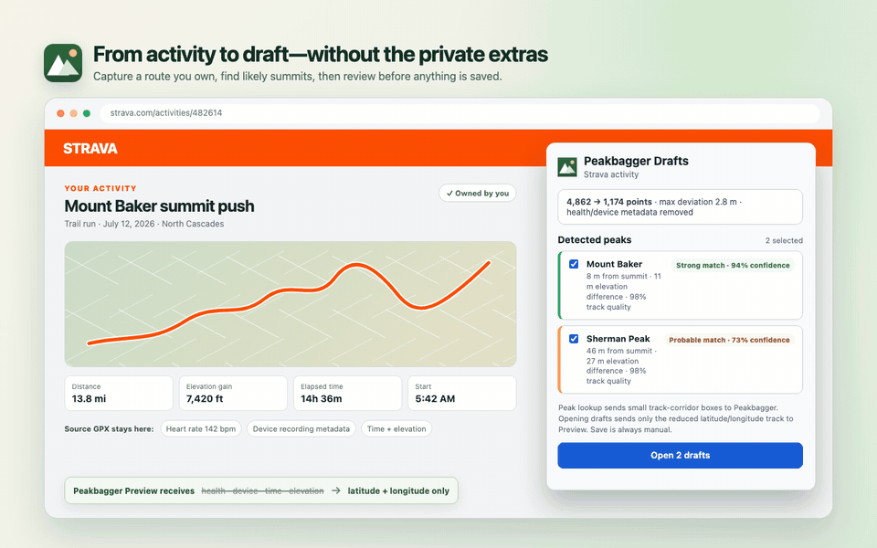
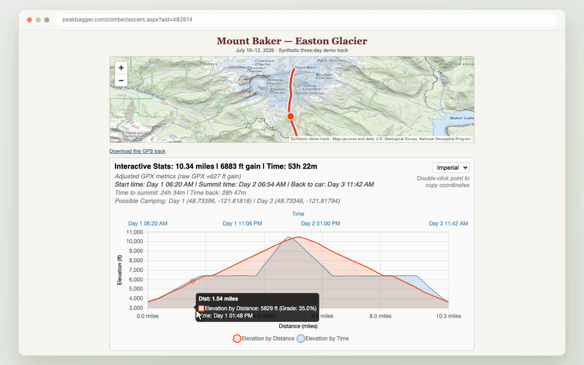
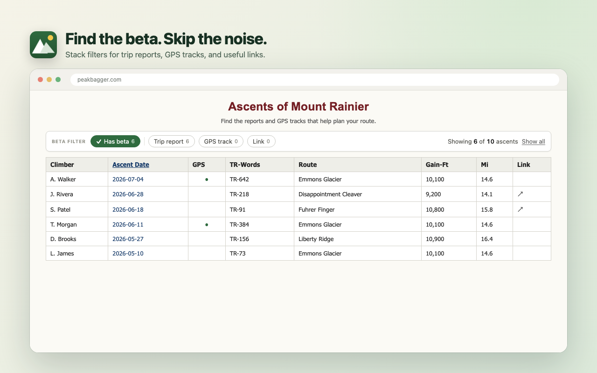

# Better Peakbagger

**Spend less time wrestling with Peakbagger and more time planning the next summit.**

Better Peakbagger turns your Garmin and Strava activities into review-ready
ascent drafts, makes GPS tracks easier to understand, surfaces the trip reports
that matter, adds location-aware forecast and satellite-imagery links, and
provides a polished dark mode for
[Peakbagger](https://www.peakbagger.com/).

[](https://chromewebstore.google.com/detail/better-peakbagger/kndjohodnpdoejmjkiiakejfehoodedn)
[](https://addons.mozilla.org/en-US/firefox/addon/better-peakbagger/)

Works with Chrome, Edge, Brave, and Firefox. No userscript manager required.
No analytics or telemetry.


---

## Install

Choose the official listing for your browser:

- [Chrome Web Store](https://chromewebstore.google.com/detail/better-peakbagger/kndjohodnpdoejmjkiiakejfehoodedn) — Chrome, Edge, and Brave
- [Firefox Add-ons](https://addons.mozilla.org/en-US/firefox/addon/better-peakbagger/) — Firefox

Most features appear automatically when you visit Peakbagger. To capture an
activity, open an activity you own on Garmin Connect or Strava and click the
Better Peakbagger icon. Settings are available from the extension's Details or
Preferences page.

---

## Feature tour

### Open-source free 3D mapping


User-uploaded GPX tracks on Peakbagger ascent pages become full 3D terrain
views at true vertical scale. The elevation model comes from
[Mapterhorn](https://mapterhorn.com/), an open-data elevation tile project;
when Peakbagger's selected map layer is a compatible raster, it is draped over
the terrain. The feature is opt-in: no tile requests occur until you choose
**3D terrain** on an ascent map.

> Special thanks to [Mapterhorn](https://mapterhorn.com/) for providing
> free, open-access global elevation data that makes this possible.

### Turn an activity into ascent drafts

Open an activity you recorded on Garmin Connect or Strava, then click Better
Peakbagger. The extension finds likely summit encounters and labels them
**Strong** or **Probable** with the evidence behind each match. Strong matches
are ready to open; Probable matches remain your choice.

Selected ascents open together as prefilled Peakbagger drafts with GPS Preview
already prepared. Review the details, make any corrections, and save when you
are satisfied. If multiple selected summits fall on the same date, their drafts
receive Peakbagger's `a`, `b`, … suffixes in track order so the ascents remain
distinct.



### Chart-synced map and track customization



Ascent pages gain an interactive elevation chart with distance and time views,
route metrics, grades, timing, and multi-day camping details. Hover over the
chart to follow the same point on the map. The map route uses a configurable
line and casing while Peakbagger's native route and markers remain on top, and
Full Screen GPS maps honor the same width and casing (and, on single-ascent
maps, the route color).

### Find useful ascent beta faster

Filter long ascent lists to trips with a report, GPS track, or external link.
Filters combine naturally, show live result counts, and remember what you mean
by “has beta.” Sortable columns reorder instantly without reloading the page.



### Check summit conditions and recent imagery

Peak pages link directly to the summit's weather detail on Windy and the same
location in Copernicus Browser. Copernicus opens with its date, dataset, and
cloud-cover controls available, so you can choose a useful recent satellite
scene instead of landing on a fixed, quickly stale image.

Where the service covers the peak's nation, two more links appear: NOAA's
NOHRSC modeled snow depth, framed on the summit (contiguous U.S. and Alaska),
and AirNow's Fire and Smoke Map centered nearby (United States, Canada, and
Mexico).

### Make Peakbagger easier on the eyes

Use a site-wide dark theme that follows your system or stays light or dark.
Shared settings also control units, the GPX chart's default view, route
appearance, map size, the best-effort 3D elevation cache, optional map-layer
memory, the off-by-default experimental 3D map, and which signals count as
ascent beta. Activity-capture settings
control waypoint retention plus automatic Trip Info and wilderness-night
filling. Changes apply to open Peakbagger tabs immediately and to the next
activity capture.


## Privacy by design

There is no Better Peakbagger account, analytics, or telemetry. The raw Garmin
or Strava GPX is processed on the activity page and is never stored or sent to
the extension developer. Peakbagger receives small corridor boxes for summit
discovery and, only after you choose **Open drafts**, a reduced coordinate-only
track for Preview. Waypoint coordinates and names are included by default and
can be turned off in Settings. Source health and device fields plus each
trackpoint's time and elevation are excluded; derived draft values remain yours
to review. The
optional 3D terrain view makes a separate, explicit request to Mapterhorn for
tiles covering the viewed map area and may re-request the selected Leaflet map
layer from its existing provider. No 3D tile request occurs before you choose
the 3D view.

## FAQ

### Why doesn't Better Peakbagger update Peakbagger automatically?

There is no safe, reliable hook for a small independent extension to receive new
activities automatically. [Strava requires a subscription][strava-api] to
create an API application, even in single-player mode where the developer reads
only their own data. The [Garmin Connect Developer Program][garmin-api] is
limited to approved business and enterprise integrations. Without those
official APIs, an unattended service would have to rely on brittle login/session
automation and keep credentials or session tokens on a server while it polls
Garmin or Strava. That adds security risk, operational complexity, and another
copy of sensitive activity data.

Better Peakbagger instead works through the provider page you already opened
and signed in to. A toolbar click grants temporary access to that one activity;
the extension never receives your password or keeps permanent Garmin or Strava
access.

There is also an important correctness boundary: summit matching is strong
evidence, not certainty, and an ascent log is your record. Automatically saving
could publish the wrong summit, date, times, or notes without your knowledge.
Better Peakbagger does the repetitive work—finding matches, filling fields, and
running GPS Preview—then stops before Save so you can review every ascent.

[strava-api]: https://developers.strava.com/docs/getting-started/
[garmin-api]: https://developer.garmin.com/gc-developer-program/program-faq/

### Can it capture any Garmin or Strava activity?

No. You must be signed in, the activity must belong to your account, and the
page must provide unambiguous ownership signals. Better Peakbagger fails closed
if it cannot verify those conditions. It also needs you to click the toolbar
icon for each capture; it does not keep permanent access to Garmin or Strava.

### What do Strong and Probable mean?

They summarize how closely the recorded route, elevation, summit shape, and
track quality support a summit encounter. Strong matches are selected by
default. Probable matches are always opt-in, and both still require your review.

### Is this an official Peakbagger extension?

No. Better Peakbagger is an independent passion project. Ideas and bug reports
are welcome in [GitHub Issues](https://github.com/wilmtang/better-peakbagger/issues)
and the [discussion board](https://github.com/wilmtang/better-peakbagger/discussions).

---

## Developer guide

- [Architecture at a glance](#architecture-at-a-glance)
- [Deep dive: Garmin/Strava activity capture](#deep-dive-garminstrava-activity-capture)
- [Deep dive: content-script worlds](#deep-dive-content-script-worlds)
- [Deep dive: the settings system and the bridge](#deep-dive-the-settings-system-and-the-bridge)
- [Deep dive: the GPX Analyzer](#deep-dive-the-gpx-analyzer)
- [Deep dive: opt-in 3D terrain](#deep-dive-opt-in-3d-terrain)
- [Deep dive: the Leaflet map-hover injection](#deep-dive-the-leaflet-map-hover-injection)
- [Deep dive: native Full Screen GPS tracks](#deep-dive-native-full-screen-gps-tracks)
- [Deep dive: the Ascent Beta Filter](#deep-dive-the-ascent-beta-filter)
- [Deep dive: site-wide dark mode](#deep-dive-site-wide-dark-mode)
- [Cross-browser notes](#cross-browser-notes)
- [Project layout](#project-layout)
- [Development & packaging](#development--packaging)
- [Privacy](#privacy)
- [License](#license)
- [Acknowledgements](ACKNOWLEDGEMENTS.md)

---

## Architecture at a glance

```
                          chrome.storage.sync  ({ units, theme, chart/map preferences, beta* })
                                   ▲   │  onChanged
                 ┌─────────────────┼───┼──────────────────────────────────────────┐
   options page  │                 │   ▼                                            │
  options.js ────┘        ┌────────┴────────────────┐                              │
                          │  ISOLATED content world  │  (chrome.storage available) │
                          │  settings.js  (shared)   │                             │
                          │  theme.js  → data-bpb-theme on <html>                  │
                          │  bridge.js  ←── postMessage ──┐                        │
                          │  big-map-bridge.js (width only)│                        │
                          │  terrain-map.js (frame bridge)◀┼── coordinates + safe  │
                          │                                │   raster descriptor   │
                          │  ascent-filter.js             │                        │
                          └───────────────────────────────┼────────────────────────┘
                                                           │  window.postMessage
                          ┌────────────────────────────────┼───────────────────────┐
                          │  MAIN (page) world              ▼                        │
                          │  chart.umd.min.js  +  gpx-analyzer.js                    │
                          │  (needs page globals: map iframe, Chart, clipboard)      │
                          │  big-map.js (native Full Screen Leaflet tracks)           │
                          └──────────────────────────────────────────────────────────┘
                                                           │ validated terrain input
                                                           ▼
                          ┌──────────────────────────────────────────────────────────┐
                          │  extension frame: terrain-frame.js + packaged MapLibre   │
                          └──────────────────────────────────────────────────────────┘
```

Activity capture is a separate, short-lived pipeline:

```
toolbar click (`activeTab`) ──▶ inject provider adapter in MAIN world
                                      │
                         ownership gate + Peakbagger login gate
                                      │
                         provider GPX parsed on the activity page
                                      │  analysis fields only
                                      ▼
     Peakbagger corridor lookup ──▶ score encounters ──▶ reduce to ≤ 3,000 points
                                                               │
                                                    `storage.session` (30 min)
                                                               │
                                                               ▼
                  grouped ascent tabs ◀── verified handshake ── fill + Preview once
```

Four boundaries do most of the work:

1. **Content scripts run in two different JavaScript "worlds,"** and each feature is placed in the world it needs. The GPX Analyzer and the on-demand activity-provider adapter run in the page's own world; form filling and extension UI run in the isolated extension world.
2. Because the MAIN-world analyzer can't touch `chrome.storage`, a tiny **bridge** relays settings across the world boundary over `window.postMessage`.
3. The optional MapLibre renderer stays **in an extension-owned frame and dormant** until the user chooses the 3D view. The isolated bridge relays bounded coordinate segments plus an optional validated descriptor for Peakbagger's selected raster layer; the packaged renderer then requests tiles for that 3D view.
4. Activity capture is a **gated transaction**, not a persistent provider integration: the extension receives temporary access only after a toolbar click, refuses ambiguous ownership, keeps only a privacy-reduced draft payload in session storage, and never activates Peakbagger's Save controls.

---

## Deep dive: Garmin/Strava activity capture

The capture feature treats an activity track as sensitive data. Its pipeline is intentionally fail-closed: an uncertain ownership result, missing Peakbagger login, incomplete summit lookup, invalid draft identity, or changed Peakbagger form stops the operation instead of silently weakening a privacy or correctness check.

### 1. On-demand access and ownership

There are no permanent Garmin or Strava host permissions. Clicking the toolbar action grants `activeTab` access to that one page, and the background worker injects `src/provider-page.js` into the **MAIN world**. Running in the page realm lets the adapter inspect the signed-in page state and make the provider's authenticated, same-origin GPX export request without collecting provider credentials.

Before requesting the GPX, the adapter requires two independent owner signals:

1. The signed-in viewer profile ID must equal the activity-author profile ID.
2. The page must expose that activity's owner-only edit control.

Missing or changed DOM is not treated as proof of ownership. The popup reports signed-out, not-owner, and ownership-unavailable states separately; each ownership-gate failure also gets an action badge so closing the popup cannot hide it. The background then verifies the Peakbagger login and obtains the climber ID (`cid`) **before** asking the provider page for coordinates.

Garmin and Strava remain isolated behind separate adapters because their page DOM and export requests are undocumented dependencies. For example, the current Garmin path uses its session-authenticated GPX download service plus the page's CSRF/app-version headers. If either provider changes, that adapter should fail with a provider-specific export error; it must not bypass the ownership gate.

### 2. Two track representations, one privacy boundary

The source XML never leaves the activity page and is never persisted. With default settings, the parser returns ordered track points and segment boundaries, the track/activity name for Trip Info, and waypoint coordinates and names. Waypoint retention can be turned off. Capture then produces successively narrower representations:

| Representation | Fields | Lifetime and purpose |
| --- | --- | --- |
| Full-resolution analysis | latitude, longitude, optional elevation, optional timestamp, segment boundaries | In memory while validating the track, finding summits, and calculating ascent fields. |
| Peakbagger upload | track latitude/longitude and segment boundaries; optional waypoint latitude/longitude/name | Reduced to at most 3,000 total trackpoints and waypoints, kept in `storage.session`, and uploaded only after **Open drafts**. |

The upload serializer constructs new GPX rather than deleting selected nodes from the source. Its allowlist is deliberately tiny: `<gpx>`, `<trk>`, `<trkseg>`, `<trkpt lat="…" lon="…">`, and—when waypoint retention is enabled—`<wpt lat="…" lon="…"><name>…</name></wpt>`. A second validator on the Peakbagger draft page enforces the setting and rejects anything outside that shape, more than 3,000 total points, or more than 50 segments before attaching the file. Descriptions, metadata, routes, timestamps, elevation, symbols, device fields, heart rate, cadence, temperature, power, and all extensions have no path into the upload.

Timestamps and elevation are optional analysis inputs, not assumptions about a provider export. If timestamps are absent, the extension does not invent them: it uses the provider's displayed local start date when available, leaves the encounter time empty, calculates durations as zero, and lowers the track-quality evidence.

### 3. Track validation and summit lookup

Points are processed in recorded order; they are never sorted and gaps are never bridged. Invalid coordinates or timestamps create segment breaks. So do reversed clocks, implied speeds over 100 m/s, a gap over 10 minutes that also spans over 300 m, a spatial jump over 10 km, or an untimed jump over 1 km. Besides preventing invented straight lines across bad data, these breaks feed a track-quality score used by matching.

The validated path is split into chunks whose path length and spatial span stay within 10 km, padded by 300 m, and converted into bounding-box requests to Peakbagger's nearby-summit endpoint. Requests run four at a time and retry once. The capture fails if any required box still fails: presenting a partial response as "no other peaks" would be misleading. Bounding boxes are used for discovery; the reduced coordinate track is not uploaded at this stage.

Every returned summit is projected onto the original track segments. Nearby projections of the same summit are treated as one encounter unless they are separated by more than 300 m along the activity or five minutes in time.

### 4. Confidence is evidence, not a claim of certainty

The confidence percentage is a weighted score with smooth cubic decay between each full-credit and zero-credit distance:

| Evidence | Weight | Full credit | Zero credit |
| --- | ---: | ---: | ---: |
| Horizontal proximity to the route | 50% | ≤ 10 m | ≥ 100 m |
| Recorded vs. summit elevation | 20% | ≤ 10 m difference | ≥ 80 m difference |
| Near a local high point | 15% | ≤ 5 m below it | ≥ 40 m below it |
| Climb-before / descend-after shape | 10% | route-shape evidence | no evidence |
| Track quality | 5% | clean track | degraded by breaks/missing time |

A **Strong match** is at least 80% confidence and within 30 m of the route; it is selected by default. A **Probable match** is 60–79% and is opt-in. Possible (35–59%) and Weak results are intentionally hidden. A match without usable elevation is capped at 69%, and anything farther than 150 m is Weak. When several nearby summits describe the same encounter, they are capped at Probable unless the top candidate leads the runner-up by at least ten percentage points.

The popup pairs the percentage with route distance, elevation difference when available, and track quality. The percentage ranks the evidence in this activity; it does not prove that the user stood on a summit, which is why saving remains manual.

### 5. How the track is reduced to 3,000 points

All dates, durations, distances, elevations, and gain are calculated from the full-resolution analysis track **before** reduction. Reduction affects only the privacy upload.

The reducer is segment-aware and uses a globally prioritized Ramer–Douglas–Peucker-style process:

1. Protect every segment's first and last point, its minimum and maximum elevation points, and the two original vertices that bracket each detected summit projection.
2. Between protected points, find the original vertex with the greatest perpendicular path error and put that interval into a global max-heap.
3. Repeatedly keep the highest-error vertex across *all* segments, split its interval, and enqueue the two new candidates until 3,000 points are retained or no candidates remain.
4. Serialize retained points in their original segment and recording order, then measure the largest distance from every omitted point to its retained line segment.

This global priority matters: a winding section receives more of the fixed budget than a nearly straight section, regardless of which segment appeared first. The reducer never invents or moves a coordinate and never connects separate segments. It reports original count, retained count, and maximum measured deviation. Retained waypoints consume the same 3,000-point budget before track reduction. If protected anchors and waypoints cannot fit—or the sanitized track exceeds Peakbagger's 50-segment limit—the capture fails instead of dropping required data.

### 6. Draft handoff and exactly-once Preview

Ready jobs contain only the reduced GPX, public match evidence, calculated form values, any allowlisted trip name, the settings snapshot, selection state, and identifiers in `storage.session`, with a 30-minute expiry. Closing the popup does not cancel background work, and repeated clicks for the same activity reuse the in-flight or completed job only while the capture settings still match.

Before tabs open, only the selected matches are grouped by ascent date. A date with multiple selected summits receives alphabetical Peakbagger suffixes (`a`, `b`, …) in ascending route distance, which is their track-encounter order; a date with one selected summit keeps its suffix blank. The suffix is stored on the private draft before matches are sorted by confidence, so confidence-ranked tab order cannot change ascent identity. When Trip Info filling is enabled, multiple selected summits also share one new trip and receive 1-based sequence values in track order.

The new trip name uses the first available source in this order:

1. The first GPX track's direct `<name>` value.
2. The activity page's main heading.
3. The selected summit names in track order, joined with ` / `.

Whitespace in GPX and activity-page names is normalized, and every result is limited to 200 characters. Calendar-date span supplies New Trip Nights Out. For an overnight capture with one selected summit, the separate wilderness-night setting fills `Wilderness Nights out on Single Ascent Trip` instead, avoiding duplicated nights across multi-peak drafts.

Selected matches then open as inactive tabs in the **Peak Drafts** group. Each blank tab is assigned a private `{ jobId, tabId, pid, cid }` identity before navigation. On the ascent editor, `src/ascent-draft.js` sends a ready handshake; the background checks the sender tab plus `pid` and `cid` before returning any payload. The content script verifies the expected form and privacy-reduced GPX, fills both metric and imperial fields plus the assigned suffix and enabled trip fields, attaches the file, records a Preview-start acknowledgement, and clicks `GPXPreview` exactly once. Encounter time remains analysis metadata and is never written into Peakbagger's suffix field.

After Peakbagger reloads with the Preview result, the second handshake sees that Preview already started and shows a short-lived, dismissible Strong/Probable confidence notice instead of submitting again. When all drafts finish Preview, the background clears the stored GPX. No code path clicks either Save control: the user must review Peakbagger's result and save each ascent manually.

---

## Deep dive: content-script worlds

A browser extension can inject a content script into either of two JavaScript execution contexts on a page:

- **Isolated world** (the default). The script shares the page's *DOM* but gets its **own** `window`/global scope, and it *can* call extension APIs (`chrome.storage`, messaging, …). Crucially, it **cannot see JavaScript variables the page itself defined** — the page's globals live in a separate realm.
- **MAIN world** (`"world": "MAIN"` in the manifest). The script runs in the page's own realm, exactly like a `<script>` tag the site shipped. It **can** read the page's JS globals and shares the page's `window`, but it **cannot** use extension APIs.

This split is the single most important design constraint in the extension. Here's how each piece lands:

| Script | World | Why |
| --- | --- | --- |
| `gpx-analyzer.js` | **MAIN** | Needs page-realm access: the map iframe's Leaflet globals (see below), the bundled `Chart` global, and page clipboard/`localStorage` semantics identical to a userscript. |
| `chart.umd.min.js` | **MAIN** | Loaded immediately before the analyzer so the `Chart` UMD global lands in the same realm the analyzer reads. |
| `provider-page.js` | **MAIN**, injected on demand | Needs the activity page's signed-in state and authenticated same-origin export; exposes only the narrow ownership/capture adapter to the background. |
| `big-map.js` | **MAIN** | Reaches into the Full Screen page's same-origin `MasterMap.aspx` child iframe (where the Leaflet map and tracks live), applies the native GPS-polyline weight, adds a matching casing underlay, and recolors the single track on `t=A` maps. |
| `big-map-bridge.js` | isolated | Sends the MAIN-world BigMap enhancer only the validated route style (color, width, casing); it has no settings-write path. |
| `terrain-map.js` | isolated | Creates the extension-owned frame and relays only validated terrain messages between it and the analyzer. |
| `terrain-frame.js`, MapLibre | extension document | Owns the WebGL terrain surface and packaged CSP worker. It has no access to Peakbagger globals and does not request tiles until the bridge sends a user-requested coordinate route plus an optional validated raster descriptor. |
| `theme.js`, `bridge.js`, `ascent-filter.js`, `settings.js` | isolated | They only touch the DOM and `chrome.storage`; no page globals needed. |
| `ascent-draft.js` | isolated | Uses extension messaging to verify a prepared draft, then fills the Peakbagger DOM and starts Preview. |

A subtle point about **shared scope**: all content scripts from the *same* extension injected into the *same* frame and world share one global scope. That's why listing `["src/settings.js", "src/ascent-filter.js"]` in a single manifest entry lets `ascent-filter.js` use the `window.BPBSettings` object that `settings.js` defined — and why `settings.js` guards with `if (window.BPBSettings) return;`, since a page that matches several manifest entries will inject it more than once into that one shared world.

The heritage here matters: these two features started as Tampermonkey userscripts (`@grant none`, i.e. running in the page's MAIN world). Porting the analyzer to a MAIN-world content script preserves its behavior *exactly*; the map-hover trick below is why "just run it in the isolated world" was never an option.

---

## Deep dive: the settings system and the bridge

Settings live in **`chrome.storage.sync`** under a single key (`bpbSettings`). `sync` means they roam across a signed-in user's browsers; the payload is a handful of fields, far under the quota.

`src/settings.js` is the shared core, loaded into the background worker, every isolated content script, and the options page. It exposes `globalThis.BPBSettings` with:

- `get()` / `set(patch)` — promise-based, with input **sanitisation** (`clean()`), so a corrupt or partial stored object can never crash a consumer; unknown values fall back to defaults (`{ units: 'auto', theme: 'system', … }`).
- `subscribe(cb)` — wraps `chrome.storage.onChanged` so any context is notified when settings change in another (the options page, another tab).
- `resolveTheme(pref)` — turns the `'system'` preference into a concrete `'light' | 'dark'` via `matchMedia('(prefers-color-scheme: dark)')`.

### The bridge

The GPX Analyzer runs in the MAIN world and therefore **cannot** read `chrome.storage` at all. To give it settings, `src/bridge.js` runs in the isolated world on the *same* ascent pages and relays across the boundary using `window.postMessage` — the one channel both worlds share on a single `window`:

```
page (analyzer)  ── { __bpb, dir:'toCS',  kind:'get' | 'set', patch } ──▶  bridge (isolated)
bridge           ── { __bpb, dir:'toPage', settings } ──────────────────▶  page (analyzer)
```

Flow:

1. On load the analyzer posts `{ dir:'toCS', kind:'get' }` and `await`s the first `toPage` reply (with an 800 ms fallback to defaults, so a missing/slow bridge never hangs the chart).
2. The bridge answers `get` by reading storage and posting the settings back.
3. Inline controls post narrow patches through the same channel: the chart's
   unit and route-color controls, the map resize grip, and—when explicitly
   enabled—the native layer selector. The bridge validates and writes each
   patch to the shared settings object.
4. Any external change (Settings or another tab) returns through
   `storage.onChanged` → bridge push. The analyzer updates only the affected
   surface; for example, a saved layer ID does not rebuild the chart or route
   overlay.

Every message is validated (`event.source === window`, `event.origin === location.origin`, an `__bpb` tag, and a direction). The bridged data is limited to validated preferences—enumerated strings, booleans, bounded numbers, hex colors, and a known map-layer ID—and contains no activity data. The checks reject unrelated page traffic and prevent arbitrary values from becoming extension settings.

---

## Deep dive: the GPX Analyzer

### 1. Extraction
The script finds the "Download this GPS track" anchor, `fetch`es the GPX (same-origin, so no host permission needed), and parses it with `DOMParser` into `<trkpt>` nodes → `{ lat, lon, rawEleM, ms }`. Because it parses raw XML on the client, it's fast and private.

### 2. Chronological sort
GPX editors and Peakbagger's own merging can emit track segments out of order (Day 3 before Day 1, reversed tracks). Every trackpoint is sorted by its `<time>` first, so distance and time accumulate chronologically. Points without valid coordinates/elevation are dropped up front.

### 3. Adjusted metrics
Raw GPX totals are noisy. The analyzer applies several client-side corrections to land near Garmin/Strava numbers, with **no external service**:

- **Distance — confirmed movement.** Naively summing Haversine steps inflates distance because a stationary receiver jitters by a few metres. Naively dropping every sub-5 m step *under*-counts dense switchbacks. So steps accumulate into a **pending buffer**; the buffer's full path length is committed only once the anchor-to-current displacement clears **5 m** (`DIST_CONFIRM_M`). This keeps real switchbacks while suppressing standstill drift. A long pause with tiny displacement (`PAUSE_RESET_SECONDS`) resets the anchor so a lunch stop doesn't slowly accrue phantom metres.
- **Bad-jump rejection.** When timestamps exist, a step whose implied speed exceeds `MAX_REASONABLE_SPEED_MPS` (10 m/s) is discarded from the adjusted mileage — GPS teleports don't count.
- **Elevation gain — smoothed hysteresis.** Elevations are first cleaned with a 5-point median then a short distance-window average. Gain is then counted by a small **state machine** (`unknown → rising → falling`) that only banks a climb once it's confirmed by `ELEVATION_GAIN_THRESHOLD_M` (3 m), so minor dips don't reset the climb and flat noise doesn't manufacture gain.
- **Grade.** Computed over a **distance baseline** (`GRADE_WINDOW_M`, with a lookback cap) rather than point-to-point, which tames wild spikes between closely spaced points.
- **Honest labelling.** The panel calls these "Adjusted GPX metrics" and only surfaces the raw-vs-adjusted delta when it's material (≥3 % distance or ≥5 %/100 ft gain).

### 4. Timing, multi-day, camping
`Start` = first chronological point, `Summit` = timestamp of the highest *adjusted* elevation, `Back to car` = last point; `Time to summit` / `Time back` follow. All clock times and day boundaries use the **climb's local time**, not the viewer's: the track's starting coordinate — the trailhead, which decides which side of a zone border (or of a border peak) the trip's civil time belongs to — is resolved to an IANA timezone by the bundled offline [tz-lookup](https://github.com/photostructure/tz-lookup) raster (no network, no coordinates leave the page), and `Intl` then applies the correct political offset and DST for the trip's date. The stats bar names the zone, e.g. *"Times in the mountain's local time (PDT)"*. If the lookup ever fails (malformed out-of-range coordinates, or a zone id the browser's ICU doesn't recognize after a tzdata rename), times fall back to solar time rounded to the whole hour from the start longitude and the label says so (*"UTC−8, estimated from longitude"*). A *relative-day* helper converts each timestamp to mountain-local midnight and diffs against the start date; if the trip spans >1 calendar day it prefixes tooltips/axes/stats with `Day N`. **Camping** detection is purely chronological: whenever a point lands on a later calendar day than its predecessor, the *predecessor's* coordinates are the camp for that night. Being chronological (not spatial), it's immune to overnight GPS drift.

### 5. The chart and its interaction quirks
The chart plots two datasets on one shared Y (elevation) with **two X axes** — distance (bottom) and time (top). Three interaction problems were solved deliberately:

- **The jittering problem.** Two datasets on two X scales confuse "which line am I hovering?" and the tooltip flickers between them. Fix: `interaction: { mode: 'nearest', intersect: true, axis: 'xy' }` — proximity is judged in *both* axes at once, giving a stable focus on the physically nearest line.
- **Disappearing focus.** `hitRadius: 40` + `intersect: true` create a 40 px interactive halo around the lines; move outside it and the tooltip and map marker cleanly vanish instead of sticking to the chart edge.
- **Dynamic interaction mode.** A custom legend `onClick` toggles dataset visibility, and when only *one* line remains it switches to `{ mode: 'index', intersect: false }` so you can scrub the X axis from anywhere in the plot's vertical space; re-enabling the second line restores strict `xy` proximity.

Theming is applied per-render: a `PALETTES[light|dark]` object (resolved from the current theme) colors the panel (inline styles) and the chart (`scales.*.ticks/grid/title.color`, legend label color). Because the analyzer paints its own panel with inline styles, the site-wide dark stylesheet deliberately leaves it alone — the analyzer is the single owner of its own colors and re-themes live on a settings push.

---

## Deep dive: opt-in 3D terrain

Leaflet remains the right tool for Peakbagger's native 2D map, but a Leaflet
plugin would not provide a sound 3D boundary here: the extension would have to
mutate a site-owned Leaflet instance and depend on plugin APIs Peakbagger does
not ship. The 3D view instead uses packaged
[MapLibre GL JS](https://maplibre.org/maplibre-gl-js/docs/examples/3d-terrain/)
in a separate extension-owned surface. Peakbagger's iframe remains underneath
and is hidden only after MapLibre reports a successful load.

### Height and map imagery are separate

The word “basemap” is easy to misread in a 3D renderer. Two independent raster
sources do different jobs:

1. **Mapterhorn is the height field.** The renderer reads Mapterhorn's public
   [Terrarium tiles](https://mapterhorn.com/data-access/) through a bounded
   local protocol as a MapLibre `raster-dem` source. The RGB values in each
   Terrarium pixel encode elevation as `R × 256 + G + B ÷ 256 − 32768` metres.
   MapLibre decodes those pixels into the mesh that moves vertices up and down.
   GPX elevations do not shape the terrain.
2. **A Peakbagger layer is the optional surface texture.** Just before 3D
   starts, the analyzer enumerates every layer in Peakbagger's native map
   control that resolves to a compatible XYZ/TMS raster `TileLayer`, sending
   the whole list plus the currently-selected layer. The renderer drapes the
   selected layer's tile template as a MapLibre `raster` source over the DEM,
   and offers the rest in an on-map **drape picker** so you can switch the
   texture (roads, contours, imagery) without leaving 3D. A layer whose tiles
   are all blocked by the provider's cross-origin policy can't be draped; the
   renderer detects that at the first idle (the source errored and never
   delivered a tile), disables that layer in the picker with a short notice,
   and falls back to terrain-only. Partial tile gaps are kept.

Mapterhorn currently documents global 30 m coverage, 10 m coverage across the
U.S., and finer coverage where it has incorporated public regional elevation
data. Resolution is still the resolution of the DEM, not the sharpness of the
selected map image: a crisp 256 px topo tile cannot create a ridge absent from
the elevation source.

The style is assembled locally in this order:

| Order | MapLibre layer | Purpose |
| --- | --- | --- |
| 1 | background | Fills areas outside available terrain. |
| 2 | color relief | Converts DEM elevation into restrained hypsometric color. |
| 3 | selected raster, when compatible | Drapes Peakbagger's selected 2D layer at 78% opacity. |
| 4 | hillshade | Restores slope and aspect cues above the raster texture. |
| 5 | route casing and route | Keeps the GPX line legible over light or dark maps. |
| 6 | chart-hover point | Shows the chart's current coordinate on the 3D route. |

Terrain exaggeration is exactly `1`: one rendered vertical metre equals one
horizontal metre. That restraint matters for route planning because the common
“dramatic terrain” setting makes slopes look steeper than they are.

Gestures use cooperative mode so the page never scroll-jacks: drag pans,
right-drag tilts, and zoom needs the platform modifier (`⌘` on macOS, `Ctrl`
elsewhere) plus scroll. Because that requirement is not otherwise obvious, a
small always-visible hint spells it out with the correct key for the viewer's
OS, and MapLibre's momentary full-surface overlay is suppressed in favor of it.
This works the same in Chrome and Firefox.

### Activation and browser boundaries

The feature must first be enabled with **Enable experimental 3D map** in
Settings. That setting discloses the external tile requests and only exposes
the per-page 3D control; it does not request tiles. Choosing **3D terrain** on
an ascent map starts the renderer. The feature then crosses three JavaScript
worlds, but each world has a narrow job:

```text
Peakbagger MAIN world
  gpx-analyzer.js
  ├─ reads the route already parsed for the chart
  ├─ enumerates the compatible Leaflet TileLayers (selected + the rest)
  └─ sends a bounded init message after the 3D button is clicked
              │
              ▼
isolated extension world
  terrain-map.js
  ├─ independently checks the stored feature gate
  ├─ creates terrain/terrain.html
  ├─ waits for the frame's explicit "ready" handshake
  └─ relays init, style, hover, and destroy messages
              │
              ▼
extension-owned document
  terrain-cache.js + terrain-frame.js + packaged MapLibre + CSP worker
  ├─ validates the route and raster descriptor again
  ├─ reuses or requests bounded DEM tiles and requests optional map tiles
  └─ reports "loaded" only after MapLibre is usable
```

The explicit `ready` handshake is important: Chromium can finish the iframe's
load event before the frame script has installed its message listener. The
bridge retains the initial route until the frame announces that it can receive
it. The frame starts at `opacity: 0` rather than `visibility: hidden`; Chromium
may suppress WebGL rendering and tile scheduling for a visibility-hidden frame.
Only the `loaded` reply makes it opaque and interactive, then the analyzer hides
the native map. The native map is never destroyed.

MapLibre and its strict-CSP worker are checked into `vendor/`; no executable
code is downloaded at runtime. Running them in `terrain/terrain.html` gives the
worker a stable extension origin and avoids the browser-specific worker sandbox
encountered when WebGL was attempted directly from a content script. The
manifest exposes only that packaged HTML entrypoint to Peakbagger.

### Reusing the selected Leaflet layer safely

The extension does not copy a Leaflet object or accept arbitrary MapLibre style
JSON. `gpx-analyzer.js` finds an active layer with a normal `_url` tile template
and creates a small, transient descriptor:

```js
{
  name: "Open Topo Map",
  tiles: ["https://…/{z}/{x}/{y}.png"],
  tileSize: 256,
  minzoom: 0,
  maxzoom: 17,
  scheme: "xyz",
  attribution: "…"
}
```

Leaflet's `{s}` subdomain and `{r}` retina placeholders are resolved before the
handoff. The extension frame then independently requires all three `{z}`, `{x}`
and `{y}` tokens, one tile template, bounded zooms and text lengths, no URL
credentials or fragment, and an HTTPS public hostname (or Peakbagger's own
origin). IP-literal, localhost, local/internal, unknown-placeholder, and malformed URLs
are rejected. Attribution is reduced to text and safe HTTP(S) links before it
enters MapLibre's attribution control.

Compatibility is deliberately narrower than Leaflet's full plugin ecosystem:

| Selected Peakbagger layer | 3D result |
| --- | --- |
| Standard HTTPS XYZ or TMS `TileLayer`, with provider CORS support | Draped over the terrain. |
| Standard layer using Leaflet `{s}` or `{r}` | Placeholders are resolved, then the layer is draped. |
| WMS, custom `GridLayer`, reverse/offset zoom, or a layer without a reusable tile URL | Terrain-only color relief and hillshade. |
| IP-literal/local, malformed, or unsupported tile URL | Rejected; terrain-only rendering continues. |
| Valid public tile URL whose provider denies cross-origin WebGL requests | The failed raster is removed; terrain-only rendering continues. |

The layer is sampled when **3D terrain** is chosen. To use a different
layer, return to **2D map**, select it in Peakbagger, and open 3D again. This
avoids synchronizing controls between two independent map engines and makes the
chosen provider for each 3D session unambiguous.

### Bounded DEM cache

Mapterhorn currently marks its terrain responses as publicly cacheable for
seven days, so the browser's ordinary HTTP cache already avoids many immediate
re-downloads. Better Peakbagger also puts successful DEM responses behind a
MapLibre custom protocol and stores them in a dedicated CacheStorage cache.
This makes reuse explicit across short-lived 3D frames and gives it a predictable
ceiling.

The default limit is **512 MB**, configurable from 0–2048 MB in Settings; 0
disables and clears the owned DEM cache on the next 3D load. Settings shows the
current on-device cache size beside that limit, and hides both controls while
the experimental 3D map is off. An LRU index in
`storage.local` tracks byte size and last use. Writes and eviction run off the
render-critical network path, so cache bookkeeping cannot turn a usable tile
into a rendering failure. The index is reconciled against CacheStorage when a
new terrain frame starts, which handles browser eviction or partial storage
cleanup without trusting stale metadata.

This is deliberately **best-effort**, not persistent/offline-map storage. The
extension never calls `navigator.storage.persist()`, so Chrome or Firefox may
purge cached tiles under disk pressure or when the user clears site/extension
data. A missing, evicted, corrupt, oversized, or quota-rejected entry simply
returns to Mapterhorn. Only Mapterhorn DEM tiles are cached here; selected
Leaflet basemap tiles continue to follow their provider's own cache policy.

### Privacy, failure, and teardown

No 3D request occurs while the experimental setting is off or on page load.
Only choosing **3D terrain** on the map starts MapLibre.
Mapterhorn, a third-party elevation service, then receives DEM tile coordinates
for the viewed area plus ordinary request metadata under its
[privacy policy](https://mapterhorn.com/privacy-policy/). When a compatible
selected map is used, its existing provider also receives a new set of tile
requests for the 3D camera's view. Its tile template and attribution are relayed
only for that renderer session and are not persisted by Better Peakbagger.
Successful Mapterhorn DEM responses may remain in the bounded local cache
described above; they contain terrain pixels addressed by tile coordinate, not
the route or GPX.

The route handoff remains coordinate-only: latitude, longitude, and segment
boundaries, capped at 3,000 points and 1,500 segments. The renderer rejects
extra per-point fields, invalid coordinates, and implausibly global bounds.
Source GPX XML, timestamps, GPX elevations, health/device fields, and activity
metadata do not enter the extension frame. The optional raster descriptor is
map configuration, not activity data.

Failure is layered rather than all-or-nothing:

- An incompatible or failed selected raster falls back to Mapterhorn color
  relief and hillshade while keeping 3D usable.
- Missing WebGL, invalid route input, a missing renderer, a DEM failure, or the
  renderer's 15-second load timeout removes the partial surface and leaves the
  native 2D map visible. The analyzer has a slightly longer 17-second watchdog
  for a lost frame reply.
- Returning to 2D removes the MapLibre instance, frame, resize observer, and
  load timer. This releases the WebGL context and stops that session's tile
  activity.

Chart hover follows the route in either map. This is still a terrain-shape view,
not current conditions: a DEM and raster basemap cannot establish current snow
bridges, crevasses, cornices, rockfall, vegetation, or route safety. The map
therefore always labels itself **Not live conditions**.

---

## Deep dive: the Leaflet map-hover injection

This is the feature that forces the whole MAIN-world design, and the most fragile thing in the extension — documented here in full because it depends on Peakbagger internals we don't control.

**The goal:** as your cursor moves along the 2-D elevation chart, a dot glides along the *actual geographic route* on Peakbagger's topo map, so you can see *where* on the mountain a given grade or elevation happens.

Peakbagger renders that map inside an `<iframe src="…/MasterMap.aspx">`. Inside that iframe, Peakbagger's own scripts create a [Leaflet](https://leafletjs.com/) map and — usefully for us — leave two values as globals on the iframe's `window`:

- `mapsPlaceholder` — the Leaflet map instance.
- `L` — the Leaflet library itself.

The map integration works in three parts:

1. **Iframe interception.** Find the map iframe and grab its `contentWindow`:
   ```js
   const mapIframe = document.querySelector('iframe[src*="MasterMap.aspx"], iframe[src*="mastermap.aspx"]');
   const iframeWin = mapIframe && mapIframe.contentWindow;
   ```
   This only works because the analyzer runs in the **MAIN world**. An isolated content script can reach a same-origin iframe's *DOM*, but **not** the JavaScript globals (`mapsPlaceholder`, `L`) the iframe's own scripts defined — those live in that frame's page realm. Reading them requires being in the page realm ourselves. *This is the concrete reason the analyzer is a MAIN-world script.* (The iframe is same-origin — both are `peakbagger.com` — so the cross-frame property access is permitted; a cross-origin iframe would throw.)

2. **Leaflet hooking.** Once the GPX and map are ready, the analyzer draws a non-interactive high-contrast route beneath Peakbagger's native markers and native route: a configurable line and wider casing, defaulting to 5 px red over 9 px white. Colors can be changed beside the chart or in Settings; widths live in Settings, where validation keeps the casing at least 2 px wider. It does not guess at or mutate Peakbagger's own route layer. Original GPX segment breaks are preserved, rendering is capped at 3,000 sampled points with every segment endpoint retained, and pathological tracks that cannot fit without dropping a segment fail closed to the native route.

   The parent page wraps the iframe in an extension-owned, keyboard-accessible resize surface. Width is stored in pixels (320–4,096 px) but CSS caps the rendered map at 100% of the available content area; height is stored as 240–720 px. The 450 × 450 px default and reset value therefore preserve Peakbagger's original map without allowing it to overflow a narrower page. Dragging persists once the pointer is released, arrow keys provide smaller adjustments, and every change calls Leaflet's `invalidateSize(false)` so tiles and overlays reflow. Settings exposes both dimensions and a reset to the original size.

   Map-layer memory is deliberately opt-in. When enabled, the analyzer listens to Peakbagger's native `#selmap` control, stores only a known layer ID, and replays that ID through the control's own `change` handler on later ascent maps. Missing controls, unknown IDs, and layers unavailable on a particular map leave Peakbagger's default untouched. Disabling the preference also clears the saved ID.

   The hovered chart point carries the original `{ lat, lon }` (stashed on each datum as `_raw`). Using the iframe's `L` and map instance, the analyzer also creates or moves a high-visibility `L.circleMarker` on the real map — red when hovering the distance line, blue for the time line:
   ```js
   const L = iframeWin.L, map = iframeWin.mapsPlaceholder;
   hoverMarker = L.circleMarker([d.lat, d.lon], { radius: 9, color: '#fff', fillColor, weight: 2, fillOpacity: 1 }).addTo(map);
   // subsequent hovers just: hoverMarker.setLatLng([d.lat, d.lon])
   ```
   The route casing and marker are recreated if they no longer belong to the current map instance (the iframe can reload underneath us).

3. **Real-time sync.** `onHover` fires continuously, so `setLatLng` moves the dot in lockstep with the cursor. When the cursor leaves the 40 px hit halo, `activeElements` is empty and the marker is faded to `opacity: 0`.

**Why it's fragile, and how it fails.** `mapsPlaceholder` and `L` are undocumented Peakbagger internals. If Peakbagger renames them, restructures the iframe, changes origin, or removes the standard `L.polyline` API, the guards simply leave the native route alone and skip the affected enhancement. **The failure is closed**: the chart, tooltips, and every other feature keep working; you may lose the thicker route, the moving dot, or both. No exception, no console spam. That's the intended contract for a feature built on someone else's private globals.

---

## Deep dive: native Full Screen GPS tracks

`BigMap.aspx?t=A` (one ascent) and `BigMap.aspx?t=G` (the recent/different-route
GPS view) do not expose the ascent page's downloadable GPX to the analyzer.
They already own the correct route layers, colors, hover state, popups, and trip
report links. Redrawing those routes would duplicate geometry and break the
meaning of the 10-track color palette, so `big-map.js` restyles the native
tracks in place and traces one non-interactive casing underlay behind each.

`BigMap.aspx` is a shell page: the Leaflet map and its tracks live in a
same-origin `MasterMap.aspx` child iframe, not the top window. `big-map.js` runs
in the top frame's MAIN world and reaches into that child frame (falling back to
this window for other layouts) so the casing is built in the frame that owns the
tracks — checking only the top window would find no map at all.

The MAIN-world script accepts only the validated route style (color, 1–12 px
width, casing color, casing width ≥ width + 2) sent by a dedicated, read-only
isolated-world bridge. On `t=G`, it requires a genuine `L.Polyline` with
Peakbagger's native mouseover plus click/popup behavior. That extra gate
excludes polygons, tile layers, markers, and transient line-shaped hover
effects. On `t=A`, the single native route may be non-interactive, so the gate
accepts a non-filled polyline with at least two valid Leaflet coordinates.

On `t=G` the enhancer calls `setStyle({ weight })`—never touching `color`, so
the 10-track palette that distinguishes climbers is preserved; on the single
`t=A` track it also applies the route `color`. Under every native track it adds
a `bringToBack()`-ed casing polyline (`interactive: false`) matching the track
geometry, so the colored line reads as a cased route without intercepting hover
or clicks. Peakbagger's mouseover can still widen or highlight a route, and its
click handler opens the same native details/trip-report popup; a small mouseout
listener runs after the native synchronous handlers and restores the configured
style. Layers added after page load are handled through Leaflet's `layeradd`
event and their casings are cleaned up on `layerremove`; changing the
preference in Settings updates open BigMap pages.

This is also fail-closed. Only the documented GPS URL modes are eligible, and
the script looks for the same page-owned `L` plus `mapsPlaceholder`/`map` globals
Peakbagger currently uses — in the `MasterMap.aspx` child iframe first, then this
window — and re-binds when that iframe reloads. Missing globals, a cross-origin
or restructured frame, changed layer structure, or ambiguous group layers leave
the Full Screen map entirely native.

---

## Deep dive: the Ascent Beta Filter

Runs in the isolated world on `PeakAscents.aspx` and personal `ClimbListC.aspx` ascent lists.

- **Column resolution.** Peakbagger renders a *different* column set per URL variant (all-years vs. single-year vs. metric), so the script never assumes fixed positions — it resolves the TR-Words / GPS / Link columns from the header row's text on every load. Cells that "look empty" can contain a literal `&nbsp;` (` `), which the parser normalises before testing.
- **The data model.** Each data row becomes `{ words, gps, link, beta }`. Year-separator rows (single-cell) are tracked as sections so they can be hidden when empty.
- **A user-defined "has beta".** `beta` is computed from the shared settings: an ascent qualifies if it has any *enabled* signal — a trip report of at least `betaTrMinWords` words (`betaTr`), a GPS track (`betaGps`), or a link (`betaLink`). The chip's count and tooltip recompute live when the definition changes in the options page, and `clean()` guarantees the definition can never be empty (all-off resets to all-on).
- **Stackable AND filters.** Each chip is an independent predicate; a row is visible only if it passes *every* active chip. Toggling recomputes visibility, updates the live "Showing x of y" count, hides now-empty year headers, and reveals a **Show all** escape hatch.
- **State split.** The filter's per-page UI state — chip on/off states *and* the Trip report `≥ N words` threshold — persists together in the page's `localStorage` (`pbAscentBetaFilter.v1`), so it is remembered across visits without touching the synced settings. The shared `chrome.storage` settings own only the cross-cutting **"has beta" definition** (`betaTr`/`betaTrMinWords`/`betaGps`/`betaLink`); a `subscribe` re-applies it live when the options page changes it.
- **Compact view.** Views whose table lacks the TR-Words / GPS / Link columns have nothing to filter; there the bar degrades to a one-click link to the full "all years, full details" view (`y=9999`), preserving the existing `sort`/unit params.

### Instant table sort

Peakbagger's sortable table headers are backend links, so changing Climber, Date, GPS, TR-Words, Route, metrics, icons, quality, or Link normally reloads the whole page. On `PeakAscents.aspx` and personal `ClimbListC.aspx` pages, the script replaces every one of those native sort links with a persistent ▲/▼ control and answers in the DOM:

- **Type-aware, stable sorting.** Text uses case-insensitive natural ordering; numbers, presence flags, and icon sequences use values already present in each cell. Equal values keep their original relative order.
- **Exact date reversal.** On a page that is already date-sorted, the opposite direction is the served order reversed: year sections reverse along with the rows inside them. The sorter does not reinterpret `Unknown`, partial dates (`1915-06`), typos (`1941 l`), or red parenthesised variants. If Date is selected from a flat non-date response, a conservative year/month/day fallback is used because the backend order is not present in the DOM.
- **Honest grouping.** Year separators are date grouping metadata, so they are hidden during any non-date sort and restored exactly when the user returns to Date.
- **Persistent controls.** A ▲/▼ arrow marks the active column and direction. Each button exposes `aria-sort`, a next-action label, keyboard activation, and a visible focus state.
- **No premature reload.** The sorter wires up synchronously, *before* the awaited settings read, and a capture-phase click guard installed at `document_start` holds any native header-sort click made while a large table is still parsing. It replays that click in the DOM once ready; year-jump and metric-toggle links remain untouched.
- **Current rows are the invariant.** Default views may have backend sort links that add `y=`/`j=`/`u=` parameters. The sorter never follows or copies those links and reorders only the `<tr>` nodes already present. Date toggles update only the URL's `sort` parameter because Peakbagger has distinct ascending/descending date keys.
- **Composes with the filters.** Rows keep their visibility through a reorder, and the chips keep their live references to the moved `<tr>` nodes.

Development against this table doesn't touch the live site: `test/fixtures/peakascents/` holds real captures (a ~4,145-row Mount Rainier page plus smaller Wayback captures), **masked** for the capturer's identity (see the fixtures README and `test/fixtures-privacy.test.mjs`), and `npm test` runs the content script against them in jsdom (golden chip counts, type-aware sort toggling, grouping restoration, and click guards).

---

## Deep dive: site-wide dark mode

Dark mode is delivered by a **stylesheet plus an attribute toggle**, both injected synchronously at `document_start` — the way Dark Reader does it, so there's no flash of the native light page:

- `src/site-dark-css.js` holds the dark rules as a string (`window.BPBDarkCSS`); every rule is scoped under `html[data-bpb-theme="dark"]`, so it's **inert** until that attribute exists.
- `src/theme.js` (isolated, `document_start`) injects that string as a `<style>` straight into `<html>` (which exists this early; `<head>` doesn't yet) and sets `data-bpb-theme` — **both in one synchronous tick**. It resolves `'system'` via `matchMedia`, and re-applies on `storage.onChanged` and on OS light/dark changes (while following the system). See [`docs/dark-mode-flash.md`](docs/dark-mode-flash.md) for why this beats a manifest `css` entry.

The dark palette is derived from Peakbagger's native `pb.css` (navy links, purple visited, maroon `h1`, navy `h2`, `table.gray` borders, and the `mewallp.gif` body wallpaper) and maps each to a readable dark equivalent, plus higher-specificity overrides for the filter bar (`html[data-bpb-theme="dark"] #pbaf-bar …`, which outrank the bar's own `#pbaf-bar` rules). The mountain wallpaper is retained as a very low-contrast, non-interactive layer behind the page; its opaque white field is filtered out before the linework is blended into the dark base. Other images and the map iframe are left untouched so photos and topo maps render normally (the theme script uses `all_frames: false`, so it never darkens the map iframe).

One consequence of leaving images alone: the header banner sits on the light `header.jpg` photo, and its title + nav links carry inline `color:black`. The global link recolor would override that black with the light-on-dark link color, washing the links out over the photo — so `.mainbanner a` / `.mainmenu a` are re-darkened back to `#000`.

Every text/background pair in the theme is held to **WCAG 2.1 AA** contrast (4.5:1 normal, 3:1 large) by `test/dark-contrast.test.mjs`, which parses the shipped stylesheet (the single source of truth for colors) and checks each pairing against the captured fixtures — so a future color edit that fails contrast fails the build.

Trade-offs, stated honestly:

- **Coverage.** Peakbagger is a large, old-school site; the stylesheet targets the common structural elements (body, tables, links, headings, form controls, legacy `bgcolor` cells). A rarely-visited page may show a stray light element — file it and it's a one-line addition.
- **Stacking with other dark extensions.** If you also run a global dark-mode extension (e.g. Dark Reader), whitelist Peakbagger there so the two don't double up.

The options page themes itself with the same `data-bpb-theme` mechanism (CSS variables under `:root[data-bpb-theme="dark"]`). Its head loads `options/theme.js` before the stylesheet so a synchronous extension-origin `localStorage` mirror can set the theme before first paint; `chrome.storage.sync` remains authoritative and reconciles the mirror after load.

---

## Cross-browser notes

- **Manifest V3** for both engines. Chrome uses a service worker; Firefox uses the background-scripts fallback from the same source files.
- **`"world": "MAIN"`** for the analyzer requires **Chrome 111+** and **Firefox 128+**.
- **`browser_specific_settings.gecko`** provides the Firefox add-on `id`, `strict_min_version: "140.0"`, and the required `locationInfo` disclosure. This is a data-handling disclosure for coordinates sent to Peakbagger and, only when the user loads the 3D view, map-tile coordinates requested from Mapterhorn and a compatible selected map provider; it is not permission to access device geolocation.
- **Storage promises.** `chrome.storage.*` returns promises in MV3 on both engines; `settings.js` also prefers `browser.*` when present, so it's native on Firefox and works via the `chrome.*` alias on Chromium.
- **Match patterns.** `*://*.peakbagger.com/*` covers `www` and the bare host; page-specific entries list relevant filename casings (`ascent.aspx`/`Ascent.aspx` and `BigMap.aspx`/`bigmap.aspx`) because match-pattern paths are case-sensitive.
- **No remote code.** [Chart.js](https://www.chartjs.org/) 4.5.1 and [MapLibre GL JS](https://maplibre.org/) 5.24.0 are vendored under `vendor/` rather than pulled from a CDN — required by MV3, and better for privacy and reliability. Mapterhorn supplies elevation data, never executable code.

---

## Project layout

```
manifest.json            MV3 manifest (permissions, options_ui, content scripts)
popup/                   activity capture, confidence list, and draft selection UI
options/
  options.html           settings UI
  options.css            themed via data-bpb-theme + CSS variables
  theme.js               synchronous pre-paint theme bootstrap
  options.js             load/save + authoritative theme reconciliation
src/
  settings.js            shared chrome.storage core (window.BPBSettings)
  theme.js               injects the dark <style> + sets data-bpb-theme on <html>
  site-dark-css.js       dark rules as a string (window.BPBDarkCSS), theme-scoped
  bridge.js              relays settings to the MAIN-world analyzer (postMessage)
  gpx-analyzer.js        elevation/time chart + map-hover (MAIN world)
  big-map-bridge.js      read-only Full Screen route-width bridge
  big-map.js             native Full Screen GPS track width (MAIN world)
  terrain-map.js         isolated bridge for the extension-owned terrain frame
  terrain-cache.js       bounded best-effort Mapterhorn DEM cache
  terrain-frame.js       opt-in MapLibre terrain renderer (extension document)
  terrain-map.css        scoped 3D surface and control styling
  ascent-filter.js       ascent-list filter and instant table sort (isolated world)
  provider-page.js       on-demand Garmin/Strava ownership + minimal GPX extraction
  capture-core.js        segment validation, summit scoring, metrics, GPX reduction
  background.js          session jobs, Peakbagger lookup, draft tabs and grouping
  ascent-draft.js        fail-closed ascent form filling + one Preview submission
vendor/
  chart.umd.min.js       Chart.js 4.5.1, bundled (MIT)
  maplibre-gl-csp.js     MapLibre GL JS 5.24.0 strict-CSP build (BSD-3-Clause)
  maplibre-gl-csp-worker.js  packaged MapLibre worker, loaded only for 3D
  maplibre-gl.css        MapLibre controls and canvas styles
terrain/
  terrain.html           packaged renderer frame; loads only local code and CSS
icons/                   16/32/48/128 px
test/
  fixtures/peakascents/  PeakAscents.aspx captures, PII-masked (see its README)
  fixtures/pages/        whole-page captures (home, peaks, climber), masked (see its README)
  helpers/load-page.mjs  jsdom + chrome.storage stub harness
  ascent-filter.test.mjs fixture-driven filter/sort tests (npm test)
  dark-contrast.test.mjs WCAG AA contrast guard for the dark theme
  theme-inject.test.mjs  dark-theme sheet-injection invariant
  options.test.mjs       options page end-to-end (populate/save/clean)
  provider-page.test.mjs provider ownership/export adapters and privacy parsing
  terrain-map.test.mjs   DEM boundary, route validation, renderer lifecycle
  terrain-cache.test.mjs CacheStorage reuse, eviction, and disable behavior
  big-map.test.mjs       native GPS color/hover/click preservation
  capture-core.test.mjs  track validation, scoring, metrics, and reduction
  background-capture.test.mjs  session jobs, lookup, grouping, and handshakes
  ascent-draft.test.mjs  form/privacy validation and exactly-once Preview
  popup.test.mjs         confidence labels and selection defaults
  fixtures-privacy.test.mjs  fails if a fixture leaks the capturer's identity
```

Settings shape (`chrome.storage.sync`, key `bpbSettings`):
```js
{ units: 'auto' | 'imperial' | 'metric',
  theme: 'system' | 'light' | 'dark',
  enable3dMap: boolean,              // experimental; default false
  retainWaypoints: boolean,         // default true; allowlists waypoint coordinates/names
  fillTripInfo: boolean,            // default true; multiple selected peaks
  fillWildernessNights: boolean,    // default true; overnight single-peak capture
  chartDefaultSeries: 'both' | 'distance' | 'time',  // GPX chart's initial series
  mapRouteColor: '#rrggbb', mapRouteWidth: 1..12,        // defaults #d9483b / 5
  mapRouteCasingColor: '#rrggbb', mapRouteCasingWidth: 3..20, // defaults #ffffff / 9
  mapViewportWidth: 320..4096,     // pixels; default 450; capped by parent
  mapViewportHeight: 240..720,     // pixels; default 450; reset restores both
  terrainCacheLimitMb: 0..2048,    // default 512; best-effort local DEM cache
  rememberMapLayer: boolean,       // opt-in; default false
  mapLastLayer: '' | known layer ID,
  betaTr: boolean,                  // "has beta" counts a trip report…
  betaTrMinWords: number,           //   …of at least this many words
  betaGps: boolean,                 // "has beta" counts a GPS track
  betaLink: boolean }               // "has beta" counts an external link
```

---

## Development & packaging

```
npm test                fixture-driven tests (jsdom, no network needed)
npm run lint            web-ext lint (0 errors expected)
npm run build           build the canonical Chrome package
npm run build:firefox -- SOURCE.zip FIREFOX.zip
                        derive Firefox's inline-Preferences package
npm run start:firefox   launch Firefox with a temporary inline manifest
npm run start:chromium  same for Chromium
```

No build step is required for development. `manifest.json` is the canonical
Chrome/unpacked source, so Chrome's Options entry opens the settings page in a
full tab. The Firefox launcher and store packaging copy that manifest and
change only `options_ui.open_in_tab`, preserving Firefox's embedded Preferences
tab. Shippable archives include `manifest.json`, `src/`, `vendor/`, `icons/`,
`popup/`, `options/`, README, LICENSE, and ACKNOWLEDGEMENTS; development files
are excluded.

Version tags submit verified packages to both browser stores after their one-time
publisher setup. See [Browser store releases](docs/releasing.md) for credentials,
first-release constraints, and the release checklist.

Automated tests do not require live Garmin, Strava, or Peakbagger accounts. Peakbagger page features run against PII-masked captures in `test/fixtures/`; the capture pipeline uses synthetic provider DOM/GPX data, mocked network responses, and stubbed extension APIs. This makes the privacy and failure-path invariants repeatable, but current provider DOM/export behavior still needs manual browser verification before a release.

---

## Privacy

Better Peakbagger has no account, analytics, telemetry, advertising, or developer
data server. It uses the data it handles only for the user-facing features
described here, does not sell it, and does not use or transfer it for unrelated
purposes or credit decisions. Captured activity data leaves the browser only for
the Peakbagger summit lookup and GPS Preview actions described below.

### Browser permissions

- **`storage`** saves theme, units, chart/map, and beta-filter preferences in
  `storage.sync`. It keeps the bounded DEM cache index in `storage.local`, and
  short-lived capture jobs and prepared drafts in `storage.session`; that data
  expires after 30 minutes. DEM response bytes live in browser-managed
  CacheStorage and may be evicted under storage pressure.
- **`activeTab`** grants temporary access to the one Garmin Connect or Strava
  activity page where you clicked the toolbar button. It replaces permanent
  provider host permissions.
- **`scripting`** injects the packaged provider adapter into that clicked tab's
  page world so it can verify ownership and make the provider's authenticated,
  same-origin GPX export request. It does not download or execute remote code.
- **`tabGroups`** groups newly opened ascent drafts under **Peak Drafts** so they
  can be reviewed together. It does not inspect or reorganize unrelated groups.
- **`alarms`** runs cleanup every five minutes so expired capture jobs and draft
  payloads are removed from session storage.
- **Peakbagger host access** (`https://peakbagger.com/*` and
  `https://www.peakbagger.com/*`) enables the GPX Analyzer, ascent filters and
  sorting, theme, login and summit checks, and validated draft filling on
  Peakbagger. There is no persistent Garmin Connect or Strava host access.
- **Firefox `locationInfo` disclosure** reports that activity coordinates are
  sent to Peakbagger for summit lookup and GPS Preview and, when the user loads
  the 3D view, that tile coordinates for the viewed area go to Mapterhorn and a
  compatible selected map provider. It is a data-handling disclosure, not
  permission to read the device's location.

### Activity-data flow

- **Ownership gate:** capture stops before reading GPS coordinates unless the
  provider page gives an unambiguous signal that the signed-in user owns the
  activity.
- **On-page analysis:** the raw Garmin or Strava GPX is parsed in the activity
  page. It is never persisted, sent to the extension developer, or forwarded as
  source XML.
- **Summit discovery:** Peakbagger receives small bounding boxes derived from the
  track corridor. Every required lookup must succeed before results are shown.
- **Prepared drafts:** derived ascent fields and a reduced coordinate track live
  only in `storage.session`, are bound to the expected source and draft tabs,
  and expire after 30 minutes.
- **GPS Preview:** only after you choose **Open drafts**, Peakbagger receives a
  newly serialized GPX containing latitude, longitude, and segment boundaries,
  plus waypoint coordinates/names by default, reduced to at most 3,000 total points.
- **3D terrain:** the feature is off by default. After you enable it in Settings
  and choose **3D terrain**, the third-party Mapterhorn service receives DEM
  tile requests covering the route area and subsequent map movements. A
  compatible selected Leaflet provider also receives raster requests for the 3D
  camera's view. The renderer receives coordinate segments plus a bounded,
  transient tile-layer descriptor; it does not receive source GPX, time,
  elevation, or activity metadata. Successful DEM responses may be reused from
  the bounded, best-effort local cache; returning to 2D destroys the renderer,
  not the cache.
- **Excluded source fields:** heart rate, cadence, power, temperature, device
  fields, descriptions, routes, waypoint elevation/time/symbols, extension
  elements, and each trackpoint's timestamp and elevation. The activity/track
  name is retained only for enabled multi-peak Trip Info; waypoint coordinates
  and names are retained unless disabled. Derived form values such
  as the activity date, ascent times, distance, gain, and nights out are retained
  for the prepared draft; the other source fields are not.
- **Manual publication:** Better Peakbagger can prepare GPS Preview, but no
  extension path clicks either Peakbagger Save control. Review and publication
  remain with you.

The GPX Analyzer fetches only the GPX already linked from the current
Peakbagger ascent page and processes it locally. Its optional 3D view is the
only analyzer path that contacts another service, and it does so only after you
enable the disclosed setting and choose the 3D view. Cross-page preferences live in
`storage.sync` and may leave the device only through the user's browser-sync
account. Page-specific filter state and the early theme mirror stay in
Peakbagger's `localStorage`.

## License

[AGPL-3.0-or-later](LICENSE). Third-party license notices and project credits
are in [ACKNOWLEDGEMENTS.md](ACKNOWLEDGEMENTS.md).
