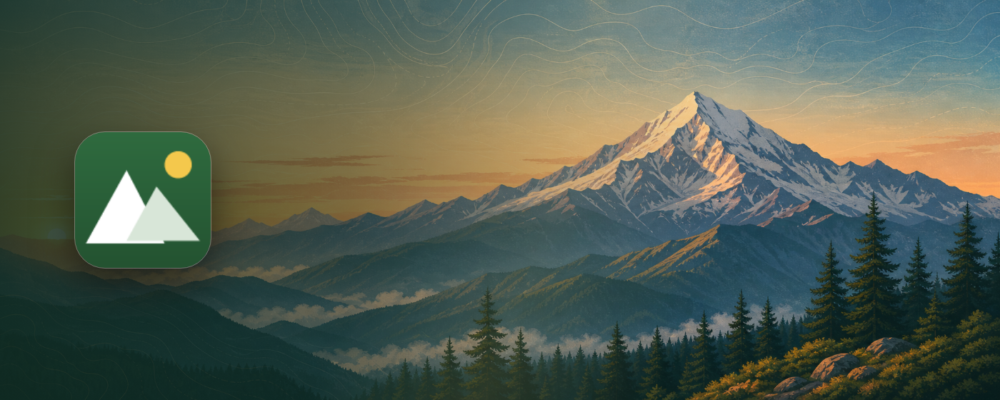
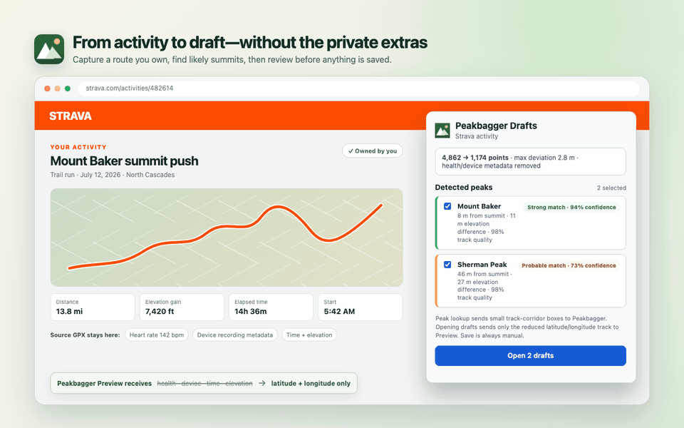
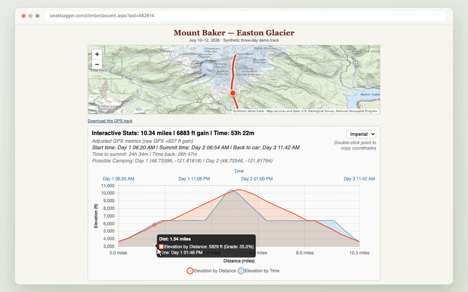
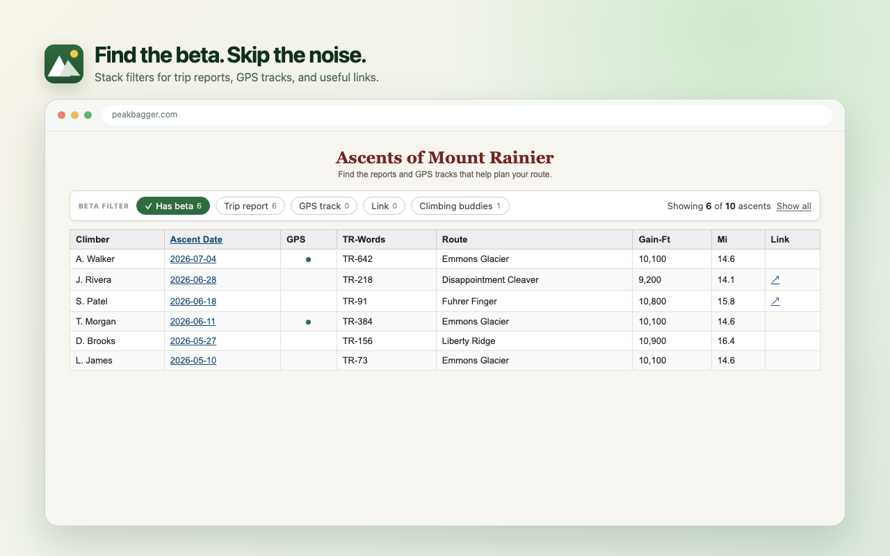
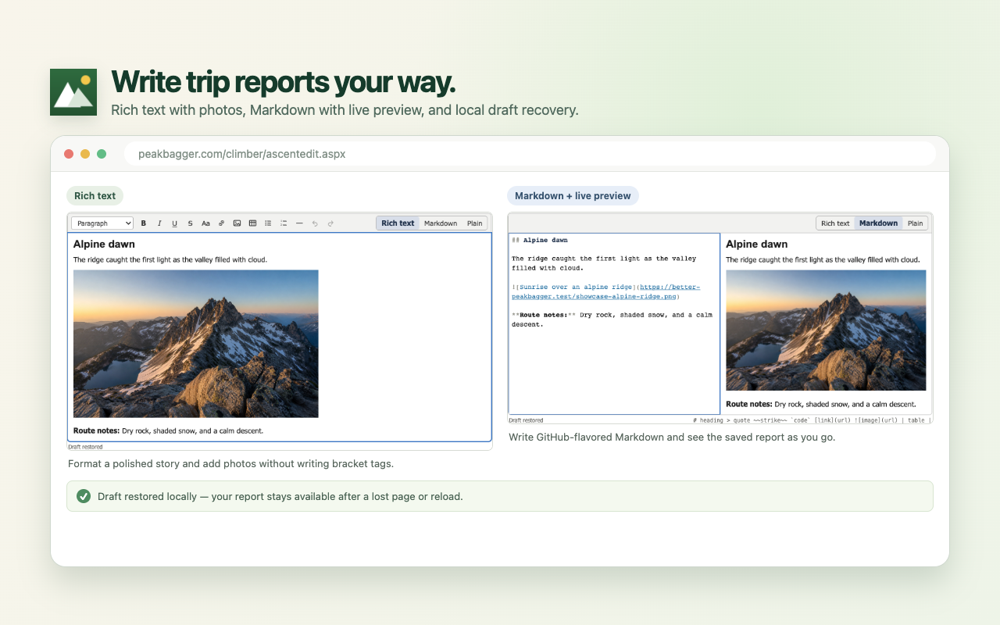
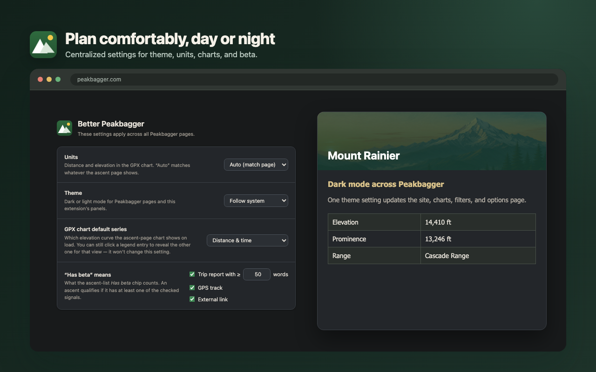

# Better Peakbagger

**Spend less time wrestling with Peakbagger and more time planning the next summit.**

Better Peakbagger turns Garmin and Strava activities—or a GPX file you already
have—into review-ready ascent drafts. It also adds free 3D terrain, richer GPX
analysis, filters and favorite climbers for finding useful beta, rich-text and
Markdown trip reports with reusable photo topos, optional GitHub backup,
location-aware planning links, and a polished dark theme to
[Peakbagger](https://www.peakbagger.com/).

[](https://chromewebstore.google.com/detail/better-peakbagger/kndjohodnpdoejmjkiiakejfehoodedn)
[](https://addons.mozilla.org/en-US/firefox/addon/better-peakbagger/)

Works with Chrome, Edge, Brave, and Firefox. No userscript manager required.
No analytics or telemetry.



## Install

Choose the official listing for your browser:

- [Chrome Web Store](https://chromewebstore.google.com/detail/better-peakbagger/kndjohodnpdoejmjkiiakejfehoodedn) — Chrome, Edge, and Brave
- [Firefox Add-ons](https://addons.mozilla.org/en-US/firefox/addon/better-peakbagger/) — Firefox

Most features appear automatically when you visit Peakbagger. To capture an
activity, open an activity you own on Garmin Connect or Strava and click the
Better Peakbagger icon. Settings are available from the extension's Details or
Preferences page.

## Feature tour

### Open-source free 3D mapping


Explore ascent tracks, Full Screen GPS maps, and peak Dynamic Maps in
interactive 3D at true vertical scale. Better Peakbagger combines open
[Mapterhorn](https://mapterhorn.com/) elevation data with Peakbagger's familiar
compatible basemaps and an experimental OpenFreeMap style. 3D is opt-in and
uses a small, bounded terrain cache to make return visits faster.

> Special thanks to [Mapterhorn](https://mapterhorn.com/) for providing
> free, open-access global elevation data that makes this possible.

### Turn an activity into ascent drafts

Turn an activity you own on Garmin Connect or Strava into prefilled Peakbagger
ascent drafts. Explained **Strong** and **Probable** matches help you choose the
right summits; route details and a privacy-reduced track are prepared for GPS
Preview, and multi-peak trips open as coordinated drafts. You always review and
save each ascent yourself.



### Process a GPX directly on Peakbagger

Choose a GPX from your watch, a friend, or a mapping app on Peakbagger's
**Add Ascent** form. Better Peakbagger calculates the route details, finds
summits along the track, and can prepare coordinated drafts for a multi-peak
trip. Large tracks are reduced to Peakbagger's point limit without sending the
original file anywhere else.

### Chart-synced map and track customization



Ascent pages gain an interactive elevation chart with distance and time views,
route metrics, grades, mountain-local timing, and multi-day details. Chart
points stay synchronized with the map and can be selected by pointer or
keyboard for coordinate copying. Custom route colors, width, and outline carry
through to Full Screen GPS maps without covering Peakbagger's native route or
markers.

### Find useful ascent beta faster

Filter and sort long ascent lists by trip report, GPS track, external link, or
favorite climber—without reloading the page. Favorites can follow your
Peakbagger Buddy List or a searchable custom list, with optional Buddy syncing
and GitHub transfer. Filters combine, show live counts, and remember which
signals you consider useful beta.



### Write trip reports, not bracket tags

Write trip reports in rich text or GitHub-flavored Markdown with tables, media,
syntax highlighting, and live preview; Better Peakbagger handles the
square-bracket format Peakbagger expects. Device-local autosave and a dedicated
draft workspace help recover interrupted work, while Plain mode keeps the
native textarea available for unsupported legacy markup. See the
[supported syntax and safety contract](https://github.com/wilmtang/better-peakbagger/blob/main/docs/trip-report-editor.md).



### Draw and reuse photo topos

Draw routes, curves, labels, and familiar climbing symbols over a photo, then
insert a flattened, metadata-free JPEG or PNG into your report. Originals,
editable projects, and your ImgBB API key are device-local. The saved key
remains in device-local extension storage and is never exposed to Peakbagger,
another website, GitHub, browser sync, or status UI. The background worker gives
it only to Better Peakbagger's exact packaged photo page for the direct ImgBB
upload. An explicit manual settings export includes the key and warns you to
keep the file private. Images decode up to 64 megapixels and 16,384 pixels per
side; editable project bundles are capped at 40 MiB, while ImgBB decides the
upload size allowed for your account. A searchable local library keeps drafts
and published versions reusable, while optional GitHub recovery can preserve
the catalog and annotation projects. See the
[photo workflow and privacy boundaries](https://github.com/wilmtang/better-peakbagger/blob/main/docs/photo-topo-editor.md).

### Back up your Peakbagger data to GitHub

Keep portable copies of your ascents in a GitHub repository you control, with
trip reports as Markdown, form data as JSON, and Peakbagger's stored GPX files.
Back up one saved ascent or your full history, then keep later edits in sync.
The same connection can separately transfer settings and favorite climbers or
preserve photo-library recovery data. Each backup is optional, respects its own
controls, and never changes an ascent on Peakbagger.

### Check summit conditions and recent imagery

Peak pages link directly to location-aware forecasts, recent satellite imagery,
modeled snow depth, and fire or smoke information from supported planning
services.

### Make Peakbagger easier on the eyes

Use a site-wide theme that follows your system or stays light or dark. Shared
settings cover units, maps, GPX charts, activity capture, trip reports, photo
topos, backups, and beta filters, and can be exported for safekeeping. The
download always includes saved API keys and can optionally include the current
GitHub connection; it is not encrypted and must be kept private.



## Privacy by design

There is no Better Peakbagger account, analytics, telemetry, advertising, or
developer data server. Raw Garmin or Strava GPX is processed on the activity
page and is never stored or sent to the extension developer. Peakbagger receives
small corridor boxes for summit discovery and, only after you choose **Open
drafts**, a privacy-reduced track for GPS Preview. The optional 3D view requests
map tiles only after you enable it; once enabled, hovering or focusing its
toggle may prefetch a small bounded elevation tile set before the view opens.
GitHub
backup is off until you enable it, sends an ascent only to the repository you
choose, and keeps its access token in local extension storage, never synced.
The token enters a manual settings download only when you explicitly choose
**Include GitHub connection**; that file is not encrypted.

See [Privacy and data handling](PRIVACY.md) for the complete permissions,
retention, provider, and field-level disclosure.

## FAQ

### Is this an official Peakbagger extension?

No. Better Peakbagger is an independent passion project. Ideas and bug reports
are welcome in [GitHub Issues](https://github.com/wilmtang/better-peakbagger/issues)
and the [discussion board](https://github.com/wilmtang/better-peakbagger/discussions).

### How can Better Peakbagger offer 3D maps for free? What's the catch?

Most elevation data is public or openly licensed; the costly part is turning it
into map tiles and serving them at scale. Better Peakbagger renders 3D locally
with open-source [MapLibre](https://maplibre.org/projects/gl-js/) and uses
public terrain tiles from
[Mapterhorn](https://mapterhorn.com/), a project supported by grants, sponsors,
and donated infrastructure. Better Peakbagger runs no map server and has no
subscription, advertising, or sale of user data.

The trade-off is relying on community-supported services without guaranteed
availability. Better Peakbagger reuses a bounded local elevation cache and may
show less distant detail at steep angles to limit traffic. After you enable 3D,
tile providers receive the area viewed and ordinary request data such as your
IP address. You can disable 3D at any time; Peakbagger's 2D maps remain
available.

### Does Better Peakbagger place extra demand on Peakbagger or bypass its protections?

Some features make additional requests, so zero impact would be misleading.
Activity capture searches small areas along the route; the GPX Analyzer reads
the track linked from an ascent page; 3D requests Peakbagger's nearby-peak feed
after the camera settles; and Buddy or backup features read only the account
data they need. Buddy data is cached for seven days, and full-profile backups
are explicit, read Peakbagger ascents one at a time, and skip existing backups
by default.

Better Peakbagger is an interactive client, not a crawler. It uses your normal
signed-in session and stops or pauses for rate limits or human checks. It never
solves CAPTCHAs, rotates identities or proxies, or evades blocks.

### Why doesn't Better Peakbagger update Peakbagger ascents automatically?

There is no safe, reliable hook for a small independent extension to receive new
activities automatically. [Strava requires a subscription][strava-api] to
create an API application, even when the developer reads only their own data.
The [Garmin Connect Developer Program][garmin-api] is limited to approved
business and enterprise integrations. An unattended workaround would require
brittle login automation and another copy of sensitive activity data.

Better Peakbagger instead works through the provider page you already opened
and signed in to. A toolbar click grants temporary access to that one activity;
the extension never receives your password or keeps permanent Garmin or Strava
access.

Summit matching is also evidence, not certainty, and an ascent log is your
record. Better Peakbagger does the repetitive work, then stops before Save so
you can review every ascent.

[strava-api]: https://developers.strava.com/docs/getting-started/
[garmin-api]: https://developer.garmin.com/gc-developer-program/program-faq/

### Can it capture any Garmin or Strava activity?

No. You must be signed in, the activity must belong to your account, and the
page must provide unambiguous ownership signals. Better Peakbagger fails closed
if it cannot verify those conditions. You must click the toolbar icon for each
capture; the extension does not keep permanent provider access.

### What do Strong and Probable mean for a captured activity?

They describe the evidence that your recorded route encountered a summit—not a
claim that you reached it. Better Peakbagger compares closest approach, the
track's elevation near the summit, whether it forms a local high point, and
track quality. **Strong** means several signals agree and is selected by
default. **Probable** means the route is close enough to consider but the
evidence is weaker or ambiguous, so it is never selected automatically. Review
both before opening drafts, and review every draft before Save.

### Which third-party services can receive my information?

Better Peakbagger has no developer data server, account, analytics, advertising,
or telemetry. Garmin or Strava is accessed only after your toolbar click, and
the raw activity GPX is processed on that page rather than sent to the
developer.

Optional services are contacted only for the feature you use. Map tiles are
requested from Mapterhorn and your selected map provider after you enable 3D.
GitHub receives only the backups you authorize for your chosen repository.
ImgBB receives a flattened image only when you provide an API key and choose
**Upload & insert**. Remote report media contacts its host when displayed. See
[Privacy and data handling](PRIVACY.md) for the complete field-level list.

### Will Better Peakbagger add a developer-run server or telemetry in the future?

There are no plans to. Running a reliable service costs money and creates a
long-term maintenance commitment, so Better Peakbagger is designed to work
without a developer-run data server or telemetry. This is also why it favors
backups you control: if Peakbagger or Better Peakbagger ever disappears, your
backed-up trip reports can remain in your GitHub repository.

If a future feature truly requires a service, it will not be introduced
silently. The feature will require your explicit choice, collect and retain
only the data it needs, and be documented in the README and privacy policy
before you use it.

## Development

Start with the
[architecture and design guide](https://github.com/wilmtang/better-peakbagger/blob/main/docs/architecture.md),
then use the
[development workflow](https://github.com/wilmtang/better-peakbagger/blob/main/docs/development.md)
and
[browser-store release guide](https://github.com/wilmtang/better-peakbagger/blob/main/docs/releasing.md).
Focused design notes and archived investigations are maintained in the
[developer documentation index](https://github.com/wilmtang/better-peakbagger/blob/main/docs/README.md).

Install locked dependencies with `npm ci`. Runtime source is bundled into
`dist/`; load, test, lint, verify, and package `dist/`, never the repository
root.

```sh
npm test
npm run test:scale
npm run lint:js
npm run lint
npm run verify:browsers
```

## License

[AGPL-3.0-or-later](LICENSE). Third-party license notices and project credits
are in [ACKNOWLEDGEMENTS.md](ACKNOWLEDGEMENTS.md).
