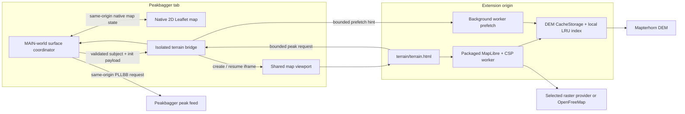

# 3D map architecture and runtime contract

This is the maintained design for Better Peakbagger's opt-in 3D terrain map.
It describes the shipped runtime, its trust boundaries, and the invariants a
change must preserve. Historical investigations and completed audits under
`docs/archive/` explain how individual decisions were reached, but they are
not runtime specifications.

The short mental model is:

> A Peakbagger page owns the subject and native 2D map, an isolated extension
> bridge owns consent and the iframe, and an extension-origin MapLibre frame
> owns rendering. Every boundary validates again, and native 2D remains the
> fail-safe.

## Non-negotiable invariants

An implementation or review should start with these, not with MapLibre API
details:

1. **3D is opt-in.** The extension does not contact a terrain or basemap
   provider until the user has enabled 3D. After enablement, hovering or
   focusing an idle 3D toggle may prefetch a bounded DEM tile set because that
   is an explicit intent signal.
2. **Native 2D is the fail-safe.** The native map stays visible through boot.
   It is hidden only after the frame reports `loaded`, and every fatal boot or
   renderer failure restores it.
3. **Elevation is required; imagery is optional.** Mapterhorn DEM tiles build
   the surface. A raster drape or vector basemap can fail without taking down
   valid terrain.
4. **No raw GPX enters the renderer.** Route views receive bounded
   coordinate-only segments and validated display metadata. They do not
   receive GPX XML, timestamps, GPX elevations, activity metadata, or device
   fields.
5. **The three page surfaces share one lifecycle.** `src/terrain/terrain-coordinator.js`
   owns state transitions, timeouts, camera handoff, compass updates, and
   failure recovery. Surface modules still own subject identity, geometry
   collection, consent-pending state, and native-map DOM.
6. **Every `postMessage` boundary is untrusted.** Tags and direction fields are
   necessary routing hints, not authorization. Receivers also check the event
   source and origin and validate the bounded payload.
7. **Page JavaScript never receives extension privileges.** MAIN-world code
   cannot access storage or runtime messaging. It asks the isolated bridge to
   perform the small extension-owned operations it needs.
8. **The extension-origin frame never fetches authenticated Peakbagger data.**
   Peak dots are requested by the page-world coordinator with the page's
   existing same-origin session, then relayed as validated records.
9. **Returning to 2D is bounded.** An active stop asks the frame for its latest
   center and zoom, but a missing reply cannot trap the user; the coordinator
   falls back after one second.
10. **No change is verified by one green command.** jsdom, a real unpacked
    extension, and a hardware-GPU terrain run cover different failure classes.

## Runtime topology



The renderer is not placed in the page's MAIN world. MapLibre needs a stable
origin, packaged CSP worker, WebGL context, and extension-origin CacheStorage.
The extension-owned iframe provides those consistently in Chrome and Firefox
without giving the host page extension APIs.

## Which module owns what?

| Module | World | Owns | Must not own |
| --- | --- | --- | --- |
| `src/gpx/gpx-analyzer.js` | MAIN | Ascent GPX coordinate extraction, chart highlight, native MasterMap integration, Analyzer-specific messages | Storage, frame creation, generic terrain lifecycle |
| `src/maps/big-map.js` | MAIN | Full Screen route/peak identity, native layer detection, group colors and ascent links, native map DOM | Storage, renderer internals, duplicate lifecycle logic |
| `src/maps/peak-map.js` | MAIN | Peak-page identity agreement, summit focus, embedded map context | Storage, renderer internals, duplicate lifecycle logic |
| `src/terrain/terrain-coordinator.js` | MAIN | `idle`/`loading`/`active` lifecycle, toggle UI, timeouts, camera round trip, compass, recovery | Subject discovery, privileged APIs, provider requests |
| `src/terrain/terrain-map.js` | isolated | Feature gate, trusted consent UI, settings read, frame creation/parking, page↔frame relay, prefetch relay | Page-owned Leaflet globals, rendering |
| `src/terrain/terrain-frame.js` | extension iframe | Payload validation, MapLibre, DEM protocol, route/peak/highlight layers, drape picker, WebGL failure detection | Authenticated Peakbagger fetches, settings writes |
| `src/terrain/terrain-basemap.js` | MAIN/pure helper | Convert compatible Leaflet raster layers and known menu choices to bounded drape specs | Fetching or assuming a layer is CORS-compatible |
| `src/terrain/terrain-camera.js` | pure helper | Validate and convert Leaflet↔MapLibre center/zoom | Bearing or pitch persistence |
| `src/terrain/terrain-compass.js` | page UI helper | Continuous shortest-arc bearing display and reset affordance | Camera state |
| `src/terrain/terrain-cache.js` | extension contexts | Custom DEM protocol, best-effort CacheStorage LRU | Raster/vector basemap caching policy |
| `src/terrain/terrain-tiles.js` | pure helper | Bounded first-paint DEM tile enumeration for prefetch | Network or browser APIs |
| `src/maps/peak-markers.js` | MAIN | Same-origin Peakbagger feed context, request validation, single-flight fetch | Frame rendering or persistence |
| `src/background/background.js` | extension worker | Sender/settings revalidation, prefetch throttling/deduplication/concurrency | Map UI or long-lived terrain state |

The separation is deliberate. For example, putting subject discovery into the
shared coordinator would make it easier for a generic lifecycle change to
weaken a Peak-page identity check. Putting the lifecycle back into each
surface would reintroduce the drift that previously left some surfaces silent
on failure.

## Supported page surfaces

### GPX Analyzer on an ascent page

The Analyzer fetches the ascent's GPX through the page's signed-in context,
parses it on the page, and reduces it to route segments. Only `[lat, lon]`
coordinates and the validated route style enter the terrain payload.

The Analyzer additionally owns two interactions that are not generic terrain
lifecycle concerns:

- chart hover posts a bounded `highlight` coordinate while 3D is active;
- the inline analyzer status area displays renderer errors and drape notices.

### Full Screen Map

`src/maps/big-map.js` does not download and reparse a second GPX. It locates genuine
native Leaflet route layers and flattens their coordinates only when the user
asks to open or prefetch 3D. This preserves native hover, click, popup, and
group-map semantics in 2D.

Single-ascent maps may use the configured route color. Group maps preserve
each native route color. A group route may carry one validated ascent id and a
plain-text label so the frame can reconstruct a Peakbagger ascent link; native
popup HTML is never forwarded.

A route-free Full Screen peak map is eligible only when URL parameters, the
page's subject link, and the exact `MainPeak*Circle.gif` marker at the requested
coordinate agree. An ambiguous or changed page fails closed to native 2D.

### Peak page Dynamic Map

`src/maps/peak-map.js` requires agreement among the Peak page id, the linked Full
Screen `t=P` map id, valid focus coordinates, and a subject name. It passes a
summit focus rather than an invented route. The subject peak is supplied
separately because Peakbagger's nearby-peak feed may intentionally exclude the
page's own summit.

## Lifecycle state machine

The shared coordinator has three stored states plus one active-stop flag:

```mermaid
stateDiagram-v2
    [*] --> idle
    idle --> loading: "start with valid subject"
    loading --> idle: "user cancels"
    loading --> idle: "error or 17 s page timeout"
    loading --> active: "validated loaded message"
    active --> active: "2D requested; stopPending=true"
    active --> idle: "matching camera reply"
    active --> idle: "1 s camera timeout"
    active --> idle: "fatal renderer error"
```



`stopPending` is not a fourth durable renderer state. It is a bounded
sub-state of `active` while the latest camera is requested.

| Lifecycle | Toggle | Native map | Frame behavior |
| --- | --- | --- | --- |
| `idle` with no subject | Disabled `3D` | Visible | No frame required |
| `idle` with subject | Enabled `3D` | Visible | May have a parked frame |
| `loading` | Enabled `3D` spinner; title says cancel | Visible | Booting or resuming |
| `active` | Enabled `2D` | Hidden and `aria-hidden` | Interactive |
| `active + stopPending` | Disabled `2D`; returning label | Still hidden briefly | Answering one camera request |

Why is loading cancelable? The bridge already knows how to hard-destroy a
frame whose boot raced a stop. Disabling the button would add no safety and
would trap the user behind slow DEM or browser startup.

### Start sequence

1. The surface rechecks that it has a route or validated summit.
2. If 3D is disabled, the surface asks the isolated bridge to show consent.
3. The bridge waits for its initial settings read. A newer storage push wins
   over a stale initial read through a revision counter.
4. Consent is accepted only from a trusted click (`event.isTrusted`) inside
   the isolated world. The bridge writes `enable3dMap` through the settings
   module and reports the result to the page.
5. The coordinator builds a surface-specific payload, captures the current
   native Leaflet center/zoom, enters `loading`, and posts `init`.
6. The bridge either resumes a parked loaded frame or creates
   `terrain/terrain.html` in the surface-owned `#bpb-map-viewport`.
7. The frame posts `ready`; the bridge then sends the pending `init`. This
   handshake avoids the Chromium race where iframe `load` can happen before
   the parent listener is ready.
8. The frame validates route/focus, style, camera, basemaps, cache budget, and
   optional peak/link metadata before constructing MapLibre.
9. MapLibre boots with a DEM-only style. Route and peak sources are added on
   `load`; the selected drape is attached afterward.
10. The frame posts `loaded` with bounded camera and control-stack metrics.
11. Only then does the coordinator hide native 2D and enter `active`.

There are two intentionally staggered startup timeouts. The frame owns a
15-second MapLibre load timeout and can report a specific renderer reason. The
page coordinator owns a 17-second backstop in case the frame or relay dies
without reporting anything. The more specific inner failure should normally
win.

### Return-to-2D sequence

When 3D is active, a `2D` click does not immediately discard the user's map
position:

1. the coordinator sets `stopPending`, allocates an integer request id, and
   posts `cameraRequest`;
2. the frame serializes validated MapLibre center/zoom and echoes that id;
3. only a matching reply completes the stop;
4. the coordinator applies center/zoom to Leaflet without animation, restores
   native DOM visibility, and posts `destroy`;
5. if the reply never arrives, the same stop completes after one second using
   the last valid camera seen from the frame.

The bridge parks a loaded frame instead of immediately deleting it. It sends
`suspend`, sets opacity to zero and pointer events to none, and retains the
MapLibre instance for five minutes. The frame cancels peak debounce, popup,
pointer, and compass-stream work. A re-entry sends fresh route/focus, camera,
theme, style, and drape context through `resume`. After the TTL—or immediately
when boot never completed or 3D is disabled—the frame and WebGL context are
destroyed.

## Camera and compass contract

The transferable camera contains only:

```js
{ center: [latitude, longitude], zoom: number }
```

Latitude is limited to Web Mercator, longitude to `[-180, 180]`, and terrain
zoom to `[0, 18]`. Leaflet uses 256-pixel tiles while MapLibre's camera uses
512-pixel tiles, so equivalent ground coverage is `terrainZoom = leafletZoom
- 1`. The inverse adds one when restoring Leaflet.

Bearing and pitch are intentionally not carried back to 2D. A fresh or resumed
3D entry takes the live 2D center/zoom but starts at pitch 60 and bearing 0.
This makes 2D the canonical navigational handoff and avoids pretending Leaflet
can represent a 3D camera.

The frame streams bearing and pitch at most once per animation frame. The page
compass normalizes pitch to `[0, 85]` and unwraps bearing into a cumulative
shortest-arc rotation. Without unwrapping, a north crossing such as 359°→1°
would make CSS interpolate almost a full revolution. Reset-to-north asks the
frame to ease to bearing 0 and pitch 0 over 600 ms, or instantly when the user
prefers reduced motion.

## Renderer construction and layer order

### Why the initial style is terrain-only

MapLibre's `load` waits for the constructor style to finish loading. If a
throttled raster drape is part of that style, pending imagery tiles can block
the whole map even though the DEM surface is ready. Full Screen maps amplify
the problem because a pitched, full-viewport camera sees many horizon tiles.

The constructor therefore receives only:

- a themed background and relief/hillshade presentation;
- the `bpb-dem://{z}/{x}/{y}.webp` raster-dem source;
- terrain with exaggeration exactly 1.

After `load`, the frame adds route casing, route, peak rings, chart highlight,
and then the selected imagery. Terrain can become interactive while raster
tiles stream progressively. A picker selection made during the short pre-load
window is queued and applied immediately after the base style loads.

### Drape sources

`src/terrain/terrain-basemap.js` exposes only Leaflet sources MapLibre can sample as a
single raster `{z}/{x}/{y}` template. It omits WMS, dynamic image exports,
unsupported projections, Google/Bing integrations, non-zero zoom offsets, and
other shapes that do not map safely to a raster source.

The 3D picker contains:

- terrain relief with no imagery;
- the extension-provided experimental OpenFreeMap vector style;
- compatible known choices from Peakbagger's current layer menu;
- the active live Leaflet layer when it can be converted safely.

The frame validates each drape again. Remote URLs must be bounded, credential-
free, fragment-free HTTPS URLs on public hosts, except that the current
Peakbagger origin may supply its own same-origin URL. Tile templates must
contain only `{z}`, `{x}`, and `{y}`. Attribution is parsed and reconstructed
from plain text and safe links; scripts, styles, and arbitrary markup do not
survive.

Raster source errors are not automatically fatal. At the first post-load
`idle`, the frame removes a drape only when it saw errors and did not load even
one tile—evidence of a wholly unusable/CORS-blocked source. Partial tile gaps
remain visible rather than collapsing the layer. Source/tile errors after load
also remain fail-open because a network hole is not a dead renderer.

Most known drapes use a sharper pitch-aware LOD to avoid blurry imagery at
high tilt. OpenTopoMap deliberately retains stock, thriftier LOD because it is
volunteer-run. Unknown live Leaflet providers also retain stock LOD because the
extension cannot assume their traffic policy. DEM keeps MapLibre's stock LOD;
forcing high-resolution elevation tiles across the pitched horizon would
multiply fetch and mesh cost.

If a user chooses a drape inside 3D, resume preserves that choice. Otherwise,
resume re-resolves the page's current 2D layer so a change made while in 2D is
reflected on the next entry.

## Input validation and data minimization

### Route payload

Route parsing is all-or-nothing in the frame:

- 1 to 1,500 segments;
- at least 2 points per segment;
- at most 3,000 total points;
- every point is exactly `[lat, lon]` with finite Web Mercator latitude and
  longitude in `[-180, 180]`;
- total longitude span must be less than 180°, so antimeridian ambiguity fails
  closed;
- optional per-segment color must be six-digit hexadecimal;
- optional ascent link must have a positive integer id at most `1e9` and a
  control-character-free label of at most 200 characters.

The frame converts coordinates to GeoJSON `[lon, lat]` only after the complete
route passes. It does not partially draw a malformed route.

### Focus and peaks

A summit focus is exactly one bounded `[lat, lon]` and a zoom in `[0, 18]`
(default 13 when the supplied zoom is unusable). A focus-peak marker is kept
only when its validated coordinate agrees with the focus within `1e-6` degrees
on both axes.

Peak feed replies are independently bounded and validated. The page-side
client accepts only the native map types that show dots, clamps request bounds,
rejects spans over 6 degrees, times out after 10 seconds, filters prominence as
the native page does, caps output at 400, and aborts a stale request when the
camera moves again. The frame validates the reply again before rendering.

The marker renderer, terrain summit snapping, hit testing, and accepted visual
artifacts are specified in [3d-peak-markers.md](3d-peak-markers.md).

### Settings and live updates

Route style, theme, viewport dimensions, cache budget, and feature state are
cleaned through `src/settings/settings-schema.js`; readers do not carry local copies of
bounds or defaults. While 3D is open, route-style and theme changes are applied
without rebuilding the frame. Feature disablement tears down an open or parked
view and returns to native 2D.

## Consent, privacy, and network requests

The first-use dialog is extension-owned and identifies the providers that may
receive tile coordinates: Mapterhorn for elevation, OpenFreeMap when its vector
style is selected, and the provider behind a selected compatible 2D layer.
Choosing “Not now” leaves the feature disabled. Page script cannot synthesize
the trusted acceptance click. The user may alternatively enable the same gate
in Better Peakbagger Settings, where the provider and viewed-area disclosure is
shown beside the checkbox.

| Request | When it can happen | Credentials/referrer | Persistence |
| --- | --- | --- | --- |
| Mapterhorn DEM render | Enabled 3D is opened | `credentials: omit`, `no-referrer` through custom protocol | Optional bounded DEM cache |
| Mapterhorn DEM prefetch | 3D enabled plus idle-toggle hover/focus | Same cache loader | Optional bounded DEM cache |
| Selected raster drape | That drape is active in an open 3D frame | Browser/MapLibre public tile behavior | Provider/browser policy only |
| OpenFreeMap vector | User selects vector in an open frame | Public style/tile requests | Provider/browser policy only |
| Peakbagger PLLBB feed | 3D open and camera settles above marker zoom cutoff | Page's same-origin session | Never persisted |

There is no analytics or extension-developer map service. Route coordinates
remain inside the Peakbagger tab plus the extension frame embedded in that tab.
The public privacy contract remains [PRIVACY.md](../PRIVACY.md); this document
explains mechanics rather than replacing that disclosure.

## DEM cache and prefetch

MapLibre reads DEM through the custom `bpb-dem` protocol. The protocol accepts
only bounded `bpb-dem://z/x/y.webp` coordinates through zoom 18 and maps them to
`https://tiles.mapterhorn.com/z/x/y.webp`.

`src/terrain/terrain-cache.js` uses CacheStorage name `bpb-mapterhorn-dem-v1` plus a
best-effort `storage.local` LRU index. Important properties:

- the shared settings schema determines the megabyte budget;
- budget zero deletes the owned cache and index;
- reads reconcile the index with actual CacheStorage entries;
- missing or independently evicted entries become ordinary cache misses;
- a missing index can be reconstructed from metadata stored on cached
  responses;
- writes are serialized, oversized single tiles are not stored, and oldest
  entries are trimmed first;
- quota pressure, index-write failure, or browser eviction never makes terrain
  fail if the network tile itself is usable;
- only DEM bytes use this cache. Raster and vector imagery follow normal
  browser/provider caching.

### Why prefetch goes through the worker

CacheStorage is origin-keyed. MAIN-world Peakbagger code cannot populate the
extension origin's cache, so it can only send a hint. The isolated bridge waits
for its initial settings read before relaying that hint; this prevents a first
hover from racing the temporary default `terrainEnabled = false`.

The background worker then revalidates everything:

- sender must be a Peakbagger tab with an integer tab id;
- 3D must still be enabled and cache budget must be non-zero;
- viewport width and height must each be between 100 and 8,192;
- the hint must contain either route bounds or peak center plus zoom;
- tile enumeration is capped at 32, including the target level and its parent;
- one accepted hint per tab per 15 seconds;
- up to 4 tile fetches run concurrently;
- a successfully warmed tile is deduplicated for 10 minutes;
- failed tiles are removed from the dedupe set so a later intent can retry;
- per-tab throttle state is deleted when that tab closes.

`src/terrain/terrain-tiles.js` mirrors the frame's 512-pixel tile, 46-pixel fit
padding, and maximum fit zoom 15.5. If a view would exceed the cap, it lowers
the target level until target plus parent fit. Prefetch is an optimization:
failure is ignored by the surface and a normal renderer cache miss goes to the
network.

## Peak dots and route interaction

The frame cannot contact Peakbagger with the page's authenticated context. On
camera settle it posts bounded visible bounds to the coordinator. The shared
page-side client reconstructs the same `/Async/PLLBB.aspx` request the native
map would issue from the MasterMap iframe URL, including map type, subject peak
id where native semantics require it, climber id, and prominence cutoff.

New camera requests abort older ones. A map type with no native peak feed, such
as a group map, answers `unavailable` once so the frame stops asking. No result
is persisted.

Peak rings use screen-space hit testing rather than MapLibre layer-scoped
events. A pitched terrain ray can strike ground behind a billboarded ring, so
ground-query hit testing becomes unreliable near the horizon. The frame
projects validated anchors to pixels and chooses the nearest ring inside the
shared visual radius plus touch slop.

Route links are different: only validated group-map segments carry link
metadata, and the frame reconstructs a same-origin ascent URL from the integer
id. It never renders forwarded native popup HTML.

## Failure policy

| Reason | Typical source | Fatal? | User result |
| --- | --- | --- | --- |
| `frame` | Iframe resource could not start | Yes | Native 2D restored; visible shared failure |
| `unavailable` | Invalid/unsupported route or focus, missing required runtime, feature disabled | Yes | “Unavailable for this map”; native 2D unchanged |
| `maplibre` | Startup/style construction failure before activation | Yes | Native 2D restored; visible render failure |
| `renderer` | WebGL context loss or source-less post-load renderer/style error | Yes | Native 2D restored; visible render failure |
| `timeout` | 15 s frame load timeout or 17 s page backstop | Yes | Native 2D restored; visible timeout failure |
| Basemap source/tile error | CORS, throttling, missing imagery tile | No | Terrain stays interactive; wholly unusable drape falls back |
| Peak feed error | Same-origin feed/network/parser failure | No | Dots clear until a later camera settle |
| Cache/index error | Eviction, quota, storage failure | No | Network fallback; terrain remains usable |

WebGL context loss calls `preventDefault()` because the product is abandoning
that renderer and restoring 2D rather than competing with MapLibre's context
restoration. Teardown clears the map identity before `map.remove()` so a final
MapLibre error emitted by removal cannot recurse through failure handling.

Full Screen and Peak surfaces use an accessible, themed, auto-hiding
`role=status` note near the toggle. The Analyzer uses its existing inline
status panel. The human-readable reason mapping is shared by
`src/terrain/terrain-failure.js`; `unavailable` deliberately describes the map rather
than incorrectly blaming the browser.

## Page↔bridge↔frame protocol

### Page to isolated bridge

| Message | Purpose |
| --- | --- |
| `requestConsent` | Ask extension-owned UI to enable 3D |
| `init` | Start or resume with fresh bounded surface payload |
| `destroy` | Return to 2D; park or destroy frame depending on load state |
| `cameraRequest` | Ask for latest center/zoom before returning to 2D |
| `highlight` | Analyzer chart-hover coordinate or clear |
| `resetNorth` | Compass reset action |
| `prefetch` | Bounded route/peak intent hint |
| `peaks` | Validated page-side peak feed reply |
| `update` | Live route style and theme |

### Frame to page, relayed by the bridge

| Message | Purpose |
| --- | --- |
| `loaded` | Safe to hide native 2D; includes camera and control metric |
| `camera` | Validated center/zoom, optionally matching a request id |
| `metrics` | Cross-origin bottom control-stack height for toggle placement |
| `view` | Bearing/pitch stream for the page compass |
| `peaksRequest` | Ask page context for native Peakbagger dots |
| `error` | Bounded fatal reason |

The bridge also uses frame-only `ready`, `resume`, `suspend`, and `destroyed`
messages. Unknown failure strings are collapsed to `renderer` before they reach
the page.

Why is `postToFrame` sent with target origin `*`? The iframe has a
browser-specific extension origin distinct from the Peakbagger parent. Authority
comes from holding the exact `frame.contentWindow`; the frame independently
requires `event.source === window.parent`, a Peakbagger parent origin, the
frame tag, and the `toFrame` direction. Replies are accepted only from the
current iframe window. The wildcard is transport compatibility, not a skipped
receiver check.

## Verification matrix

| Check | Proves | Does not prove |
| --- | --- | --- |
| `npm test` | Builds shipped IIFEs; pure algorithms, jsdom fixtures, protocol/state tests, worker logic | Real manifest interpretation, actual WebGL, browser worker lifecycle |
| `npm run lint:js` | Source-level JavaScript lint | Runtime behavior or package validity |
| `npm run lint` | Built extension/package lint | User interaction or renderer output |
| `npm run verify:extension` | Real unpacked `dist/` in hidden Chrome for Testing: manifest order/worlds, content injection, worker and bridge boot | Firefox behavior, visual WebGL correctness, native focus/window placement |
| `npm run verify:browsers` | Real unpacked Chrome and Firefox profiles | Live provider behavior and GPU terrain visuals |
| `npm run terrain:verify` | Real packaged MapLibre frame in hidden Chrome on asserted hardware GPU; route, drape, pending-drape boot, compass placement, context-loss fallback | Real storage/settings bridge, live Mapterhorn or Peakbagger services, native focus |
| `npm run terrain:verify:firefox` | Focused Firefox hardware-WebGL terrain and interaction | Full extension workflow or live services |

The terrain showcase intentionally stubs storage and bridge protocol. A green
GPU run cannot establish that the manifest loaded the real isolated bridge.
Conversely, a green real-extension run can establish injection and handshakes
without exercising the true MapLibre GPU path. Both are required after changes
to shared terrain bundle composition or load order.

All browser verification must use an isolated hidden/headless profile unless
the behavior under test is inherently native UI. Hardware terrain checks must
fail closed on a software renderer; SwiftShader output is not product evidence.

## Interview-style grilling questions

### Why not put everything in one content script?

Because no one execution world has all the right privileges. MAIN can inspect
Peakbagger's Leaflet globals but cannot call extension APIs. Isolated code can
use settings/runtime APIs but cannot trust page globals. An extension frame can
run packaged MapLibre and share extension CacheStorage but must not inherit the
page's authenticated session. The split is a least-privilege design, not a
bundling accident.

### Why does the shared coordinator accept callbacks instead of knowing each map?

Lifecycle is invariant; eligibility is not. Every surface needs the same
loading/cancel/error/camera mechanics, but only Full Screen code knows what a
genuine native route layer looks like, and only Peak-page code can prove its
subject identity. Callbacks centralize drift-prone mechanics without
centralizing security-sensitive page interpretation.

### Why keep native 2D visible during boot?

An iframe existing is not evidence that terrain is usable. DEM parsing,
MapLibre startup, WebGL allocation, and payload validation can still fail.
`loaded` is the commit point: before it, native 2D remains authoritative; after
it, the renderer is interactive and the page can hide native DOM reversibly.

### Why not wait for the selected raster before reporting loaded?

Imagery and elevation have different correctness roles. DEM is the geometry
the feature promises. A drape is optional context from a potentially slow or
volunteer provider. Coupling them made a pending OpenTopoMap tile block an
otherwise complete surface. Progressive drape loading gives the user useful
terrain sooner and isolates provider failure.

### Why are ordinary source errors recoverable but source-less errors fatal?

A source id identifies a bounded data dependency: one DEM, raster, vector, or
GeoJSON source can have a transient network gap. A source-less MapLibre error
after activation points at renderer/style machinery rather than an individual
tile and can leave an untrustworthy canvas. WebGL context loss is likewise a
renderer failure. The policy distinguishes missing data from a dead renderer.

### Why request a camera on stop if move events already stream camera updates?

The last `moveend` message can lag the user's final interaction, and some
camera changes may not have settled. The explicit request establishes a
request-id-correlated final snapshot. The cached last valid camera and one-
second timeout still guarantee exit if that handshake fails.

### Why does camera transfer ignore bearing and pitch?

Leaflet cannot represent them. Persisting them elsewhere would make the 2D map
cease to be the single canonical handoff and would create surprising re-entry
orientation. Center and ground coverage round-trip; 3D-only orientation resets
predictably.

### Why does the route reject an antimeridian span instead of wrapping it?

MapLibre can render wrapped geometry, but route bounds, fit-camera math,
prefetch tile enumeration, and segment interpretation would all need a shared
explicit wrap model. Guessing creates continent-wide bounds and tile bursts.
The current product fails closed with honest “unavailable for this map” copy.

### Why is prefetch compatible with opt-in privacy?

It is impossible while the feature gate is off. After consent, hover or focus
on the idle toggle is a direct intent signal, and the worker rechecks the gate,
sender, viewport, cache budget, tile cap, rate, and dedupe state. It warms only
the DEM cache the upcoming frame would read and sends no route metadata beyond
the tile coordinates implied by the view.

### What happens if a tab closes after prefetching?

The cache remains a bounded extension-owned performance cache, but the worker
deletes that tab's rate-limit entry in `tabs.onRemoved`. The audit concern that
`prefetchLastByTab` leaked per-tab state was stale by the time of implementation;
the cleanup already existed and required no code change.

### Why is the cache index not a source of truth?

CacheStorage and `storage.local` can be evicted independently. Treating the
index as authoritative would report phantom bytes or hide usable entries.
Initialization intersects the index with actual cache keys and rebuilds missing
metadata where possible; unresolved entries are discarded. Any failure
degrades to a network miss.

### Why can the frame not call the Peakbagger peak feed itself?

Its origin is the extension, not Peakbagger. Giving it cookies or broader host
access would cross a privacy boundary for no benefit. The page coordinator can
make the same same-origin request the native map already makes, then relay only
bounded marker records.

### Why are peak clicks screen-space but route clicks can query a layer?

Peak rings are constant-size billboards elevated by terrain. On a pitched
camera, the cursor ray can hit ground far behind the visible ring, so MapLibre's
terrain-ground feature query misses. A line lies on the terrain and remains
appropriate for a rendered-layer query with a pixel tolerance.

### Why park a frame for five minutes?

MapLibre construction, CSP worker startup, DEM parsing, and mesh creation are
the expensive parts of a quick 2D↔3D comparison. Parking makes re-entry fast
while a TTL bounds GPU/resource retention. The frame is non-interactive and
ambient page-driven work is canceled while parked; disabling the feature or a
failed boot skips parking and tears down immediately.

### Why is there both a frame validator and a bridge sanitizer?

They defend different boundaries. The bridge narrows what the page can ask the
extension to relay. The frame must still treat its cross-origin parent message
as untrusted and validate the complete rendering contract. Removing either
turns a future bridge or surface change into an implicit renderer privilege.

### What test would catch a wrong `world: MAIN` declaration?

Not jsdom and not the standalone terrain showcase. `npm run verify:extension`
or `npm run verify:browsers` must load the real manifest. The bundle-composition
unit test catches configured source drift, while the real extension catches
manifest execution-world and injection-order mistakes.

### What test would catch a visually plausible software-rendered terrain run?

The hardware-GPU harness reads `WEBGL_debug_renderer_info` and fails on a
software fallback. A screenshot alone is insufficient because SwiftShader can
produce plausible pixels while proving nothing about the product renderer and
consuming extreme CPU.

## Troubleshooting by symptom

| Symptom | First evidence to inspect | Likely boundary |
| --- | --- | --- |
| Toggle never enables | Surface fixture subject checks; native Leaflet globals/layers | Surface eligibility, not MapLibre |
| Consent appears but 3D never starts | Settings result and `consentResult`; real bridge injection | Isolated settings/bridge |
| Spinner can be canceled, then 2D returns with error | Failure reason and frame startup logs | Payload, MapLibre, DEM, or WebGL |
| Terrain appears but selected layer is missing | Drape notice, basemap source errors, CORS | Optional imagery only |
| Terrain waits on a pending raster | Constructor style or pending-drape GPU assertion | Regression: drape incorrectly gates boot |
| Black/frozen canvas after working | `webglcontextlost` or source-less MapLibre error | Fatal renderer recovery |
| 2D returns to an old location | Camera request id and one-second stop path | Coordinator/frame camera handoff |
| Compass spins near north | Applied cumulative rotation sequence | Angle unwrap regression |
| First hover does not warm cache | Initial settings promise and worker reply | Bridge startup race or gate |
| Peak dots disappear on pan | Request supersession, feed context, zoom cutoff | Peak relay; terrain should remain healthy |
| GPU verification burns CPU | Reported WebGL renderer | Software fallback or wrong launch flags |

## Change checklist

When changing 3D behavior:

1. Decide which owner in the module table is responsible; do not grow a second
   lifecycle or settings schema.
2. Preserve the native-map commit point: hide only after `loaded`, restore on
   cancel and every fatal error.
3. Revalidate any new field at each trust boundary and define a concrete cap.
4. Keep imagery failures independent from required DEM/renderer failures.
5. If a new network request is introduced, update consent copy, privacy docs,
   sender/origin checks, rate/cap behavior, and this request table.
6. If bundle composition or execution worlds change, update
   `scripts/build-config.mjs`, its pinned tests, and run a real unpacked
   extension check.
7. Add a focused state/protocol regression test beside the affected owner.
8. Run the hardware-GPU terrain harness for frame, drape, canvas, compass, or
   control-layout changes and state the renderer/browser/viewport used.
9. Confirm no isolated test browser, temporary profile, or debugging server is
   left running.
