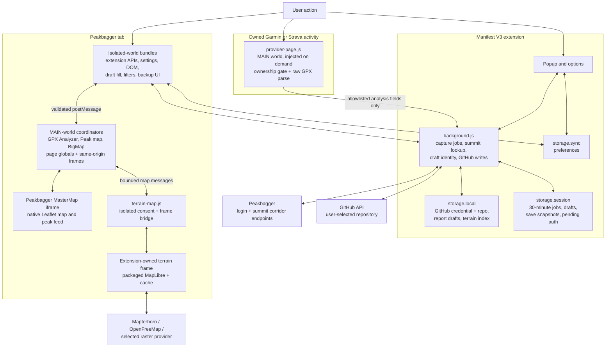
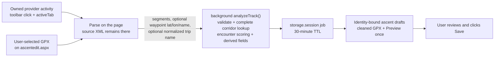

# Architecture and design guide

This is the maintained technical guide to Better Peakbagger. It explains the
runtime topology, feature ownership, trust boundaries, and failure behavior
that must remain true as the extension changes.

Use [development.md](development.md) for build and test operations and
[releasing.md](releasing.md) for store releases. Root-level documents in this
directory are living design notes. Unfinished proposals belong in
[plans/](plans/); completed plans and point-in-time investigations belong in
[archive/](archive/) and are not descriptions of the current runtime.

## Architecture at a glance

The diagram encodes five important boundaries:

1. Raw provider GPX stays in the provider page. The worker receives parsed,
   allowlisted fields, never the source XML.
2. MAIN-world modules can read Peakbagger's page globals but cannot call
   extension APIs. Isolated-world modules can call extension APIs but cannot
   read page-owned JavaScript state. Narrow, validated `postMessage` channels
   connect the two.
3. MapLibre runs in an extension-owned frame. It receives bounded geometry and
   map configuration, not source GPX, and it contacts tile providers only after
   the user enables and opens 3D.
4. The background worker coordinates short transactions and GitHub writes. It
   does not own multi-minute profile-page reads, and it never fetches raw
   provider or saved-ascent GPX itself.
5. Final Peakbagger review and Save always belong to the user.

## Deep dives

- [Shipped runtime and bundle ownership](#deep-dive-shipped-runtime-and-bundle-ownership)
- [Execution worlds, settings, and message bridges](#deep-dive-execution-worlds-settings-and-message-bridges)
- [Garmin/Strava capture and local GPX processing](#deep-dive-garminstrava-capture-and-local-gpx-processing)
- [Trip-report editor](#deep-dive-trip-report-editor)
- [GPX Analyzer and native 2D map integration](#deep-dive-gpx-analyzer-and-native-2d-map-integration)
- [Opt-in 3D terrain](#deep-dive-opt-in-3d-terrain)
- [Peak markers and non-ascent map surfaces](#deep-dive-peak-markers-and-non-ascent-map-surfaces)
- [Ascent filtering and in-page sorting](#deep-dive-ascent-filtering-and-in-page-sorting)
- [GitHub ascent and full-profile backup](#deep-dive-github-ascent-and-full-profile-backup)
- [Site-wide theme startup](#deep-dive-site-wide-theme-startup)
- [Storage and lifecycle](#deep-dive-storage-and-lifecycle)
- [Verification boundaries](#deep-dive-verification-boundaries)

Where a focused design note is more precise than this overview, the deep dive
links to it instead of maintaining a second copy of the same contract.

## Deep dive: shipped runtime and bundle ownership

Better Peakbagger ships one Manifest V3 extension for Chrome and Firefox.
Source is authored as ES modules and bundled with esbuild into `dist/`; browsers
load `dist/`, browser verification executes `dist/`, and store packages contain
`dist/`. Loading the repository root is unsupported.

Three files divide assembly responsibility:

- `manifest.json` owns permissions, URL matches, execution worlds, separately
  loaded vendor order, and browser entry points.
- `scripts/build-config.mjs` owns bundle composition, entry-point roots, copied
  files, and packaged vendor assets.
- `scripts/build.mjs` performs the build. Generated files under `dist/` are
  never edited directly.

Every entry point becomes a self-contained classic IIFE bundle. ES imports
determine module evaluation order inside a bundle. Chart.js, MapLibre, marked,
and `tz-lookup` remain separately loaded browser globals because their scripts
are deliberately ordered by the manifest or terrain frame HTML.

The worker ships once as `dist/background.js`. Chrome references it as the
service worker and Firefox references the same file as its background script.
There is no parallel raw-source worker list and no `importScripts` fallback.

### Surface ownership

| Shipped surface | Primary owner | Boundary |
| --- | --- | --- |
| Background coordination | `src/background.js` | Browser APIs, capture jobs, Peakbagger lookup, draft handshakes, GitHub auth/writes |
| Provider extraction | `src/provider-page.js` | On-demand MAIN-world injection into the active owned activity |
| Ascent editor | `src/ascent-draft.js`, `src/ascent-upload.js`, `src/report-editor.js` | Isolated-world form fill, local-file processing, report editing |
| Ascent analysis | `src/gpx-analyzer.js` | MAIN-world GPX/chart/native-map integration |
| Terrain bridge and renderer | `src/terrain-map.js`, `src/terrain-frame.js` | Isolated bridge plus extension-origin MapLibre frame |
| Full Screen and Peak maps | `src/big-map.js`, `src/peak-map.js` | MAIN-world native-map coordinators |
| Ascent lists | `src/ascent-filter.js`, `src/profile-backup.js` | Isolated-world filter/sort and owner-only backup pipeline |
| Settings and theme | `src/settings-schema.js`, `src/settings.js`, `src/theme.js` | Pure schema, sync-storage access, synchronous page startup |
| Report-draft manager | `src/report-drafts.js`, `options/drafts.js` | Shared pure draft contract plus device-local list/copy/delete UI |
| Saved-ascent backup | `src/ascent-page.js`, `src/ascent-backup.js` | Owner-only page read and user-facing backup state |
| GitHub integration | `src/github-auth.js`, `src/github-client.js`, `src/github-backup.js` | Worker-only credential, Git Data client, pure payload builder |

Extend the owning surface rather than publishing cross-feature globals. The one
deliberate Better Peakbagger global is `globalThis.BPBProviderPage`: the worker
injects functions into a provider's page realm, where an ES import cannot cross
the worker-to-page boundary. It is an adapter API, not a general module seam.

## Deep dive: execution worlds, settings, and message bridges

### Why the extension uses more than one world

Most content scripts run in the isolated extension world. They share the page
DOM while retaining `chrome.*` APIs and protection from page JavaScript. This
is the correct home for settings access, theme startup, filtering, form filling,
backup controls, and the terrain frame bridge.

Three coordinators run in the page's MAIN world because they need page-owned
state:

- `src/gpx-analyzer.js` reads Peakbagger's same-origin MasterMap frame and its
  Leaflet globals for route and hover synchronization.
- `src/big-map.js` identifies and restyles Peakbagger's native Full Screen GPS
  layers without replacing their interactions.
- `src/peak-map.js` mirrors the native map context and peak feed into 3D.

`src/provider-page.js` is also MAIN-world code, but it is injected only after a
toolbar click into the active Garmin or Strava page. Its page realm owns the
authenticated same-origin export request.

MAIN-world code cannot call `chrome.storage` or runtime messaging. Isolated
code cannot read JavaScript globals created by Peakbagger or the provider.
Moving a module between worlds therefore changes both its privileges and the
data it can observe; it is an architecture change, not a packaging detail.

### One settings schema

`src/settings-schema.js` is the only source of settings defaults, bounds, and
validators. It is pure so storage writers, MAIN-world readers, and the terrain
frame can all import the same checks. `src/settings.js` adds
`chrome.storage.sync` access and subscription behavior; it does not redefine
the schema.

Every value received through `window.postMessage` is untrusted and is cleaned
again through the shared schema. Validation is intentionally idempotent: a
value written by `settings.clean()` is accepted unchanged when a page-world or
terrain consumer validates it again.

### The bridges

The ascent-page `src/bridge.js` exchanges settings with the MAIN-world analyzer
and pushes live storage changes back to it. Page-world writes are restricted to
the analyzer-owned controls: units, route/casing colors, map viewport size, and
the remembered map layer. Theme, feature gates, capture privacy preferences,
and every other setting remain writable only from extension-owned surfaces.

The BigMap and Peak-page bridges are read-only and send only the fields their
coordinators need. `src/terrain-map.js` separately validates messages between a
page coordinator and the extension-owned frame. Tags, direction fields, source
and origin checks, bounded payload validators, and all-or-nothing parsing keep
unrelated or malformed page messages from becoming renderer input.

## Deep dive: Garmin/Strava capture and local GPX processing

Two entry points share one analysis and draft pipeline:

### 1. On-demand provider access and ownership

There are intentionally no persistent Garmin or Strava host permissions. The
toolbar click grants `activeTab` access to one activity, and the worker injects
the provider adapter into that page's MAIN world.

Before export, the adapter requires a signed-in viewer identity, a matching
activity-author identity, and the provider's owner-only edit control. Missing,
ambiguous, or changed DOM is not proof of ownership. Signed-out, not-owner, and
ownership-unavailable states fail closed. The worker verifies Peakbagger login
before it asks the provider page for coordinates.

Garmin and Strava keep separate DOM and export adapters because those are
undocumented provider dependencies. Their shared output is intentionally
narrow; a provider change should fail that adapter, not weaken ownership or
fall through to a second scraping strategy.

### 2. One parser and two representations

`src/gpx-parse.js` is the shared on-page parser for provider exports and local
file selection. It returns track segments with latitude, longitude, optional
elevation and time; optional waypoint latitude, longitude, and normalized name;
and an optional normalized first track name. It never returns source XML.

The analysis representation preserves every valid source point long enough to
validate the track, calculate geometry, find summit encounters, and derive
ascent fields. A separate upload representation is serialized later from an
allowlist and reduced to Peakbagger's budget. This separation is the privacy
boundary: the code does not redact the provider document in place.

Raw local-file GPX also remains on `ascentedit.aspx`. A real user file-selection
event replaces Peakbagger's Preview action with **Process**; the draft filler's
synthetic file change is ignored so it cannot recursively process its own
cleaned upload. The original disk file is never changed.

### 3. Validation and complete summit lookup

`src/background.js` funnels both entry points through `analyzeTrack()` and the
pure algorithms in `src/capture-core.js`. The pipeline sanitizes coordinates,
preserves segment boundaries, rejects unusable time/elevation data, and computes
corridor boxes from the validated track.

The worker queries Peakbagger for every corridor box with bounded retry. Results
are not presented until the whole lookup succeeds. A partial response is not
equivalent to “no peaks,” because presenting it would silently omit summits and
could create the wrong drafts.

Shared distance, elevation-gain, and scoring primitives live in
`src/gpx-metrics.js` and `src/capture-core.js`. The ascent-page analyzer and the
draft pipeline must not grow independent versions of the same math.

### 4. Confidence is evidence

Candidate summits are reduced to encounters along the track, then classified
from independent evidence such as closest approach, prominence-relative
geometry, track direction, and elevation behavior. Strong matches are selected
by default; Probable matches remain opt-in. Neither label claims that the user
summited the mountain.

Track encounter order and confidence order serve different purposes. Encounter
order determines same-date Peakbagger suffixes and trip-name ordering.
Confidence order determines which draft tabs open first. Mixing the two would
make suffixes change when scoring changes.

The original detector research and implementation rationale is retained as a
historical note in
[archive/peakbagger-gpx-ascent-detection-research.md](archive/peakbagger-gpx-ascent-detection-research.md);
the current code and this guide own shipped behavior.

### 5. Reduction and serialization

Peakbagger accepts at most 3,000 uploaded points and at most 50 track segments.
Retained waypoints consume the same 3,000-point budget as trackpoints. Reduction
preserves segment endpoints and summit-relevant points, then distributes the
remaining budget over the route. A track that cannot retain every segment
safely fails closed instead of flattening or silently deleting segments.

The newly serialized GPX contains only trackpoint latitude/longitude, available
elevation/time, segment structure, and—when enabled—waypoint
latitude/longitude/name. It excludes provider extensions, device and health
fields, source descriptions, waypoint symbols/elevation/time, and arbitrary
XML. `src/ascent-draft.js` validates this private GPX again before attaching it
to Peakbagger's form.

### 6. Draft identity, ordering, and exactly-once Preview

Capture jobs and prepared drafts live in `storage.session` and expire after 30
minutes. Draft delivery requires a matching sender tab, job, peak, and climber.
Every selected draft is registered before its tab navigates, closing the race
between content-script startup and worker state.

Alphabetical suffixes are assigned only among selected drafts sharing one
ascent date and follow track encounter order. Singleton dates keep a blank
suffix. Encounter time is analysis metadata and is never written to
`SuffixText`.

Multi-peak trip names prefer the first GPX track name, then the activity page
heading, then selected summit names in track order. Every candidate is
whitespace-normalized and limited to 200 characters.

`src/ascent-draft.js` may trigger GPS Preview exactly once. A reload or repeated
handshake offers recovery instead of clicking Preview again. No extension path
clicks either Save control; the user reviews all derived values and saves.

For local files, one detected summit fills immediately. Multiple summits open an
on-page picker; siblings become ordinary prepared draft tabs. A bound page whose
peak only brushes the track shows an explicit “use anyway” closest-approach
choice rather than promoting it silently. The completed implementation plan is
archived at
[archive/gpx-upload-processing.md](archive/gpx-upload-processing.md).

The field-level data disclosure is canonical in [PRIVACY.md](../PRIVACY.md).

## Deep dive: trip-report editor

`src/report-editor.js` keeps Peakbagger's native `JournalText` textarea as the
form source of truth while offering Rich, Markdown, and Plain views. Rich mode
uses a schema-locked TipTap editor; Markdown mode uses CodeMirror plus a
structural preview; Plain mode exposes the exact native bracket source.

All conversions pass through the allowlisted model in `src/report-markup.js`.
Opening a richer mode does not rewrite an untouched report. Before Preview,
Save, implicit ASP.NET submission, or page exit, the active view flushes
synchronously into the native textarea. Local drafts are keyed by ascent
identity, bounded, expiring, and restored only after explicit user approval.
`src/report-drafts.js` is the pure shared contract for those identities and
lifetimes. The options-page owner in `options/drafts.js` uses it to list every
device-local report draft, open the matching ascent form, copy Markdown, and
offer reversible deletion without duplicating or bypassing the editor's
restore gate. The editor's discovery link sends `OPEN_DRAFTS_MANAGER`; the
worker accepts it only from a Peakbagger tab and opens the extension-owned
`options/options.html#drafts` URL.

The editor's representations, sanitization boundaries, media restrictions,
round trips, draft lifecycle, and known lossy-import limitation are maintained
in [trip-report-editor.md](trip-report-editor.md). That focused design note is
the source of truth for markup behavior; this guide does not duplicate its tag
matrix.

## Deep dive: GPX Analyzer and native 2D map integration

### Extraction and metrics

`src/gpx-analyzer.js` runs only when an ascent page exposes Peakbagger's stored
GPX download link. It fetches that saved track in the page session, parses
trackpoints and segment breaks, and builds chronological chart data. Invalid
points split map geometry rather than joining a route across a gap.

Distance and gain come from `src/gpx-metrics.js`. The analyzer reports adjusted
metrics and shows a raw-versus-adjusted note when the difference is material.
Timestamped tracks add elapsed time, time-to-summit/back, local clock labels,
multi-day boundaries, and possible camping stops.

Clock times use the climb's local timezone resolved offline from the starting
coordinate with packaged `tz-lookup`. Failure falls back to a labelled
longitude estimate and never breaks the panel or sends coordinates to a time
service. See [mountain-local-time.md](mountain-local-time.md) for the timezone,
DST, fallback, and performance design.

Chart.js renders distance and time series. The initial visibility follows the
user setting, while legend clicks affect only the current view. Hovered points
retain their original coordinates, allowing one chart point to drive either the
native Leaflet hover marker or the 3D highlight. Double-click coordinate copy is
an explicit user action.

### The fragile Leaflet seam

Peakbagger places its map in a same-origin `MasterMap.aspx` iframe and currently
publishes the Leaflet library as `L` and the map instance as
`mapsPlaceholder`. These are private, undocumented page globals. The analyzer
must run in MAIN world to read them; same-origin DOM access from an isolated
content script would not grant access to the page realm's JavaScript objects.

The analyzer draws an extension-owned route line and casing without mutating
Peakbagger's native layers. Both are non-interactive and sent behind the native
route and markers. Segment breaks and the shared map-point budget are
preserved. On chart hover, an extension-owned circle marker moves to the
selected coordinate; it is hidden when hover ends.

The map iframe can reload underneath the parent. The analyzer re-resolves the
iframe, map, overlay, hover marker, and remembered layer rather than trusting
old Leaflet objects. Missing globals, changed frame structure, cross-origin
access, or an unfamiliar Leaflet API disables only the affected overlay or
hover behavior. The chart and native map remain usable without console noise or
page mutation.

The parent page owns an accessible resizable viewport. Pointer and keyboard
resizing call Leaflet's `invalidateSize(false)` and persist only after the
interaction settles so key repeat does not exhaust `storage.sync` write quotas.
The optional remembered layer replays only a known layer ID through
Peakbagger's own selector; unknown or unavailable values leave the native
default untouched.

## Deep dive: opt-in 3D terrain

### Height and imagery are separate

The terrain surface comes from Mapterhorn DEM tiles. Its visible map can be
OpenFreeMap's vector style, a compatible raster layer selected in Peakbagger,
or the renderer's terrain relief fallback. Elevation and basemap imagery have
different providers, cache behavior, CORS constraints, and failure modes.

The original provider evaluation is archived in
[archive/3d-vector-basemap-investigation.md](archive/3d-vector-basemap-investigation.md).
Historical CORS and drape-resolution investigations live beside it; they
explain past decisions but are not current runtime contracts.

### Activation and browser boundaries

The renderer is off by default. Choosing 3D while disabled opens an
isolated-world consent dialog; only trusted user activation may enable the
feature. No terrain or basemap request occurs merely because a page loaded.

MapLibre and its CSP worker run in `terrain/terrain.html`, an extension-owned
frame declared as a web-accessible resource. This avoids page-CSP and
content-script-world differences between Chrome and Firefox. The isolated
`src/terrain-map.js` bridge creates and tears down the frame, owns consent, and
passes only validated messages between it and the MAIN-world coordinator.

Route input is bounded coordinate-only geometry with segment boundaries and a
validated style. Summit-only Peak pages pass a bounded focus instead. Source
GPX, timestamps, GPX elevations, health/device fields, activity metadata, and
page settings outside the allowlist never enter the frame.

### Camera, maps, and teardown

The 2D and 3D renderers exchange validated center and equivalent zoom whenever
the user switches. Bearing and pitch remain 3D-only. Full Screen maps preserve
their native multi-track colors; ascent maps use the configured route color and
casing.

Returning to 2D stops that session's tile activity. Rather than tearing the
renderer down on every switch, the `src/terrain-map.js` bridge parks the loaded
frame in the DOM at opacity 0 and tells `src/terrain-frame.js` to suspend its
ambient work (peak debounce, popup, pointer tracking); a quick 2D→3D→2D→3D
re-entry then resumes the live MapLibre map with a fresh route/camera/theme
instead of rebuilding the map, its CSP worker, and the terrain mesh. The parked
frame is fully destroyed and its WebGL context released after a five-minute
keep-alive TTL, or immediately when 3D is disabled. Failed MapLibre startup,
invalid input, missing WebGL, DEM failure, or a bounded load timeout removes the
partial 3D surface and leaves the native map visible. A failed or incompatible
selected raster falls back without taking down valid terrain.

### Bounded DEM cache

Successful Mapterhorn responses may be kept in CacheStorage. A best-effort LRU
index in `storage.local` tracks size and use; the configured byte budget is
validated by the shared settings schema. Index reconciliation tolerates browser
eviction and partial storage cleanup. The extension does not request persistent
storage, so cache loss simply returns to the network on the next 3D session.

Only DEM response bytes are owned by this cache. OpenFreeMap and selected
raster providers follow their own browser cache policies.

### DEM prefetch on intent

CacheStorage is origin-keyed, so only extension-origin contexts share the DEM
cache — a Peakbagger content script cannot populate it. To make opening 3D paint
from cache, hovering or focusing the idle 3D toggle (explicit intent, never page
load) posts a bounded `prefetch` hint through the bridge, which the background
worker turns into cache-warming tile fetches. The pure `src/terrain-tiles.js`
mirrors the frame's fitBounds math (512-px tiles, `padding 46`, `maxZoom 15.5`)
to enumerate the first-paint tiles for a route bounds or a peak center+zoom,
plus their parent level, capped so a burst stays small. The worker fails closed
unless 3D is enabled and the cache budget is non-zero (3D enablement is the
consent gate for contacting Mapterhorn), accepts hints only from a Peakbagger
tab, rate-limits each tab, dedupes recently-warmed tiles, and loads through the
same bounded LRU cache the renderer reads. The head of `terrain/terrain.html`
also preconnects to Mapterhorn so the first real tile request skips the TLS
handshake.

## Deep dive: peak markers and non-ascent map surfaces

The 3D view mirrors Peakbagger's native peak feed without allowing the
extension-origin frame to contact Peakbagger. A MAIN-world coordinator derives
the native map context, requests the same feed in the page session, and relays a
validated all-or-nothing reply. New camera positions abort stale requests.

MapLibre's terrain-aware layer events do not reliably hit billboarded rings on
a pitched camera, so `src/terrain-frame.js` projects anchors and performs
screen-space hit testing. Peak anchors may be snapped to a nearby rendered DEM
maximum within a leash. The exact feed mapping, subject-peak preservation,
screen-space interaction, snapping rules, privacy boundary, and known limits
are maintained in [3d-peak-markers.md](3d-peak-markers.md).

### Full Screen GPS maps

`src/big-map.js` enhances Peakbagger's existing GPS layers rather than parsing a
second GPX. On group maps, it identifies genuine interactive native polylines,
preserves their color palette and popups, changes only the configured width,
and traces non-interactive casing underneath. A single-ascent map may also take
the configured route color.

The map and tracks can live in a same-origin child MasterMap frame, so the
coordinator resolves that frame before falling back to the top window. Layers
added or removed after startup receive or lose their casing accordingly. A
missing map, unfamiliar group layer, changed page global, or cross-origin frame
leaves the Full Screen map entirely native.

When 3D is enabled, the coordinator reads bounded coordinates from those
already validated native polylines, preserves per-track colors, and hands them
to the shared terrain bridge. It never replaces native hover, click, popup, or
trip-report behavior in 2D.

### Peak pages

`src/peak-map.js` supplies summit focus, subject identity, native map context,
and peak-feed replies for Peak pages. `src/peak-links.js` separately owns
user-invoked weather, snow, fire/smoke, and imagery links. Keeping planning
links separate from the map coordinator prevents remote navigation features
from acquiring map or settings privileges.

## Deep dive: ascent filtering and in-page sorting

`src/ascent-filter.js` runs on `PeakAscents.aspx` and personal
`ClimbListC.aspx` views. It resolves columns from header text because
Peakbagger serves different column sets for year, unit, and detail variants.
Rows are modeled from the page that was actually returned; the extension never
follows a backend sort link to silently change the result set.

Filter chips compose with AND semantics. “Has beta” is calculated from the
shared settings definition—trip report at or above the configured word count,
GPS, or external link—while the active chip state and per-page trip-report
threshold live in Peakbagger `localStorage`. Year separators disappear when a
filtered section is empty and return with their original rows.

Native header sort links become accessible buttons that reorder existing DOM
rows with type-aware stable comparisons. Exact ascending/descending date
reversal preserves Peakbagger's served ordering, including partial or unusual
dates. Non-date sorts hide year grouping; returning to date restores it. A
capture-phase guard holds an early header click until the document-start sorter
has either taken ownership or deliberately released the click back to normal
navigation.

Compact views without the necessary beta columns degrade to a link to the full
all-years view. Missing headers or an unrecognized table opt out instead of
guessing column positions.

## Deep dive: GitHub ascent and full-profile backup

GitHub backup is explicit and opt-in. The optional host permissions are
requested only when the feature is enabled. GitHub device flow and repository
selection run through the worker; the token and chosen repository live in
`storage.local`, never synced storage, and never enter a content script.

On Save, `src/ascent-snapshot.js` captures the submitted form and report
sidecar into a short-lived `storage.session` snapshot. On the resulting saved
ascent page, `src/ascent-page.js` verifies owner identity and reads
Peakbagger's stored GPX link. `src/ascent-backup.js` offers manual backup and,
only with a fresh precise snapshot plus the separate opt-in, automatic backup.
The backup uses Peakbagger's published track, never the raw provider GPX.

`src/github-backup.js` builds a versioned `ascent.json`, `report.md`, and
optional `track.gpx` under a stable `*-a<aid>` folder. `src/github-client.js`
writes one atomic Git Data commit, preserves unrelated repository paths and
user-added files, handles owned-folder renames, and rebuilds the whole commit
after a bounded non-fast-forward conflict. The worker serializes repository
writes so per-save and profile batches cannot race each other.

Full-profile backup runs its multi-minute producer in the owner’s
`ClimbListC.aspx` tab, whose lifetime and authenticated Peakbagger session match
the work. A bounded buffer decouples paced Peakbagger reads from a single GitHub
consumer. Batches contain at most 10 ascents or 4 MiB; producer backpressure
starts at 30 ascents or 32 MiB. A challenge or repeated transient failure pauses
without consuming the affected ascent. A rejected GitHub batch remains ready
for Resume. The repository tree is the checkpoint, so closing the tab requires
no separate progress record.

The living contracts are split by concern:

- [github-ascent-backup.md](github-ascent-backup.md): repository layout,
  authorization, per-save flow, payload, and security boundaries.
- [profile-backup-pipeline.md](profile-backup-pipeline.md): batching,
  backpressure, pause/resume, conflict, and tab-lifetime behavior.

The original implementation records are archived in
[archive/github-ascent-backup-plan.md](archive/github-ascent-backup-plan.md) and
[archive/full-profile-backup.md](archive/full-profile-backup.md).

## Deep dive: site-wide theme startup

Dark mode requires both the stylesheet and `data-bpb-theme="dark"` on `<html>`
before first paint. `src/theme.js` therefore imports the dark CSS text and
injects it synchronously at `document_start`, then reads a small page-local
mirror of the `system`/`light`/`dark` preference and applies the attribute in
the same tick.

`chrome.storage.sync` remains authoritative. Its asynchronous initial read and
change subscription reconcile the mirror and update open pages. Every apply
reasserts the sheet before the attribute, making the stylesheet-before-theme
invariant idempotent if a node was removed or an unpacked extension reloaded.
Blocked page storage degrades to the asynchronous path.

The focused rationale, first-visit compromises, and lockstep invariant are in
[dark-mode-flash.md](dark-mode-flash.md).

## Deep dive: storage and lifecycle

| Store | Owned data | Lifecycle rule |
| --- | --- | --- |
| `storage.sync` | User preferences and feature gates | Validated by the single settings schema; no secrets |
| `storage.local` | GitHub token/repository, report drafts, terrain-cache index | Device-local; report drafts are bounded and expiring |
| `storage.session` | Capture jobs, prepared drafts, save-time backup snapshots, pending device auth | Short-lived and identity-bound; capture/backup records expire after 30 minutes |
| CacheStorage | Successful Mapterhorn DEM responses | Best effort, bounded by the local LRU index |
| Peakbagger `localStorage` | Filter UI state and early theme mirror | Page-local convenience state, never authoritative extension credentials |

Freshness checks reject expired jobs, drafts, snapshots, and authorization
records on read. A five-minute alarm performs physical cleanup, but correctness
never depends on the alarm firing before an expired read.

Cancelling capture deletes its job immediately and invalidates the transaction
identity, so late provider or lookup results cannot recreate it. A new capture
or local-file process supersedes older work for the same scoped tab.

Full-profile backup intentionally has no local checkpoint. Each repository
commit is atomic and the next run diffs the current ascent list against stable
root folder identities. Terrain cache entries are also non-authoritative:
missing bytes are a cache miss, not corrupt product state.

## Deep dive: verification boundaries

No single green command proves the extension works:

- `npm test` builds `dist/`, imports pure modules, and evaluates shipped IIFE
  bundles in jsdom. It covers algorithms, fixtures, privacy gates, DOM behavior,
  and worker state, but no browser interprets the real manifest.
- `npm run lint:js` catches JavaScript errors without rewriting source.
  `npm run lint` checks the built extension package. Neither establishes
  runtime behavior.
- `npm run verify:browsers` loads the real unpacked Chrome and derived Firefox
  manifests in hidden isolated profiles. It exercises runtime origins,
  execution worlds, storage, worker/background startup, manifest surfaces,
  native file assignment, draft identity, exactly-once Preview, and the no-Save
  boundary.
- `npm run verify:packages -- CHROME.zip FIREFOX.zip` runs those gates against
  the exact minified store archives.
- `npm run terrain:verify` and `npm run terrain:verify:firefox` render packaged
  MapLibre on a reported hardware GPU with synthetic route, peak, basemap, and
  DEM fixtures. Their storage and bridge protocols are stubs, and they do not
  contact the live terrain service.

Hidden browser checks establish DOM and runtime behavior, not native focus,
window placement, permission-prompt presentation, toolbar popup sizing, or tab
group chrome. Live Garmin, Strava, Peakbagger, GitHub device-flow, saved-GPX
timing, and Cloudflare behavior remain minimal, rate-limited manual release
checks. The exact matrix and cleanup requirements live in
[development.md](development.md) and [releasing.md](releasing.md).

The completed cross-browser verification rollout is retained in
[archive/cross-browser-verification.md](archive/cross-browser-verification.md).
