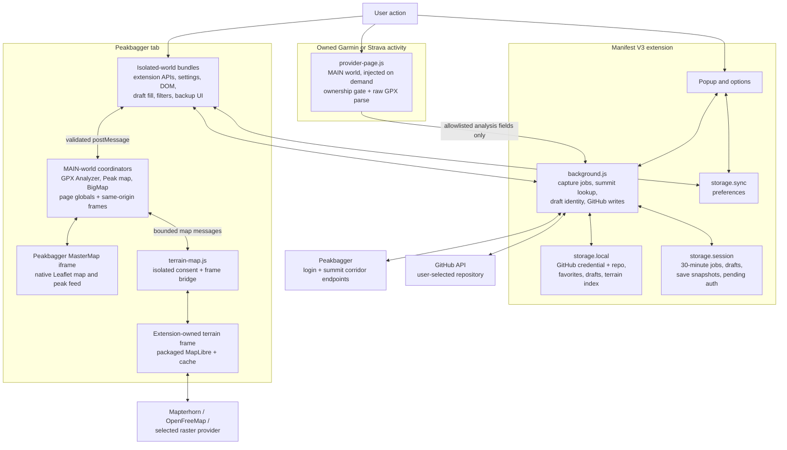
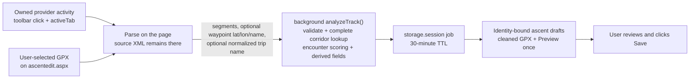

# Architecture and design guide

This is the maintained technical guide to Better Peakbagger. It explains the
runtime topology, feature ownership, trust boundaries, and failure behavior
that must remain true as the extension changes.

Use [development.md](development.md) for build and test operations and
[releasing.md](releasing.md) for store releases. Root-level documents in this
directory are living design notes. Unfinished proposals belong in
[plans/](plans/); completed plans and point-in-time investigations belong in
[archive/](archive/) and are not descriptions of the current runtime.

## Architecture at a glance



The diagram encodes five important boundaries:

1. Raw provider GPX stays in the provider page. The worker receives parsed,
   allowlisted fields, never the source XML.
2. MAIN-world modules can read Peakbagger's page globals but cannot call
   extension APIs. Isolated-world modules can call extension APIs but cannot
   read page-owned JavaScript state. Narrow, validated `postMessage` channels
   connect the two.
3. MapLibre runs in an extension-owned frame. It receives bounded geometry and
   map configuration, not source GPX, and it contacts tile providers only after
   the user enables and opens 3D.
4. The background worker coordinates short transactions and GitHub writes. It
   does not own multi-minute profile-page reads, and it never fetches raw
   provider or saved-ascent GPX itself.
5. Final Peakbagger review and Save always belong to the user.

## Deep dives

- [Shipped runtime and bundle ownership](#deep-dive-shipped-runtime-and-bundle-ownership)
- [Execution worlds, settings, and message bridges](#deep-dive-execution-worlds-settings-and-message-bridges)
- [Garmin/Strava capture and local GPX processing](#deep-dive-garminstrava-capture-and-local-gpx-processing)
- [Trip-report editor](#deep-dive-trip-report-editor)
- [GPX Analyzer and native 2D map integration](#deep-dive-gpx-analyzer-and-native-2d-map-integration)
- [Opt-in 3D terrain](#deep-dive-opt-in-3d-terrain)
- [Peak markers and non-ascent map surfaces](#deep-dive-peak-markers-and-non-ascent-map-surfaces)
- [Ascent filtering and in-page sorting](#deep-dive-ascent-filtering-and-in-page-sorting)
- [Favorite climbers](#deep-dive-favorite-climbers)
- [GitHub ascent and full-profile backup](#deep-dive-github-ascent-and-full-profile-backup)
- [Site-wide theme startup](#deep-dive-site-wide-theme-startup)
- [Storage and lifecycle](#deep-dive-storage-and-lifecycle)
- [Verification boundaries](#deep-dive-verification-boundaries)

Where a focused design note is more precise than this overview, the deep dive
links to it instead of maintaining a second copy of the same contract.

## Deep dive: shipped runtime and bundle ownership

Better Peakbagger ships one Manifest V3 extension for Chrome and Firefox.
Source is authored as ES modules and bundled with esbuild into `dist/`; browsers
load `dist/`, browser verification executes `dist/`, and store packages contain
`dist/`. Loading the repository root is unsupported.

Three files divide assembly responsibility:

- `manifest.json` owns permissions, URL matches, execution worlds, separately
  loaded vendor order, and browser entry points.
- `scripts/build-config.mjs` owns bundle composition, entry-point roots, copied
  files, and packaged vendor assets.
- `scripts/build.mjs` performs the build. Generated files under `dist/` are
  never edited directly.

Every entry point becomes a self-contained classic IIFE bundle. ES imports
determine module evaluation order inside a bundle. Chart.js, MapLibre, marked,
and `tz-lookup` remain separately loaded browser globals because their scripts
are deliberately ordered by the manifest or terrain frame HTML.

The worker ships once as `dist/background.js`. Chrome references it as the
service worker and Firefox references the same file as its background script.
There is no parallel raw-source worker list and no `importScripts` fallback.

### Surface ownership

| Shipped surface | Primary owner | Boundary |
| --- | --- | --- |
| Background coordination | `src/background.js` | Browser APIs, capture jobs, Peakbagger lookup, draft handshakes, GitHub auth/writes |
| Provider extraction | `src/provider-page.js` | On-demand MAIN-world injection into the active owned activity |
| Ascent editor | `src/ascent-draft.js`, `src/ascent-upload.js`, `src/report-editor.js` | Isolated-world form fill, local-file processing, report editing |
| Ascent analysis | `src/gpx-analyzer.js` | MAIN-world GPX/chart/native-map integration |
| Terrain lifecycle, bridge, and renderer | `src/terrain-coordinator.js`, `src/terrain-map.js`, `src/terrain-frame.js` | Shared MAIN-world state machine, isolated bridge, extension-origin MapLibre frame |
| Full Screen and Peak maps | `src/big-map.js`, `src/peak-map.js` | MAIN-world native-map coordinators |
| Ascent lists | `src/ascent-filter.js`, `src/profile-backup.js` | Isolated-world filter/sort and owner-only backup pipeline |
| Favorite climbers | `src/favorite-climbers.js`, `src/climber-favorite.js`, `options/favorites.js` | Pure local-data contract, climber-page toggle, and settings manager |
| Settings and theme | `src/settings-schema.js`, `src/settings.js`, `src/theme.js` | Pure schema, sync-storage access, synchronous page startup |
| Report-draft manager | `src/report-drafts.js`, `options/drafts.js` | Shared pure draft contract plus device-local list/copy/delete UI |
| Saved-ascent backup | `src/ascent-page.js`, `src/ascent-backup.js` | Owner-only page read and user-facing backup state |
| Peakbagger request boundary | `src/peakbagger-request.js`, `src/peakbagger-response.js`, `src/peakbagger-error.js`, `src/peakbagger-cloudflare.js` | Authenticated fetch policy, response validation, typed failures, and managed-challenge detection/recovery copy |
| GitHub integration | `src/github-errors.js`, `src/github-api.js`, `src/github-auth.js`, `src/github-client.js`, `src/github-backup.js` | Shared typed errors and authenticated REST transport, worker-only credential/device flow, Git Data client, pure payload builder |

Extend the owning surface rather than publishing cross-feature globals. The one
deliberate Better Peakbagger global is `globalThis.BPBProviderPage`: the worker
injects functions into a provider's page realm, where an ES import cannot cross
the worker-to-page boundary. It is an adapter API, not a general module seam.

### Live Peakbagger reads

User-triggered Peakbagger reads share one fail-closed boundary. The pure
`src/peakbagger-response.js` validates both status and resource-specific body
shape because a login page or `PBError.aspx` redirect can finish as HTTP 200.
`src/peakbagger-cloudflare.js` separately owns the stricter managed-challenge
signature used by peakbagger-cli: status 403 plus either `cf-mitigated:
challenge` or `Just a moment` within the first 2,000 body characters. It also
owns the shared human-check copy and recovery action. `src/peakbagger-request.js`
enforces the authenticated, no-cache fetch policy, a bounded timeout,
response-body and DOM-parser handling, and Peakbagger-origin validation.
`src/peakbagger-error.js` maps the remaining typed failures to consistent copy
and recovery actions for sign-out, network, timeout, rate limit, server, missing
resource, page drift, parser, identity, and device-storage failures.

The Buddy/favorites surfaces, profile and individual backup, saved-GPX analyzer,
worker login check, and capture summit lookup all use that boundary. Callers may
add stricter identity and schema checks, but do not translate transport failures
again. Two reads deliberately keep surface-specific orchestration: provider GPX
export is not a Peakbagger request, and native map-marker polling treats an
aborted superseded camera request as normal. Neither exception duplicates the
user-facing Peakbagger error mapper.

## Deep dive: execution worlds, settings, and message bridges

### Why the extension uses more than one world

Most content scripts run in the isolated extension world. They share the page
DOM while retaining `chrome.*` APIs and protection from page JavaScript. This
is the correct home for settings access, theme startup, filtering, form filling,
backup controls, and the terrain frame bridge.

Three coordinators run in the page's MAIN world because they need page-owned
state:

- `src/gpx-analyzer.js` reads Peakbagger's same-origin MasterMap frame and its
  Leaflet globals for route and hover synchronization.
- `src/big-map.js` identifies and restyles Peakbagger's native Full Screen GPS
  layers without replacing their interactions.
- `src/peak-map.js` mirrors the native map context and peak feed into 3D.

All three compose `src/terrain-coordinator.js` for the common
idle/loading/active lifecycle, timeout recovery, camera handoff, toggle and
compass state. Subject validation and init-payload construction stay in the
owning surface so sharing lifecycle mechanics does not weaken page-specific
eligibility checks.

`src/provider-page.js` is also MAIN-world code, but it is injected only after a
toolbar click into the active Garmin or Strava page. Its page realm owns the
authenticated same-origin export request.

MAIN-world code cannot call `chrome.storage` or runtime messaging. Isolated
code cannot read JavaScript globals created by Peakbagger or the provider.
Moving a module between worlds therefore changes both its privileges and the
data it can observe; it is an architecture change, not a packaging detail.

### One settings schema

`src/settings-schema.js` is the only source of settings defaults, bounds, and
validators. It is pure so storage writers, MAIN-world readers, and the terrain
frame can all import the same checks. `src/settings.js` adds
`chrome.storage.sync` access and subscription behavior; it does not redefine
the schema.

Every value received through `window.postMessage` is untrusted and is cleaned
again through the shared schema. Validation is intentionally idempotent: a
value written by `settings.clean()` is accepted unchanged when a page-world or
terrain consumer validates it again.

### The bridges

The ascent-page `src/bridge.js` exchanges settings with the MAIN-world analyzer
and pushes live storage changes back to it. Page-world writes are restricted to
the analyzer-owned controls: units, route/casing colors, map viewport size, and
the remembered map layer. Theme, feature gates, capture privacy preferences,
and every other setting remain writable only from extension-owned surfaces.

The BigMap and Peak-page bridges are read-only and send only the fields their
coordinators need. `src/terrain-map.js` separately validates messages between a
page coordinator and the extension-owned frame. Tags, direction fields, source
and origin checks, bounded payload validators, and all-or-nothing parsing keep
unrelated or malformed page messages from becoming renderer input.

## Deep dive: Garmin/Strava capture and local GPX processing

Two entry points share one analysis and draft pipeline:



### 1. On-demand provider access and ownership

There are intentionally no persistent Garmin or Strava host permissions. The
toolbar click grants `activeTab` access to one activity, and the worker injects
the provider adapter into that page's MAIN world.

Before export, the adapter requires a signed-in viewer identity, a matching
activity-author identity, and the provider's owner-only edit control. Missing,
ambiguous, or changed DOM is not proof of ownership. Signed-out, not-owner, and
ownership-unavailable states fail closed. The worker verifies Peakbagger login
before it asks the provider page for coordinates.

Garmin and Strava keep separate DOM and export adapters because those are
undocumented provider dependencies. Their shared output is intentionally
narrow; a provider change should fail that adapter, not weaken ownership or
fall through to a second scraping strategy.

### 2. One parser and two representations

`src/gpx-parse.js` is the shared on-page parser for provider exports and local
file selection. It returns track segments with latitude, longitude, optional
elevation and time; optional waypoint latitude, longitude, and normalized name;
and an optional normalized first track name. It never returns source XML.

The analysis representation preserves every valid source point long enough to
validate the track, calculate geometry, find summit encounters, and derive
ascent fields. A separate upload representation is serialized later from an
allowlist and reduced to Peakbagger's budget. This separation is the privacy
boundary: the code does not redact the provider document in place.

Raw local-file GPX also remains on `ascentedit.aspx`. A real user file-selection
event replaces Peakbagger's Preview action with **Process**; the draft filler's
synthetic file change is ignored so it cannot recursively process its own
cleaned upload. The original disk file is never changed.

### 3. Validation and complete summit lookup

`src/background.js` funnels both entry points through `analyzeTrack()` and the
pure algorithms in `src/capture-core.js`. The pipeline sanitizes coordinates,
preserves segment boundaries, rejects unusable time/elevation data, and computes
corridor boxes from the validated track.

The worker queries Peakbagger for every corridor box with bounded retry. Results
are not presented until the whole lookup succeeds. A partial response is not
equivalent to “no peaks,” because presenting it would silently omit summits and
could create the wrong drafts.

Shared distance, elevation-gain, and scoring primitives live in
`src/gpx-metrics.js` and `src/capture-core.js`. The ascent-page analyzer and the
draft pipeline must not grow independent versions of the same math.

### 4. Confidence is evidence

Candidate summits are reduced to encounters along the track, then classified
from independent evidence such as closest approach, prominence-relative
geometry, track direction, and elevation behavior. Strong matches are selected
by default; Probable matches remain opt-in. Neither label claims that the user
summited the mountain.

Track encounter order and confidence order serve different purposes. Encounter
order determines same-date Peakbagger suffixes and trip-name ordering.
Confidence order determines which draft tabs open first. Mixing the two would
make suffixes change when scoring changes.

The original detector research and implementation rationale is retained as a
historical note in
[archive/peakbagger-gpx-ascent-detection-research.md](archive/peakbagger-gpx-ascent-detection-research.md);
the current code and this guide own shipped behavior.

### 5. Reduction and serialization

Peakbagger accepts at most 3,000 uploaded points and at most 50 track segments.
Retained waypoints consume the same 3,000-point budget as trackpoints. Reduction
preserves segment endpoints and summit-relevant points, then distributes the
remaining budget over the route. A track that cannot retain every segment
safely fails closed instead of flattening or silently deleting segments.

The newly serialized GPX contains only trackpoint latitude/longitude, available
elevation/time, segment structure, and—when enabled—waypoint
latitude/longitude/name. It excludes provider extensions, device and health
fields, source descriptions, waypoint symbols/elevation/time, and arbitrary
XML. `src/ascent-draft.js` validates this private GPX again before attaching it
to Peakbagger's form.

### 6. Draft identity, ordering, and exactly-once Preview

Capture jobs and prepared drafts live in `storage.session` and expire after 30
minutes. Draft delivery requires a matching sender tab, job, peak, and climber.
Every selected draft is registered before its tab navigates, closing the race
between content-script startup and worker state.

Alphabetical suffixes are assigned only among selected drafts sharing one
ascent date and follow track encounter order. Singleton dates keep a blank
suffix. Encounter time is analysis metadata and is never written to
`SuffixText`.

Multi-peak trip names prefer the first GPX track name, then the activity page
heading, then selected summit names in track order. Every candidate is
whitespace-normalized and limited to 200 characters.

`src/ascent-draft.js` may trigger GPS Preview exactly once. A reload or repeated
handshake offers recovery instead of clicking Preview again. No extension path
clicks either Save control; the user reviews all derived values and saves.

For local files, one detected summit fills immediately. Multiple summits open an
on-page picker; siblings become ordinary prepared draft tabs. A bound page whose
peak only brushes the track shows an explicit “use anyway” closest-approach
choice rather than promoting it silently. The completed implementation plan is
archived at
[archive/gpx-upload-processing.md](archive/gpx-upload-processing.md).

The field-level data disclosure is canonical in [PRIVACY.md](../PRIVACY.md).

## Deep dive: trip-report editor

`src/report-editor.js` keeps Peakbagger's native `JournalText` textarea as the
form source of truth while offering Rich, Markdown, and Plain views. Rich mode
uses a schema-locked TipTap editor; Markdown mode uses CodeMirror plus a
structural preview; Plain mode exposes the exact native bracket source.

All conversions pass through the allowlisted model in `src/report-markup.js`.
Opening a richer mode does not rewrite an untouched report. Before Preview,
Save, implicit ASP.NET submission, or page exit, the active view flushes
synchronously into the native textarea. Local drafts are keyed by ascent
identity, bounded, expiring, and restored only after explicit user approval.
`src/report-drafts.js` is the pure shared contract for those identities and
lifetimes. The options-page owner in `options/drafts.js` uses it to list every
device-local report draft, open the matching ascent form, copy Markdown, and
offer reversible deletion without duplicating or bypassing the editor's
restore gate. The editor's discovery link sends `OPEN_DRAFTS_MANAGER`; the
worker accepts it only from a Peakbagger tab and opens the extension-owned
`options/options.html#drafts` URL.

The editor's representations, sanitization boundaries, media restrictions,
round trips, draft lifecycle, and known lossy-import limitation are maintained
in [trip-report-editor.md](trip-report-editor.md). That focused design note is
the source of truth for markup behavior; this guide does not duplicate its tag
matrix.

## Deep dive: GPX Analyzer and native 2D map integration

### Extraction and metrics

`src/gpx-analyzer.js` runs only when an ascent page exposes Peakbagger's stored
GPX download link. It fetches that saved track in the page session, parses
trackpoints and segment breaks, and builds chronological chart data. Invalid
points split map geometry rather than joining a route across a gap.

Distance and gain come from `src/gpx-metrics.js`. The analyzer reports adjusted
metrics and shows a raw-versus-adjusted note when the difference is material.
Timestamped tracks add elapsed time, time-to-summit/back, local clock labels,
multi-day boundaries, and possible camping stops.

Clock times use the climb's local timezone resolved offline from the starting
coordinate with packaged `tz-lookup`. Failure falls back to a labelled
longitude estimate and never breaks the panel or sends coordinates to a time
service. See [mountain-local-time.md](mountain-local-time.md) for the timezone,
DST, fallback, and performance design.

Chart.js renders distance and time series. The initial visibility follows the
user setting, while legend clicks affect only the current view. Hovered points
retain their original coordinates, allowing one chart point to drive either the
native Leaflet hover marker or the 3D highlight. Double-click coordinate copy is
an explicit user action.

### The fragile Leaflet seam

Peakbagger places its map in a same-origin `MasterMap.aspx` iframe and currently
publishes the Leaflet library as `L` and the map instance as
`mapsPlaceholder`. These are private, undocumented page globals. The analyzer
must run in MAIN world to read them; same-origin DOM access from an isolated
content script would not grant access to the page realm's JavaScript objects.
The iframe's `t` query parameter selects the native map context, while `d` is
an overloaded subject ID whose meaning follows that context. The maintained
mapping, including the distinction between `t=G` and `gt`, is documented in
[peakbagger-map-types.md](peakbagger-map-types.md).

The analyzer draws an extension-owned route line and casing without mutating
Peakbagger's native layers. Both are non-interactive and sent behind the native
route and markers. Segment breaks and the shared map-point budget are
preserved. On chart hover, an extension-owned circle marker moves to the
selected coordinate; it is hidden when hover ends.

The map iframe can reload underneath the parent. The analyzer re-resolves the
iframe, map, overlay, hover marker, and remembered layer rather than trusting
old Leaflet objects. Missing globals, changed frame structure, cross-origin
access, or an unfamiliar Leaflet API disables only the affected overlay or
hover behavior. The chart and native map remain usable without console noise or
page mutation.

The parent page owns an accessible resizable viewport. Pointer and keyboard
resizing call Leaflet's `invalidateSize(false)` and persist only after the
interaction settles so key repeat does not exhaust `storage.sync` write quotas.
The optional remembered layer replays only a known layer ID through
Peakbagger's own selector; unknown or unavailable values leave the native
default untouched.

## Deep dive: opt-in 3D terrain

The complete maintained protocol, state machine, validation caps, failure
taxonomy, request table, verification matrix, and interview-style design
rationale live in [3d-map.md](3d-map.md). This section is the architecture-level
summary.

### Height and imagery are separate

The terrain surface comes from Mapterhorn DEM tiles. Its visible map can be
OpenFreeMap's vector style, a compatible raster layer selected in Peakbagger,
or the renderer's terrain relief fallback. Elevation and basemap imagery have
different providers, cache behavior, CORS constraints, and failure modes.

The original provider evaluation is archived in
[archive/3d-vector-basemap-investigation.md](archive/3d-vector-basemap-investigation.md).
Historical CORS and drape-resolution investigations live beside it; they
explain past decisions but are not current runtime contracts.

### Activation and browser boundaries

The renderer is off by default. Choosing 3D while disabled opens an
isolated-world consent dialog; only trusted user activation may enable the
feature. No terrain or basemap request occurs merely because a page loaded.
After the feature is enabled, hovering or focusing an idle 3D toggle may warm a
bounded DEM tile set as an explicit intent signal.

MapLibre and its CSP worker run in `terrain/terrain.html`, an extension-owned
frame declared as a web-accessible resource. This avoids page-CSP and
content-script-world differences between Chrome and Firefox. The isolated
`src/terrain-map.js` bridge creates and tears down the frame, owns consent, and
passes only validated messages between it and the MAIN-world coordinator.

Route input is bounded coordinate-only geometry with segment boundaries and a
validated style. Summit-only Peak pages pass a bounded focus instead. Source
GPX, timestamps, GPX elevations, health/device fields, activity metadata, and
page settings outside the allowlist never enter the frame.
The frame rechecks all-or-nothing route/focus, style, basemap, link, peak, and
camera payloads even though the page and bridge already narrowed them.

### Camera, maps, and teardown

The 2D and 3D renderers exchange validated center and equivalent zoom whenever
the user switches. Bearing and pitch remain 3D-only. The shared coordinator
waits at most one second for the final camera, and the page's 17-second startup
backstop deliberately outlasts the frame's 15-second MapLibre timeout. Loading
is cancelable. Every surface exposes the same continuous shortest-arc compass
and reset-to-north action. Full Screen maps preserve their native multi-track
colors; ascent maps use the configured route color and casing.

Returning to 2D stops that session's tile activity. Rather than tearing the
renderer down on every switch, the `src/terrain-map.js` bridge parks the loaded
frame in the DOM at opacity 0 and tells `src/terrain-frame.js` to suspend its
ambient work (peak debounce, popup, pointer tracking); a quick 2D→3D→2D→3D
re-entry then resumes the live MapLibre map with a fresh route/camera/theme
instead of rebuilding the map, its CSP worker, and the terrain mesh. The parked
frame is fully destroyed and its WebGL context released after a five-minute
keep-alive TTL, or immediately when 3D is disabled. Failed MapLibre startup,
invalid input, missing WebGL, WebGL context loss, a source-less post-load
renderer error, DEM failure, or a bounded load timeout removes the partial 3D
surface, restores the native map, and shows a shared accessible failure. A
source-specific tile gap remains recoverable, and a failed or incompatible
selected raster falls back without taking down valid terrain.

MapLibre is constructed with a DEM-only style. Route and peak layers attach on
`load`, and the selected raster/vector presentation is applied afterward. A
slow OpenTopoMap or other drape therefore streams progressively instead of
gating the entire 3D boot; a picker change made during boot is queued and
applied after the base style becomes ready.

### Bounded DEM cache

Successful Mapterhorn responses may be kept in CacheStorage. A best-effort LRU
index in `storage.local` tracks size and use; the configured byte budget is
validated by the shared settings schema. Index reconciliation tolerates browser
eviction and partial storage cleanup. The extension does not request persistent
storage, so cache loss simply returns to the network on the next 3D session.

Only DEM response bytes are owned by this cache. OpenFreeMap and selected
raster providers follow their own browser cache policies.

### DEM prefetch on intent

CacheStorage is origin-keyed, so only extension-origin contexts share the DEM
cache — a Peakbagger content script cannot populate it. To make opening 3D paint
from cache, hovering or focusing the idle 3D toggle (explicit intent, never page
load) posts a bounded `prefetch` hint through the bridge, which the background
worker turns into cache-warming tile fetches. The pure `src/terrain-tiles.js`
mirrors the frame's fitBounds math (512-px tiles, `padding 46`, `maxZoom 15.5`)
to enumerate the first-paint tiles for a route bounds or a peak center+zoom,
plus their parent level, capped so a burst stays small. The worker fails closed
unless 3D is enabled and the cache budget is non-zero (3D enablement is the
consent gate for contacting Mapterhorn), accepts hints only from a Peakbagger
tab, rate-limits each tab, dedupes recently-warmed tiles, and loads through the
same bounded LRU cache the renderer reads. The head of `terrain/terrain.html`
also preconnects to Mapterhorn so the first real tile request skips the TLS
handshake. The bridge waits for its initial settings read before applying the
feature gate, so the first intent hint is not lost to startup. Worker state is
rate-limited per tab and pruned when that tab closes.

## Deep dive: peak markers and non-ascent map surfaces

The 3D view mirrors Peakbagger's native peak feed without allowing the
extension-origin frame to contact Peakbagger. A MAIN-world coordinator derives
the native map context, requests the same feed in the page session, and relays a
validated all-or-nothing reply. New camera positions abort stale requests.

MapLibre's terrain-aware layer events do not reliably hit billboarded rings on
a pitched camera, so `src/terrain-frame.js` projects anchors and performs
screen-space hit testing. Peak anchors may be snapped to a nearby rendered DEM
maximum within a leash. The exact feed mapping, subject-peak preservation,
screen-space interaction, snapping rules, privacy boundary, and known limits
are maintained in [3d-peak-markers.md](3d-peak-markers.md).

### Full Screen GPS maps

`src/big-map.js` enhances Peakbagger's existing GPS layers rather than parsing a
second GPX. On group maps, it identifies genuine interactive native polylines,
preserves their color palette and popups, changes only the configured width,
and traces non-interactive casing underneath. A single-ascent map may also take
the configured route color.

The map and tracks can live in a same-origin child MasterMap frame, so the
coordinator resolves that frame before falling back to the top window. Layers
added or removed after startup receive or lose their casing accordingly. A
missing map, unfamiliar group layer, changed page global, or cross-origin frame
leaves the Full Screen map entirely native.

When 3D is enabled, the coordinator reads bounded coordinates from those
already validated native polylines, preserves per-track colors, and hands them
to the shared terrain bridge. It never replaces native hover, click, popup, or
trip-report behavior in 2D.

### Peak pages

`src/peak-map.js` supplies summit focus, subject identity, native map context,
and peak-feed replies for Peak pages. `src/peak-links.js` separately owns
user-invoked weather, snow, fire/smoke, and imagery links. Keeping planning
links separate from the map coordinator prevents remote navigation features
from acquiring map or settings privileges.

## Deep dive: ascent filtering and in-page sorting

`src/ascent-filter.js` runs on `PeakAscents.aspx`, personal `ClimbListC.aspx`
views, and the Buddy List at `report/report.aspx?r=b`. It resolves columns from
header text because Peakbagger serves different column sets for year, unit, and
detail variants. Rows are modeled from the page that was actually returned; the
extension never follows a backend sort link to silently change the result set.

Filter chips compose with AND semantics. “Has beta” is calculated from the
shared settings definition—trip report at or above the configured word count,
GPS, or external link—while the active chip state and per-page trip-report
threshold live in Peakbagger `localStorage`. Year separators disappear when a
filtered section is empty and return with their original rows.

The full `PeakAscents.aspx` view also models the climber id from each row's
profile link. Its Favorites chip intersects those ids with either the custom
favorite list or the signed-in account's Buddy List cache. It is an ordinary
AND filter: Favorites plus Trip report means a matching climber whose row also
has a qualifying report. Compact views and personal `ClimbListC.aspx` omit the
chip because their rows do not expose the required climber identity.

Buddy mode is stale-while-revalidate. A saved cache filters immediately; only
an active Favorites chip starts a same-origin Buddy List refresh when the cache
is absent or older than seven days. Account identity scopes the cache, one page
load issues at most one refresh, and a failed refresh leaves the previous set
usable. Visiting the signed-in user's Buddy List reparses the rendered table
and updates the cache without another request. Custom-list and cache changes
propagate through `storage.onChanged`, so open ascent lists update in place.

Native header sort links become accessible buttons that reorder existing DOM
rows with type-aware stable comparisons. Exact ascending/descending date
reversal preserves Peakbagger's served ordering, including partial or unusual
dates. Non-date sorts hide year grouping; returning to date restores it. A
capture-phase guard holds an early header click until the document-start sorter
has either taken ownership or deliberately released the click back to normal
navigation. The Buddy List's GridView exposes no beta fields and not every
header has a native sort link, so all six displayed headers become frontend
sort controls while the beta bar and ascent-list newest-first preference stay
absent.

Compact views without the necessary beta columns degrade to a link to the full
all-years view. Missing headers or an unrecognized table opt out instead of
guessing column positions.

## Deep dive: favorite climbers

Favorite Climbers is not one interchangeable list. It is a source selector, two
device-local datasets with different lifecycles, one page-local filter state,
three ingestion paths, and an optional explicit transfer path. Keeping those
roles separate is the central invariant: changing source must not copy or delete
data, a stale Buddy cache must not become a custom list implicitly, and browser
sync must never acquire the third-party names stored in either local dataset.

### Runtime topology and ownership

| Module or surface | Runtime boundary | Owns | Does not own |
| --- | --- | --- | --- |
| `src/favorite-climbers.js` | Pure ES module bundled into each caller | Validation, normalization, bounds, parsers, merge/mirror semantics, effective membership, and comparators | DOM globals, storage, fetch, extension messaging, or UI |
| `src/ascent-filter.js` | Isolated content script at `document_start` | Peak-ascent row identities, Favorites chip state/count, automatic Buddy revalidation, and opportunistic Buddy-page caching | Custom-list management or GitHub transfer |
| `src/climber-favorite.js` | Separate isolated content script at `document_end` | The add/remove control on a public climber page | Buddy-mode editing or arbitrary profile lookup |
| `options/favorites.js` | Extension options page | Source selection, Buddy refresh status, custom-list management, reversible bulk actions, and GitHub transfer UI | GitHub token access or repository writes |
| `src/profile-backup-core.js` | Pure shared module | Signed-in owner discovery and numeric URL identity | Favorites persistence or request orchestration |
| `src/peakbagger-request.js`, `src/peakbagger-response.js`, and `src/peakbagger-error.js` | Shared request boundary | Authenticated fetch policy, response classification, parsing failures, and actionable error copy | Favorites schema or persistence |
| `src/background.js` plus `src/github-client.js` | Extension worker | Shared GitHub connection, token, fixed `favorites.json` path, repository validation, serialized writes, and restore reads | Interpreting or mutating the favorites schema |

`options/favorites.js` owns management. It fetches authenticated Peakbagger
pages through the shared Peakbagger request boundary, then parses validated
documents with the shared pure modules. Buddy refresh goes directly to the
signed-in account's `report/report.aspx?r=b` page, deriving the owner id from
that same response so the cache remains owner-scoped without a separate
home-page probe. If browser cookie policy makes that extension-origin request
appear signed out, the options page opens an inactive extension-owned redirect
helper that navigates to the same first-party report. The existing report
content script validates the rendered owner and refreshes
the local cache; the options page accepts only that newly validated cache and
closes its tab before completing the import. Custom additions verify that the
fetched public profile id matches the requested id. Delete, mirror, and GitHub restore are replace
operations with a brief local Undo snapshot; merge is additive.

Both content scripts use the default isolated extension world, not Peakbagger's
MAIN world. They can read the rendered DOM and extension storage without exposing
privileged APIs through a page global or `postMessage` bridge. The manifest
loads the ascent-filter bundle on `PeakAscents.aspx`, `ClimbListC.aspx`, and the
Buddy report endpoint; the smaller climber-favorite bundle loads only on public
`climber.aspx` pages. `scripts/build-config.mjs` composes both bundles with the
single settings schema and favorite-climbers contract.

### Persisted state and schemas

There are four relevant persistence locations:

| Location | Key | Shape and authority | Lifecycle |
| --- | --- | --- | --- |
| `storage.sync` | `bpbSettings.favoritesSource` | `buddies` or `custom`; validated by `settings-schema.js`; defaults to `buddies` | Syncs as a preference through the browser account |
| `storage.local` | `bpbFavoriteClimbers` | Authoritative custom list | Device-local until edited, restored, extension data is cleared, or the extension is removed |
| `storage.local` | `bpbBuddyCache` | Last successfully parsed Buddy List plus owner and fetch time | Device-local stale-while-revalidate cache; no expiry deletion |
| Peakbagger `localStorage` | `pbAscentBetaFilter.v1.fav` | Whether the Favorites chip is selected | Page-origin UI convenience; independent of the source and datasets |

The custom list is schema-versioned:

```js
{
  schemaVersion: 1,
  entries: [
    {
      cid: 900002,
      name: "Example Climber",
      addedAt: 1784667845000,
      source: "manual" // or "buddy"
    }
  ]
}
```

The Buddy cache is intentionally narrower and is not a custom-list snapshot:

```js
{
  ownerCid: 900001,
  entries: [
    { cid: 900002, name: "Example Climber" }
  ],
  fetchedAt: 1784667845000
}
```

`source` on a custom entry records provenance only. It says whether that entry
was added manually or copied by merge/mirror; it does not select the effective
mode, keep the entry synchronized with Peakbagger, or make it part of the live
Buddy cache.

Every reader cleans data through `src/favorite-climbers.js` before use. Climber
ids must be positive safe integers. Names replace non-breaking spaces, collapse
whitespace, trim, and retain at most 200 UTF-16 code units. Added-at values must
be finite and non-negative, and custom provenance must be exactly `manual` or
`buddy`. Lists preserve the first valid occurrence of each climber id and input
order, discard later duplicates or invalid entries, and stop after 500 entries.
Unknown properties do not survive cleaning.

The two envelopes fail differently by design. An absent, non-object, or unknown
custom `schemaVersion` becomes an empty version-1 custom list. An invalid Buddy
owner or fetch time invalidates the whole cache and becomes `null`; invalid
individual Buddy rows are skipped. The cache has no schema version, so a future
incompatible cache shape requires either backward-compatible structural cleaning
or a new storage key. GitHub restore is stricter than an ordinary local read: it
rejects the entire import if its schema is unknown, it exceeds 500 raw entries,
or cleaning would remove even one malformed or duplicate entry.

The 500-entry bound is a product guardrail, not a Peakbagger or browser hard
limit. Peakbagger's Buddy List is capped at 100, while the custom mode is meant
to outgrow it. The current options UI renders the entire list and every mutation
rewrites one JSON object, so an unbounded import would make storage, rendering,
and backup costs attacker- or accident-controlled. Raising the bound requires
large-list UI and backup verification; removing it does not create genuinely
unlimited browser storage.

### Effective membership and filtering

`favoriteSet(mode, favorites, buddyCache)` chooses exactly one source and returns
a `Set` of numeric climber ids:

```text
mode == custom  -> cleaned bpbFavoriteClimbers entries
otherwise       -> cleaned bpbBuddyCache entries
```

There is no automatic union. Switching from Buddy to custom mode leaves both
datasets untouched and merely changes which one supplies the set. This also
means the synced mode can arrive on a second browser while its device-local
custom list is empty; the user must populate it locally or explicitly restore
`favorites.json`.

On a full `PeakAscents.aspx` page, `src/ascent-filter.js` extracts the first
`climber.aspx?cid=...` profile identity from each ascent row. Rows without a
valid climber id never match. It then marks each record by `Set.has(cid)`. The
source-specific chip reads **Climbing buddies** or **Fav climbers** and shows
the number of matching ascent rows, not the number of stored climbers. Buddy
mode omits the count until a valid owner-matching Buddy List has been loaded;
after a valid empty list is loaded, `0` is meaningful and displayed. The chip
composes with every other filter using AND semantics.

An empty or unavailable effective set deliberately does not hide the entire
ascent table. The chip becomes disabled and a persisted `fav: true` state is
temporarily ineffective. If a later storage or source change makes the set
available, the same saved state becomes active again and the open table is
re-filtered. Compact Peak Ascents views deliberately retain the existing
“open the full details view” notice instead of mounting only part of the filter
bar. Personal `ClimbListC.aspx` pages omit Favorites because every row belongs
to the one listed climber and does not expose a meaningful cross-climber filter.

### Buddy acquisition and cache state machine

Peakbagger exposes no Buddy API used by this feature. Network refreshes read the
authenticated HTML report at one of these forms:

```text
options page:  /report/report.aspx?r=b
ascent filter: /report/report.aspx?r=b&cid=<signed-in-owner-cid>
```

The options page omits `cid` so Peakbagger resolves the current account and the
extension derives `ownerCid` from that same response. The ascent filter already
knows the rendered page owner, includes that id, and requires the response owner
to match.

The shared request boundary uses authenticated, no-cache fetches with a bounded
timeout, then applies `classifyResponse(..., { kind: 'buddies' })` before parsing.
A confirmed managed challenge, failed or rate-limited response, login page, or
body without both the Buddy List marker and `RGridView` is rejected and mapped
to a typed, actionable error. Cloudflare scripts or headers on an otherwise
successful response do not override that resource validation. The parser then
examines only cell zero of each `#RGridView` row, accepts an exact
`/climber/climber.aspx?cid=...` link, and persists only the normalized id/name
pair. The fetched HTML, other Buddy columns, and ascent history are never
persisted.

The cache can be populated through three paths:

1. **Active filter revalidation.** On `PeakAscents.aspx`, the content script
   discovers the current account from rendered “My Ascents”, “Add Ascent”, or
   “My Home Page” navigation. It fetches from `location.origin` only when Buddy
   mode and the Favorites chip are active, the owner is known, and the cache is
   absent or stale. A fresh cache causes no request.
2. **Options actions.** The extension page cannot trust a Peakbagger page DOM for
   current identity, so it fetches the signed-in Buddy endpoint without `cid` and
   derives the owner from that validated response. **Refresh now**, merge, and
   mirror each request the current report even when the stored cache is fresh;
   simultaneous actions join the same in-flight request.
3. **Zero-network opportunistic refresh.** When the user visits a Buddy report
   whose URL `cid` equals the owner detected in that rendered page, the ascent
   content script parses the already displayed table and rewrites the cache
   after the Buddy table has passed normal sorter initialization. This happens
   regardless of the selected source and issues no extra request.

Cache states have precise behavior:

| State | Filter behavior | Refresh behavior |
| --- | --- | --- |
| Fresh, matching owner | Uses cached ids immediately | Automatic filter path skips the request; options refresh, merge, and mirror still request the current report |
| Stale, matching owner, non-empty | Uses stale ids immediately | An active Favorites chip revalidates in the background |
| Stale refresh fails | Keeps using the stale ids | A later eligible user trigger may retry |
| Matching owner, empty entries | Represents a valid empty Buddy List; Favorites is unavailable | Options refresh, a later Buddy-page visit, or eligible revalidation after it becomes stale can replace it |
| Different detectable owner | Treats the cache as absent without deleting it | Fetches the current owner's list when eligible |
| Owner cannot be detected | A previously stored cache remains usable, but an absent cache cannot load | No automatic page request; options reports sign-in state after validating the Buddy response |
| Invalid cache envelope | Treats it as absent | A successful eligible refresh replaces it |

Seven days is only the freshness boundary:

```text
fresh := now - fetchedAt <= 7 days
```

There is no deletion timer. Stale data can remain useful indefinitely until a
successful refresh replaces it or extension data is cleared. Assigning the
new cache before `storage.local.set()` also lets the current page use a parsed
result if persistence fails, but that result will be lost on reload and the old
stored value remains authoritative for other pages.

The automatic-filter and options refreshers each keep one in-flight promise, so
simultaneous triggers on that surface join the same request. That is a concurrency
coalescer, not a one-request-per-page budget: once a failed request settles, a
later eligible trigger can retry. After a successful refresh the new `fetchedAt`
normally makes further automatic triggers no-ops.

### Custom-list mutation paths

The options manager supports these distinct operations:

- **Add by id or link** accepts a positive id or an exact Peakbagger
  `climber.aspx?cid=...` URL. It fetches the canonical public profile, rejects
  challenge/login/wrong-content responses, requires a `ClimbListC.aspx` identity
  link whose id equals the requested id, and derives the stored name from the
  page heading. This prevents a redirect or unrelated HTML page from assigning
  the wrong identity.
- **Merge buddies** is additive. It preserves every existing custom entry and
  its name, timestamp, order, and provenance; only missing Buddy ids are
  appended with one current timestamp and `source: 'buddy'`, stopping at the
  500-entry bound. Existing names are not refreshed from the Buddy page. Its
  progress, success count, or actionable failure remains visible beside the
  controls instead of relying on the transient global save toast.
- **Mirror buddy list** first fetches the current report, then shows an explicit
  confirmation naming how many custom favorites are not buddies and will be
  removed. Cancel or Escape leaves storage untouched; only the destructive
  confirmation replaces the list. Every resulting entry receives the current
  timestamp and Buddy provenance, followed by a six-second in-memory Undo.
- **Delete** persists removal immediately but leaves a six-second inline Undo
  row. Undo reinserts the exact prior entry. Sorting by name or added date only
  changes rendered order; it does not rewrite storage order.
- **GitHub restore** is another complete replacement with the same bulk Undo
  mechanism. Closing or reloading the options page discards the Undo snapshot,
  not the already persisted replacement.

On public climber pages, `src/climber-favorite.js` mounts a compact outlined or
filled star beside the page title only when custom mode is active, the page
exposes a valid id/name, and the page id is not the detected owner id. Its full
add/remove action remains in the accessible label and tooltip. Add creates a
manual entry from the already rendered, identity-bound page; remove deletes the
matching id. The control is disabled while its write is pending and when a new
entry would exceed the bound. A click rereads local storage before its
read-modify-write, which narrows the stale-tab window, but
`storage.local` provides no compare-and-swap transaction: truly overlapping
writes from two tabs remain last-writer-wins. In the narrow race where another
tab reaches the limit after this control was painted, cleaning keeps the newly
prepended entry and truncates the tail to 500; the visual limit check is not an
atomic reservation.

Custom profile names are snapshots, not a synchronized directory. They change
only when an operation writes a new entry; merge deliberately preserves the
existing entry for a duplicate id. Removing and re-adding, or mirroring from a
new Buddy fetch, is what records a newer displayed name.

### Live convergence and source changes

Open ascent lists and climber pages subscribe to `storage.onChanged`. A local
custom-list or Buddy-cache write is cleaned again, the effective set and row
counts are recomputed, and the current DOM is rerendered without navigation.
They separately subscribe to the validated settings module so a source change
switches the effective set and mounts or unmounts the climber-page control live.
The options page debounces its own local-storage change refresh to avoid
rerendering between closely related writes.

These notifications provide eventual convergence, not atomic multi-tab edits.
The options manager mutates its current cleaned snapshot, and the climber page
performs a fresh get followed by a set; two writes that overlap can still replace
one another. This is acceptable for low-frequency human actions but must be
revisited before adding bulk background mutations or automatic cross-device
sync.

### GitHub transfer and privacy boundary

Custom favorites are device-local by default. When GitHub is connected, the
options page can explicitly serialize:

```js
{
  schemaVersion: 1,
  exportedAt: "2026-07-21T21:04:05.000Z",
  entries: [/* cleaned custom entries */]
}
```

It sends that string in `GITHUB_FAVORITES_BACKUP`; it never receives the GitHub
token. The worker accepts those messages only from an extension page, reuses the
shared GitHub connection and selected repository, and writes the fixed root
path `favorites.json` through the same repository-marker check, exact base tree,
non-forced ref update, serialized write queue, and bounded conflict retry as
ascent backup. Restore is an extension-only read; a missing file is reported as
“no backup” and does not become an empty replacement.

The options page, not the worker, owns serialization and restore validation.
`exportedAt` is informational; restore authority comes from `schemaVersion` and
the exact validity of every entry. Buddy cache entries, `ownerCid`, `fetchedAt`,
filter-chip state, and the selected source are never exported. Automatic ascent
backup does not read or write `favorites.json`; favorite transfer happens only
after the explicit options-page action. A successful write leaves an affirmative
status and the worker-returned commit link visible without exposing the token.

The GitHub connection is independent of the ascent-backup setting. Turning
ascent backup off removes ascent capture and backup affordances without
disconnecting GitHub or disabling explicit favorite backup and restore.

Peakbagger HTML and authenticated cookies remain within the Peakbagger/browser
boundary. The extension persists only the ids, displayed names, provenance and
timestamps described above. Of those, only an explicitly backed-up custom list
leaves the browser for the user-selected GitHub repository.

### Failure semantics and troubleshooting

| Symptom or failure | Expected behavior | First evidence to inspect |
| --- | --- | --- |
| Favorites chip is disabled with no cache | No rows are hidden; signed-out pages cannot start a Buddy request | Whether owner navigation exposes a numeric `cid`, then `bpbBuddyCache` |
| A different account signs in | Old cache remains stored but is ignored when the new owner is detectable | Current DOM owner id versus cached `ownerCid` |
| Buddy request receives login, Cloudflare, rate-limit, or unexpected HTML | Response is rejected; stale cache survives; an absent cache shows an actionable error | Network status/body classification and the chip/options status |
| Buddy refresh appears successful only until reload | The parsed in-memory result may have been usable while `storage.local.set()` failed | Extension storage errors and persisted `fetchedAt` |
| Custom add reports no climber | No write occurs when the requested id, returned identity link, and heading cannot be proven consistent | Canonical profile response and `ClimbListC.aspx?cid=` identity link |
| Switching source appears to lose people | No data was deleted; the other dataset became effective | `favoritesSource`, then both local storage keys |
| Restore reports a newer/invalid format | Existing custom list is untouched and no Undo state is created | Raw `favorites.json`, version, duplicates, entry count, and required fields |
| Two simultaneous edits lose one change | Storage writes are whole-object and last-writer-wins | Timing of each tab's `storage.local.get/set` pair |

From an extension-page DevTools console, the authoritative diagnostic reads are:

```js
await chrome.storage.sync.get('bpbSettings')
await chrome.storage.local.get(['bpbFavoriteClimbers', 'bpbBuddyCache'])
```

Do not infer a networking problem from an old `fetchedAt` alone: automatic
revalidation is intentionally gated by Buddy mode, an active Favorites chip, a
detectable owner, staleness, and the absence of another in-flight refresh.

The response classifier and parser form two separate defenses. The classifier
prevents a login or challenge page from poisoning the cache. It cannot, however,
distinguish a genuinely empty Buddy List from a future markup change that leaves
the “Buddy List” and `RGridView` shell intact but moves profile links out of the
first column. In that case the current parser can persist an empty cache. This is
a known live-markup risk, not something fixture tests can prove away.

### Verification coverage and blind spots

The focused automated evidence is deliberately split by boundary:

- `test/favorite-climbers.test.mjs` covers schema cleaning, deduplication, name
  normalization, TTL edge behavior, URL/input parsing, synthetic Buddy parsing,
  merge/mirror semantics, effective source selection, and comparators.
- `test/profile-backup-core.test.mjs` covers Buddy/climber response acceptance
  and rejection of wrong or challenged content.
- `test/peakbagger-request.test.mjs` covers origin and fetch policy, timeouts,
  response classification, typed failures, and document parsing.
- `test/ascent-filter.test.mjs` covers custom AND-filtering, persisted chip state,
  live storage updates, owner-scoped cache use, stale-while-revalidate fetch,
  and zero-network Buddy-page caching.
- `test/options.test.mjs` covers source switching, identity-checked add, reversible
  delete/mirror/restore, Buddy refresh, merge, and explicit GitHub messages.
- `test/climber-favorite.test.mjs` covers add/remove, self exclusion, Buddy-mode
  absence, and live source/list changes.
- `test/github-client.test.mjs` and `test/github-backup-integration.test.mjs`
  cover fixed-root-file Git mechanics, conflicts, feature gates, extension-only
  messaging, missing restore files, and token confinement.
- `test/settings-schema.test.mjs`, `test/manifest-capture.test.mjs`, and the
  fixture-privacy guard pin the default/allowlist, isolated-world routes and
  bundle composition, and synthetic third-party fixture data.

Those tests use jsdom, stubbed fetch/storage, and a reduced synthetic Buddy
fixture. They do not prove the current live Peakbagger markup, an authenticated
cookie flow, Cloudflare behavior, real browser interpretation of the manifest,
the exact 500/501 truncation and oversized-restore boundary, visual usability
near that bound, simultaneous multi-tab conflict behavior, or the
empty-list-versus-markup-drift ambiguity. `npm run verify:extension` covers real
unpacked-Chrome startup and injection, but an authenticated, minimal, read-only
browser check is still required before a release that changes Buddy parsing,
owner detection, request classification, or the live options/climber UI.

## Deep dive: GitHub ascent and full-profile backup

GitHub backup is explicit and opt-in. The optional host permissions are
requested only when the feature is enabled. GitHub device flow and repository
selection run through the worker; the token and chosen repository live in
`storage.local`, never synced storage, and never enter a content script.

On Save, `src/ascent-snapshot.js` captures the submitted form and report
sidecar into a short-lived, source-tab-namespaced `storage.session` snapshot.
Peakbagger leaves Add and Edit on an `ascentedit.aspx` success view, so
`src/ascent-saved.js` links both cases to the saved ascent and follows that route
when automatic backup is enabled. There, `src/ascent-page.js` verifies owner
identity and finds the stored GPX link, while `src/ascent-backup-source.js`
fetches and validates the complete persisted edit form. The same shared source
reader supplies profile backup. `src/ascent-backup.js` offers manual backup and,
only with a fresh precise snapshot plus the separate opt-in, automatic backup.
The backup uses Peakbagger's published track, never the raw provider GPX.

`src/github-backup.js` builds a versioned `ascent.json`, `report.md`, and
optional `track.gpx` under a stable `*-a<aid>` folder. `src/github-client.js`
writes one atomic Git Data commit, preserves unrelated repository paths and
user-added files, handles owned-folder renames, and rebuilds the whole commit
after a bounded non-fast-forward conflict. On an owned individual ascent, the
same modules also perform a read-only current-state comparison after the
enabled-and-connected gate: the stable folder, structured page fields, report,
and stored GPX must match, while sync timestamp and extension-version
provenance are ignored. A match renders **Backed up ✓**; a difference or passive
check failure leaves the ordinary backup action available. The worker
serializes repository writes so per-save batches, profile batches, and the explicit root
`favorites.json` backup cannot race each other. Root-file writes use the same
marker validation, exact base tree, commit, non-forced ref update, and bounded
conflict retry as ascent writes; restore is a read-only Contents API request.

Full-profile backup runs its multi-minute producer in the owner’s
`ClimbListC.aspx` tab, whose lifetime and authenticated Peakbagger session match
the work. A bounded buffer decouples paced Peakbagger reads from a single GitHub
consumer. Batches contain at most 10 ascents or 4 MiB; producer backpressure
starts at 30 ascents or 32 MiB. A challenge or repeated transient failure pauses
without consuming the affected ascent. A rejected GitHub batch remains ready
for Resume. The repository tree is the checkpoint, so closing the tab requires
no separate progress record.

The complete living contract is
[github-ascent-backup.md](github-ascent-backup.md): the three ascent entry points,
source acquisition, save-time correlation, repository layout, authorization,
batching, backpressure, pause/resume, conflict handling, incident findings, and
security boundaries.

The original implementation records are archived in
[archive/github-ascent-backup-plan.md](archive/github-ascent-backup-plan.md) and
[archive/full-profile-backup.md](archive/full-profile-backup.md).

## Deep dive: site-wide theme startup

Dark mode requires both the stylesheet and `data-bpb-theme="dark"` on `<html>`
before first paint. `src/theme.js` therefore imports the dark CSS text and
injects it synchronously at `document_start`, then reads a small page-local
mirror of the `system`/`light`/`dark` preference and applies the attribute in
the same tick.

`chrome.storage.sync` remains authoritative. Its asynchronous initial read and
change subscription reconcile the mirror and update open pages. Every apply
reasserts the sheet before the attribute, making the stylesheet-before-theme
invariant idempotent if a node was removed or an unpacked extension reloaded.
Blocked page storage degrades to the asynchronous path.

The focused rationale, first-visit compromises, and lockstep invariant are in
[dark-mode-flash.md](dark-mode-flash.md).

## Deep dive: storage and lifecycle

| Store | Owned data | Lifecycle rule |
| --- | --- | --- |
| `storage.sync` | User preferences and feature gates | Validated by the single settings schema; no secrets |
| `storage.local` | GitHub token/repository, custom favorites, Buddy List cache, report drafts, terrain-cache index | Device-local; favorites are bounded, Buddy cache is owner-scoped, report drafts expire |
| `storage.session` | Capture jobs, prepared drafts, save-time backup snapshots, pending device auth | Short-lived and identity-bound; capture/backup records expire after 30 minutes |
| CacheStorage | Successful Mapterhorn DEM responses | Best effort, bounded by the local LRU index |
| Peakbagger `localStorage` | Filter UI state and early theme mirror | Page-local convenience state, never authoritative extension credentials |

Freshness checks reject expired jobs, drafts, snapshots, and authorization
records on read. A five-minute alarm performs physical cleanup, but correctness
never depends on the alarm firing before an expired read.

Cancelling capture deletes its job immediately and invalidates the transaction
identity, so late provider or lookup results cannot recreate it. A new capture
or local-file process supersedes older work for the same scoped tab.

Full-profile backup intentionally has no local checkpoint. Each repository
commit is atomic and the next run diffs the current ascent list against stable
root folder identities. Terrain cache entries are also non-authoritative:
missing bytes are a cache miss, not corrupt product state.

## Deep dive: verification boundaries

No single green command proves the extension works:

- `npm test` builds `dist/`, imports pure modules, and evaluates shipped IIFE
  bundles in jsdom. It covers algorithms, fixtures, privacy gates, DOM behavior,
  and worker state, but no browser interprets the real manifest.
- `npm run test:scale` separately exercises the 4,145-row ascent fixture and a
  synthetic 20,000-point provider GPX so the default local loop can stay fast
  without losing large-input coverage.
- `npm run lint:js` catches JavaScript errors without rewriting source.
  `npm run lint` checks the built extension package. Neither establishes
  runtime behavior.
- `npm run verify:browsers` loads the real unpacked Chrome and derived Firefox
  manifests in hidden isolated profiles. It exercises runtime origins,
  execution worlds, storage, worker/background startup, manifest surfaces,
  native file assignment, draft identity, exactly-once Preview, and the no-Save
  boundary.
- `npm run verify:packages -- CHROME.zip FIREFOX.zip` runs those gates against
  the exact minified store archives.
- `npm run terrain:verify` and `npm run terrain:verify:firefox` render packaged
  MapLibre on a reported hardware GPU with synthetic route, peak, basemap, and
  DEM fixtures. Their storage and bridge protocols are stubs, and they do not
  contact the live terrain service.

Hidden browser checks establish DOM and runtime behavior, not native focus,
window placement, permission-prompt presentation, toolbar popup sizing, or tab
group chrome. Live Garmin, Strava, Peakbagger, GitHub device-flow, saved-GPX
timing, and Cloudflare behavior remain minimal, rate-limited manual release
checks. The exact matrix and cleanup requirements live in
[development.md](development.md) and [releasing.md](releasing.md).

The completed cross-browser verification rollout is retained in
[archive/cross-browser-verification.md](archive/cross-browser-verification.md).
