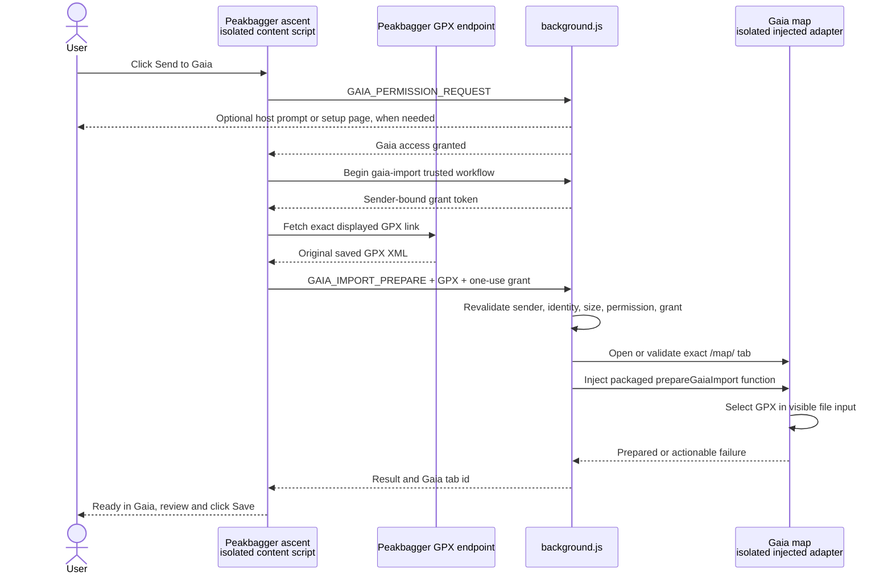

# Gaia saved-GPX handoff

This is the maintained design for Better Peakbagger's **Send to Gaia**
workflow. It covers the saved-ascent control, optional Gaia permission, exact
GPX acquisition, worker and tab coordination, Gaia's visible importer, privacy
boundaries, failure handling, and verification.

The feature deliberately stops at Gaia's import preview. Better Peakbagger
does not use a Gaia API token, inspect Gaia credentials, or click Gaia's
**Save** control. The user reviews the imported items and saves them in Gaia. The
onX-specific contract is documented in [onX saved-GPX handoff](onx-import.md).

## User workflow

On a Peakbagger saved-ascent page with a valid GPX download:

1. Better Peakbagger places a shared **Send to Gaia** and **Send to onX**
   control immediately after Peakbagger's native GPX download link.
2. The user clicks **Send to Gaia**.
3. On first use, the browser asks for access to `www.gaiagps.com`. Firefox may
   open a themed Better Peakbagger access page for this one-time grant.
4. Better Peakbagger reads the exact saved GPX from Peakbagger using the
   current signed-in Peakbagger session.
5. It opens Gaia's map, selects that GPX in Gaia's visible importer, and waits
   until Gaia shows at least one item ready to save.
6. The Peakbagger control changes to **Ready in Gaia**. The user reviews the
   preview and clicks **Save** in Gaia.

The permission grant is reusable. Once it exists, a normal signed-in run needs
only the **Send to Gaia** click and Gaia's final **Save** click.

## Runtime sequence



The GPX body exists only in page memory, the runtime message, the injected
function arguments, and Gaia's file-import path. It is not a background fetch,
storage record, log payload, or analyzer-derived reconstruction.

## Saved-ascent surface and placement

`manifest.json` loads `content/ascent-gaia.js` and `css/ascent-gaia.css` as an
independent isolated-world surface on saved-ascent URLs. The same surface owns
both Gaia and onX buttons so their placement observers cannot compete. Keeping
it separate from backup and GPX Analyzer bundles prevents a map-service failure
from disabling those features.

`src/ascent/ascent-page.js` finds Peakbagger's stored-track link. Before
showing the control, `src/gpx/saved-gpx-source.js` requires:

- an HTTPS Peakbagger `climber/ascent.aspx` page with exactly one positive
  `aid`;
- an HTTPS Peakbagger `climber/GPXFile.aspx` link on the same origin;
- exactly one matching positive `aid` on the GPX link; and
- no URL username or password fields.

No GPX request occurs while the page loads. A synthetic page event is ignored;
the read begins only from a trusted button activation.

The GPX Analyzer loads independently and may add its panel after the map
handoff control. One `MutationObserver` therefore maintains the invariant that
the shared control is the download link's immediate sibling. The observer suspends for a
persisted `pagehide`, resumes and revalidates placement on `pageshow`, and is
removed on terminal page disposal through `src/ui/page-lifecycle.js`.

The compact Gaia and onX pills use the site's explicit light/dark theme where
present and the operating-system scheme otherwise. The Firefox access page uses the
shared extension-panel palette and pre-paint theme bootstrap.

## Optional permission

Gaia is declared only in `optional_host_permissions`:

```json
"https://www.gaiagps.com/*"
```

The first message after the trusted click is `GAIA_PERMISSION_REQUEST`. The
worker calls `permissions.request()` immediately, without an earlier awaited
`permissions.contains()` call, so a browser that propagates the click to the
worker can associate its native prompt with that activation.

If the browser rejects permission requests from that background context, the
worker opens the packaged `gaia/access.html` page in the same window. A click
on **Allow Gaia access** requests exactly the Gaia origin from an extension
document. After granting it, the user returns to Peakbagger and clicks **Send
to Gaia** again. A denied request reads no GPX and leaves the action retryable.

The permission allows packaged code to run on Gaia's map. It does not expose a
Gaia password or create an extension-owned Gaia login. Gaia's own tab and
session continue to own authentication.

## Trusted action and GPX acquisition

After permission succeeds, `src/ui/trusted-action.js` proves that the action
came from a trusted DOM event. The worker binds the resulting `gaia-import`
grant to the source tab, frame, document when available, action name, and UI
generation. The initial capability expires after five seconds. Its workflow
grant can survive MV3 worker suspension, but the Gaia route consumes it once.

Only then does `readSourceGpx()` fetch the link displayed on the saved ascent.
The shared Peakbagger request boundary supplies the current session cookies,
uses `cache: no-store`, applies a deadline and response-size bound, and
classifies sign-in, Cloudflare, HTTP, content, and transport failures.

The Gaia source gate additionally requires:

- a final response on the same Peakbagger origin;
- a GPX document root;
- no XML parser error or document type declaration;
- at least one track point, route point, or waypoint; and
- a UTF-8 body no larger than 15 MiB.

The successful result retains the response text exactly and names the file
`peakbagger-<aid>.gpx`. Better Peakbagger does not reduce, normalize, redact,
or regenerate the saved export for this workflow.

This source is deliberately separate from Garmin and Strava activity capture.
Raw provider GPX is parsed on the provider page and is never an input to the
Gaia handoff. Analyzer arrays and draft payloads are not inputs either.

## Worker and tab coordination

`src/background/gaia-routes.js` configures the shared
`src/background/gpx-handoff-routes.js` transaction, which revalidates the
request before opening Gaia:

- the sender must be the exact Peakbagger saved-ascent document;
- `sourceUrl` must equal that document URL;
- the filename's numeric id must equal the page `aid`;
- the GPX must be a string within the 15 MiB limit;
- the sender-bound `gaia-import` grant must be valid and is consumed once; and
- optional Gaia permission must still be present.

Only one Gaia import may run at a time for a given Peakbagger source tab. The
worker normally creates an inactive `https://www.gaiagps.com/map/` tab in the
same window, waits up to 25 seconds for it to finish loading, validates its
origin and exact `/map/` path, injects the adapter, and then activates the tab.

If Gaia asks the user to sign in, the returned tab id stays with the page. A
later trusted click may reuse it only when it remains in the same browser
window and still has the exact Gaia map URL. Other retryable failures discard
the id so the next click starts with a fresh map tab. An arbitrary Gaia tab is
never discovered or reused by URL search.

## Gaia adapter contract

`prepareGaiaImport()` is passed directly to `scripting.executeScript`, so it is
self-contained and depends only on browser globals available inside Gaia's
isolated world. It does not load remote code.

Before supplying a file, it checks:

1. the document origin is exactly `https://www.gaiagps.com` and its path is
   exactly `/map/`;
2. the filename and GPX size still match the handoff contract;
3. exactly one visible `button[aria-label="Import Data"]` exists;
4. the importer is enabled, or Gaia visibly requires login;
5. no existing non-empty Save preview is already present;
6. this document has not started an earlier Better Peakbagger handoff; and
7. exactly one empty, enabled file input with Gaia's expected placeholder and
   `.gpx` acceptance appears after opening the importer.

At the final handoff boundary, the adapter creates a browser `File` from the
unchanged XML, places it in a `DataTransfer`, assigns that file list to Gaia's
input, and dispatches the bubbling `input` event Gaia's importer consumes. It
then waits for exactly one enabled `Save N item(s)` control with a nonzero item
count.

The Save control is evidence that the preview is ready. The adapter never
clicks it. A change to Gaia's labels or DOM fails closed before the transfer
when possible and produces an actionable status instead of guessing at a
different control.

## Data boundary

| Location | Data present | Persistence |
| --- | --- | --- |
| Peakbagger ascent content script | Page URL, displayed GPX URL, original GPX, generated filename | JavaScript memory for the active transaction |
| Background worker message | Source URL, original GPX, filename, sender-bound grant | JavaScript memory; the grant record contains no GPX |
| Gaia injected adapter | Original GPX and `peakbagger-<aid>.gpx` filename | JavaScript memory and Gaia's importer |
| Extension storage | Trusted-action token metadata | No GPX body, GPX URL, or Gaia credential |

Gaia receives every field already present in Peakbagger's saved export. That
can include track, route, and waypoint coordinates; elevation and time; names;
and GPX extensions. Gaia also sees the Peakbagger ascent id in the generated
filename. Better Peakbagger does not read or pass Gaia cookies, passwords, or
account data.

## Result and recovery states

| State | Page behavior | Safe next action |
| --- | --- | --- |
| Permission denied | No GPX read; **Send to Gaia** remains enabled | Grant Gaia access and retry |
| Firefox setup opened | No GPX read; setup instructions remain beside the button | Grant access in the opened tab, return, and retry |
| Peakbagger GPX rejected | No Gaia handoff; error remains beside the button | Use the native download to inspect the file, then retry if corrected |
| Gaia sign-in required | No file supplied; Gaia tab id is retained | Sign in in that tab, return, and click **Try again** |
| Importer unavailable or ambiguous | No confirmed file handoff | Import manually or retry in a fresh Gaia map tab |
| Preview prepared | Button becomes **Ready in Gaia** and is disabled | Review the Gaia tab and click Gaia's **Save** |
| File supplied but preview unconfirmed | Button becomes **Check Gaia** and is disabled | Inspect the Gaia tab; do not send again blindly |
| Runtime result lost | Button becomes **Check Gaia** and is disabled | Inspect Gaia before deciding whether manual action is needed |

The distinction between “not supplied” and “possibly supplied” prevents a
timeout or lost worker response from duplicating an import. Once file
assignment may have happened, the source page does not offer an automatic
retry.

## Verification

Focused tests cover source URL and GPX validation, trusted activation,
permission setup, worker sender and grant checks, tab reuse, uncertain
handoffs, control placement, BFCache restoration, and access-page behavior:

```text
test/ascent/ascent-gaia.test.mjs
test/background/gaia-routes.test.mjs
test/gaia/gaia-access.test.mjs
test/gpx/saved-gpx-source.test.mjs
test/project/manifest-capture.test.mjs
```

`npm run verify:map-handoffs` (also available as `verify:gaia`) builds and loads
the real unpacked `dist/` in hidden Chrome for Testing. It serves masked HTTPS
fixtures on real Peakbagger, Gaia, and onX hostnames and verifies:

- exact placement beside the GPX download;
- trusted click and worker routing;
- exact saved GPX text and filename handoff;
- manual Gaia Save;
- signed-out, stalled, duplicate, and uncertain states;
- absence of GPX XML from extension session storage; and
- light and dark rendering at 1000 × 760.

The verifier grants Gaia and onX in a disposable manifest because hidden automation
cannot inspect native permission chrome. It also uses a masked Gaia fixture,
not the live authenticated service. Before release, manually check the native
first-run permission experience and one low-volume signed-in Gaia import in a
dedicated browser profile. Confirm that the preview contains the expected
items and that Better Peakbagger leaves **Save** untouched.

## Change checklist

When maintaining this integration:

- keep Gaia access optional and scoped to `https://www.gaiagps.com/*`;
- keep `prepareGaiaImport()` self-contained for function serialization;
- preserve the exact saved Peakbagger GPX instead of using provider capture or
  analyzer data;
- do not write GPX XML or Gaia credentials to extension storage;
- consume one sender-bound trusted grant for each handoff;
- validate one exact Gaia map tab and one visible importer/input path;
- preserve the possibly-supplied state and suppress blind retries;
- keep Gaia's final Save user-owned;
- update `PRIVACY.md` if the destination or transferred fields change; and
- update both focused tests and the masked browser verifier when Gaia's visible
  importer contract changes.
