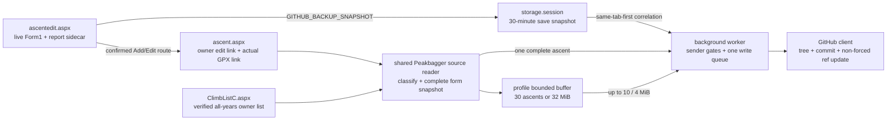
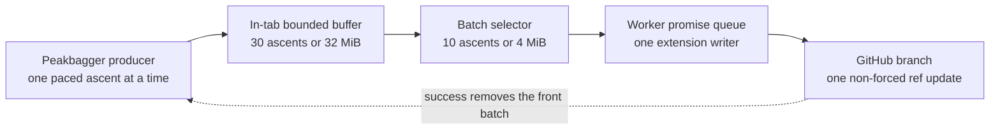

# GitHub ascent backup: complete design and failure model

This is the single maintained design for GitHub backup. It covers the
manual saved-ascent action, automatic backup after Add/Edit, full-profile
backup, source-data acquisition, snapshot correlation, batching, repository
writes, the manual custom-favorites companion file, authentication, failure
handling, and the regressions that established the current invariants.

The completed implementation records remain in
[archive/github-ascent-backup-plan.md](archive/github-ascent-backup-plan.md) and
[archive/full-profile-backup.md](archive/full-profile-backup.md), with favorite
climbers in [archive/favorite-climbers.md](archive/favorite-climbers.md). Those
files are historical. When they disagree with this document or current code,
this document and current code win.

Real GitHub device authorization, a rate-limited live Peakbagger Add/Edit, live
stored-GPX timing, and a scratch-repository commit remain manual pre-release
checks. They require the maintainer's signed-in sessions and must not be turned
into high-volume production-site automation.

## The contract in one paragraph

Every backup is a **complete replacement of one persisted Peakbagger ascent**,
not a patch assembled from whatever a display page happens to render. All three
entry points read raw ascent fields through the same edit-form snapshot builder,
classify Peakbagger responses through the same body-aware reader, serialize
through the same payload builder, and write through the same GitHub client and
worker queue. Manual and automatic individual backup are literally the same
`runBackup()` path. Full-profile backup has different orchestration and a
deliberately different way to discover whether a GPX exists, but its form
fields, response validation, GPX body validation, snapshot schema, and GitHub
writer are shared.

The custom favorite-climber list is a separate, manual root-file operation. It
shares the worker's credential gate, write queue, repository marker validation,
atomic commit, and conflict retry, but never enters any ascent payload or
automatic-backup path.

## The three shipped ascent entry points

| Concern | Full profile | Automatic after Add/Edit | Manual saved-ascent action |
| --- | --- | --- | --- |
| User trigger | **Back up all ascents** or confirmed **Refresh all** on the owner's `ClimbListC.aspx` | Separate opt-in; a confirmed Add/Edit success routes to `ascent.aspx` | **Back up to GitHub** beside Peakbagger's owner actions |
| Raw fields | Fetch each owner-only `AscentEdit.aspx?aid=…`; shared persisted-form reader | Fetch that ascent's owner-only edit URL; shared persisted-form reader | Same as automatic; the same `runBackup()` function |
| Raw-field mapper | `src/ascent-snapshot.js` via `src/ascent-backup-source.js` | Same | Same |
| Report body | Persisted `JournalText`, bracket markup converted to Markdown | Fresh save-time exact Markdown sidecar when present; otherwise persisted `JournalText` conversion | Fresh sidecar if a matching save transaction still exists; otherwise persisted conversion |
| GPX existence | Owner-list GPS marker | Actual GPX link on `ascent.aspx` | Actual GPX link on `ascent.aspx` |
| GPX URL | Shared canonical `GPXFile.aspx?aid=<aid>&sep=1` builder | The exact display-page link | The exact display-page link |
| GPX validation | Shared response/body classifier requires `<gpx` | Same | Same |
| Worker message | `GITHUB_BACKUP_PROFILE_BATCH` | `GITHUB_BACKUP_ASCENT` with `auto: true` | `GITHUB_BACKUP_ASCENT` with `auto: false` |
| GitHub unit | Up to ten ascents in one atomic commit | One ascent in one atomic commit | One ascent in one atomic commit |
| Durable resume point | Repository folder leaves | Repository state; pending save snapshot is only a short-lived report aid | Repository state |

The GPX discovery difference is intentional. Fetching every display page during
a profile sweep would add one request per ascent solely to find a link whose
existence is already represented by the owner list. The profile path therefore
trusts the verified list marker and centralizes the current URL shape in one
helper. Individual backup is already on the display page and follows its exact
link, which automatically tracks endpoint query changes.

## Non-negotiable correctness invariants

1. **A committed snapshot is complete.** `pageComplete: true` means the payload
   came from a validated owner edit form, not from a sparse display-page scrape.
2. **Missing and blank are different.** A blank control means the user cleared
   that field and the old value must disappear. A missing control means the page
   is incomplete and the backup must abort.
3. **Identity is checked twice.** The page surface proves ownership through the
   edit link; the shared form reader checks the requested ascent and peak ids;
   the worker checks message shape and ascent ids again.
4. **Track state is three-valued.** There is authoritatively no track; there is
   a validated GPX string; or a track was expected but could not be read. The
   third state aborts and must never be coerced to "no track."
5. **Peakbagger reads stay in a Peakbagger tab.** Content scripts use the signed-
   in, same-origin session. The background worker does not fetch private ascent
   forms or tracks.
6. **Raw provider GPX is not backup input.** Backup exports only Peakbagger's
   stored, user-published GPX. The Garmin/Strava capture privacy boundary is
   unchanged.
7. **Automatic means after a proven save.** A normal revisit must not produce a
   new commit. Automatic backup requires a fresh matching save-time snapshot.
8. **The token never enters a content script.** Only status, repository display
   name, folder leaves, payloads, and typed results cross extension messaging.
9. **Every branch change is atomic and non-forced.** A batch becomes visible
   only when one commit's branch-ref update succeeds.
10. **There is one extension-owned branch writer.** Manual, automatic, and
    profile writes share one worker promise queue. External writers are handled
    by bounded optimistic-concurrency retries.
11. **GitHub is not used to repair an incomplete read.** Merging a sparse new
    payload with old committed JSON would preserve values the user may have
    intentionally cleared. The safe operation is to reject the sparse read.
12. **The repository is the full-profile checkpoint.** In-memory pipeline state
    is bounded and disposable; committed `-a<aid>` folders determine later work.

## Runtime ownership

| Module | Owns | Must not own |
| --- | --- | --- |
| `src/report-editor.js` | Pre-Save flush, exact Markdown sidecar, save-time snapshot emission | GitHub token, repository writes, post-save identity guessing |
| `src/ascent-snapshot.js` | The only mapping from Peakbagger form control names to raw snapshot fields | Network, extension storage, GitHub serialization |
| `src/ascent-saved.js` | Add/Edit success recognition and routing to the saved ascent | Clicking Save, constructing backup payloads |
| `src/ascent-page.js` | Saved `aid`, owner edit link, peak fallback, date fallback, actual GPX link | Raw form-field or rendered-report backup scraping |
| `src/ascent-backup-source.js` | Authenticated Peakbagger reads, response classification, edit-form completeness, identity checks, persisted snapshot construction, profile GPX URL | UI, queue policy, GitHub access |
| `src/ascent-backup.js` | Compact saved-ascent control and the shared manual/automatic individual orchestration | Form mapping, GitHub credentials |
| `src/profile-backup-core.js` | Pure owner-list parsing, response classifier, work diff, producer/consumer state machine and limits | Browser APIs, tokens, DOM globals |
| `src/profile-backup.js` | Owner-list UI, full-list fetch, per-ascent production, progress/pause/resume | Raw field mapping, GitHub credentials |
| `options/favorites.js` | Validate/serialize explicit favorites backup and schema-check reversible restore | GitHub credentials or repository mutation |
| `src/background.js` | Sender gates, session snapshots, auth lookup, timestamping, write serialization, message routing | Peakbagger DOM parsing |
| `src/github-backup.js` | Pure folder naming and JSON/Markdown/file payload serialization | DOM, tokens, network |
| `src/github-client.js` | Repository inspection, atomic Git Data writes, owned-file pruning, conflict retry | Peakbagger data acquisition or UI |
| `src/github-auth.js` | Device flow and local token/repository storage | Synced settings or content-script exposure |

The bundle composition in `scripts/build-config.mjs` pins
`ascent-backup-source.js` into both individual and profile bundles. Tests pin
that composition so a future refactor cannot silently give the surfaces
different source readers again.

## End-to-end topology



## Source acquisition: what “shared logic” means

### Authenticated fetch and response classification

`fetchPeakbaggerResource()` always uses:

```js
{
  credentials: 'include',
  redirect: 'follow',
  cache: 'no-store'
}
```

The classification does not trust `response.ok`:

- Cloudflare markers, `cf-mitigated`, and status 403/429/503 classify as
  `challenged`.
- status 0 and other 5xx responses classify as `transient`.
- other non-2xx responses classify as `wrong-content`.
- a GPX response is valid only if its body contains a `<gpx` root marker.
- an edit response is valid only if the body contains `Form1`, `JournalText`,
  `DateText`, and `PeakListBox`.
- a list response is valid only if its body identifies `ClimbListC.aspx` and an
  ascent-list heading.

This matters because Peakbagger endpoint failures and authentication redirects
can end at an HTTP 200 HTML error page. A status-only check turns an error page
into apparently valid data. Rejected bodies are not returned to callers as
successful text.

### Persisted form completeness and identity

`snapshotFromEditDocument()` performs one shared sequence:

1. Locate `Form1` by id or name.
2. Require `JournalText`, `DateText`, and `PeakListBox`. Their absence proves the
   response cannot be a complete ascent record.
3. Build URL parameters from the edit URL, then set the expected `aid`, `pid`,
   and `cid` when known.
4. Convert persisted `JournalText` from Peakbagger bracket markup to Markdown.
5. Call the one raw-field mapper, `ascentSnapshot.build()`.
6. Require the resulting ascent id and, when known, peak id to equal the
   requested identity.
7. Use the verified display/list date and peak name only when the edit form
   leaves those human-readable values blank.

The fallback does not turn a sparse page into a complete form. It supplies two
known list/display labels after the required edit controls and numeric identity
have already passed.

### Raw form-field map

`src/ascent-snapshot.js` is the only module allowed to know these ASP.NET
control names:

| Snapshot field | Peakbagger source |
| --- | --- |
| ascent id, climber id, fallback peak id | edit URL `aid`, `cid`, `pid` |
| date, suffix | `DateText`, `SuffixText` |
| ascent type | checked `AscentTypeRBL` label |
| routes and external report URL | `RouteUp`, `RouteDn`, `URLTB` |
| gain/loss/distance | `GainFt`, `LossFt`, `UpMi`, `DnMi`, `ExUpFt`, `ExDnFt` |
| travel times | `UpHr` + `UpMin`, `DnHr` + `DnMin` |
| nights and elevations | `AscentNightsDD`, `StartFt`, `EndFt`, `PointFt` |
| quality | `AscentQuality` |
| gear | checked `GearCheckBoxList$…` labels |
| registered companions | links and labels in `OthersTable` |
| unregistered companions | plain-name rows in `OthersTable` |
| weather | `PrecipDD`, `TempDD`, `WindDD`, `VisDD`, `WeatherText` |
| peak | selected `PeakListBox` option, then verified URL/list fallback |
| report | `JournalText`, or the save-time Markdown sidecar described below |

`OthersText` is deliberately excluded. It is the autocomplete search input and
is normally cleared after adding a companion; the actual committed companion
state lives in `OthersTable`.

The snapshot layer preserves raw strings such as `"9,000"` or `"8.0"`. The
pure GitHub payload builder later converts finite numeric fields and omits blank
or unparseable values. This separation keeps DOM knowledge out of repository
serialization.

## Save-time transaction and Add/Edit routing

### Before Peakbagger Save

The report editor already has a synchronous flush boundary. On a qualifying
Save click or implicit form submission it:

1. flushes the active Rich/Markdown/Plain editor into `JournalText`;
2. resolves the report body to exact Markdown source when a valid Markdown
   sidecar exists, otherwise converts the submitted bracket markup;
3. serializes the live `Form1` through `ascent-snapshot.js`; and
4. sends `GITHUB_BACKUP_SNAPSHOT` without delaying or changing the Peakbagger
   submission.

The snapshot is best-effort. Failure to capture it never blocks Save.

The worker stores at most ten pending records in `storage.session`, each with a
30-minute expiry. New ascents have no `aid` before Peakbagger accepts them, so a
plain climber + peak + date key is not globally unique. The storage key is
therefore:

```text
climberId | peakId | normalizedDate | source tab id
```

Matching prefers records from the saved page's tab, then falls back to the
newest precise identity match. It matches known `aid` first, then peak + date
for a newly assigned ascent. This prevents two same-day, same-peak Add forms in
different tabs from overwriting or consuming each other's exact report.

### After Peakbagger Save

Peakbagger does not reliably navigate to `ascent.aspx`. Add and Edit can both
finish on the same `ascentedit.aspx` URL in an ASP.NET UpdatePanel success view.
`src/ascent-saved.js` therefore:

1. recognizes the observed success variants `Ascent Added/Saved Successfully`,
   `Ascent Added Successfully`, and `Ascent Saved Successfully`;
2. gets an edited ascent's id from the URL `aid`;
3. gets a new ascent's assigned id from Peakbagger's success-view photo link;
4. inserts **View the Saved Ascent** next to the native referring-page action;
5. observes the parent of the UpdatePanel because the panel itself may be
   replaced; and
6. follows the link only when GitHub backup is enabled, connected, automatic is
   enabled, the success view is still current, and the resolved id is unchanged.

The link is useful even when backup is disabled. No extension code clicks
`SaveButton` or `SaveButton2`.

## Individual backup: manual and automatic are one path

On `ascent.aspx`, `src/ascent-page.js` reads only stable routing facts:

- `aid` from the page URL;
- ownership from an `AscentEdit.aspx?aid=<same aid>` link;
- peak id/name and a best-effort date fallback;
- the exact stored-GPX download link, when present.

The rendered report and other display fields are intentionally not backup
sources. The display page is presentation, not a lossless record.

After `GITHUB_BACKUP_STATUS` confirms enabled + connected, the extension mounts
a compact inline action beside Peakbagger's native owner actions. There is no
fixed or sticky banner.

Both manual click and automatic entry call the same `runBackup(info, {auto})`:

1. fetch and validate the exact owner edit URL;
2. parse one complete persisted snapshot through the shared source reader;
3. if the display page has no GPX link, set GPX to `null` authoritatively;
4. if it has a link, fetch that exact URL and require valid GPX content;
5. send `GITHUB_BACKUP_ASCENT` with `pageComplete: true` and the `auto` flag;
6. render the commit link or a typed, retryable error.

Automatic mode has one additional worker rule: if no fresh save-time snapshot
matches, return `no-fresh-save`. The surface quietly returns to the manual
button. This is how an ordinary revisit avoids a surprise commit.

### Merge precedence at the worker

When a pending snapshot exists:

- the complete persisted form replaces ascent fields, including explicit
  blanks;
- nonblank persisted peak fields replace save-time peak fields;
- the nonblank exact save-time Markdown sidecar wins over the converted
  persisted report; and
- the worker stamps current extension version and `syncedAt`.

Without a pending snapshot, a manual backup remains safe because the content
script supplied a complete persisted form. Without both a pending snapshot and
`pageComplete: true`, the worker returns `no-data`.

## GPX semantics

The writer accepts `string | null`, but acquisition must preserve three states:

| Observation | Meaning | Action |
| --- | --- | --- |
| No display link / no verified list GPS marker | Peakbagger stores no track | Commit without `track.gpx`; an old owned `track.gpx` is removed on re-sync |
| Link/marker exists and body validates as GPX | Track is present | Commit the returned bytes as `track.gpx` |
| Link/marker exists but request, redirect, or body validation fails | Track state is unknown | Abort that ascent; never replace with `null` |

For individual backup the link itself is the existence signal. For profile
backup the owner-list GPS icon/title is the existence signal and the shared
helper builds `/climber/GPXFile.aspx?aid=<aid>&sep=1`. The retired
`GetAscentGPX.aspx` endpoint can redirect to a 200 HTML error page; body
classification is what prevents that page from becoming a `.gpx` file or from
being mistaken for track absence.

## Full-profile producer-consumer pipeline

### Owner list and work diff

Profile backup mounts only on `ClimbListC.aspx`. The parser requires:

- a numeric `cid` in the page URL;
- a **My Ascents** or **Add Ascent** account link with the same climber id;
- a valid ascent link and peak link for every included row; and
- an owner-only edit link on every ascent record.

Failure clears the work list rather than treating a public or mismatched list as
the user. Starting on a one-year page fetches the same climber's all-years URL
with `j=-1`, `y=9999`, and a default `sort=AscentDate`.

The worker preflight returns only root backup folder leaves. The work-list diff
extracts exact terminal `-a<aid>` identities:

- **Back up all ascents** skips ids already represented in the repository.
- **Refresh all** includes every unique list id after explicit confirmation.
- A failed or never-reached ascent has no committed folder change, so a later
  ordinary run naturally retries it.

### Why a pipeline

For ascent `i`, let `Pᵢ` be the edit-form + optional GPX production time and
`Gᵢ` the GitHub commit time. A serial loop costs roughly:

```text
Tserial ≈ Σ(Pᵢ + Gᵢ + pacing)
```

A bounded producer/consumer pipeline moves the healthy steady state toward:

```text
Tpipeline ≈ startup + max(total Peakbagger production, total GitHub consumption)
```

More importantly, ten ordinary ascents require one tree, one commit, and one
branch update instead of ten independent branch pushes. The producer remains
sequential and paced; concurrency exists between the Peakbagger reader and the
single GitHub consumer, not among Peakbagger requests or branch writers.



### Bounds, retry, and flush rules

| Control | Current default | Why it exists |
| --- | ---: | --- |
| Peakbagger pacing | 2 seconds between ascents | Avoid an aggressive same-origin sweep |
| Transient retry delays | 4 and 15 seconds | Retry short read failures without a tight loop |
| Consecutive exhausted transients before pause | 2 | Stop broad failure from turning into a full sweep |
| Batch ascent limit | 10 | Worker validation ceiling and readable commits |
| Batch payload target | 4 MiB | Flush GPX-heavy work before ten ascents |
| Buffer ascent limit | 30 | Bound object-count growth while GitHub is slow |
| Buffer payload limit | 32 MiB | Bound retained snapshot + GPX strings |
| Oversized-file inline limit | 1 MiB | Use Create Blob only for unusually large individual files |
| GitHub conflict delays | 0.5, 2, and 5 seconds | Absorb brief ref races and propagation windows |

The consumer starts a batch when any of these is true:

- ten ascents are buffered;
- buffered payload reaches 4 MiB; or
- production is finished and a smaller final batch remains.

`nextBatch()` includes at least one ascent even if that ascent alone exceeds the
4 MiB target. The producer cannot know the GPX size before reading it, so one
large ascent may take the buffer beyond 32 MiB. The invariant is that no next
Peakbagger request starts until successful consumption frees space.

The in-flight batch stays at the front of the buffer until GitHub succeeds. It
therefore counts against both buffer limits and remains available for Resume.

### Backpressure

When either buffer limit is reached:

1. production stops before the next Peakbagger request;
2. the GitHub consumer continues its current write/retry;
3. the UI says reading is waiting for GitHub and reports buffered count; and
4. a successful commit removes the batch and wakes the producer.

This is a wait state, not a failure. Unlimited read-ahead was rejected because
it would retain an entire private profile's reports and tracks during a GitHub
outage, continue loading Peakbagger when the destination cannot progress, and
still lose everything on tab closure. Making that queue durable would require a
new IndexedDB/storage retention model, quota policy, cleanup rules, and privacy
disclosure.

### Pause, challenge, cancel, and closure

- **User Pause:** both loops stop at their next safe asynchronous boundary;
  prepared ascents remain in memory.
- **Peakbagger challenge:** the producer stops on the interrupted URL. Resume
  probes that URL before retrying the item; it is not skipped.
- **Wrong content:** that ascent records a failure and the run continues. A
  later run sees no committed folder and retries it.
- **Transient read:** retry after 4 and 15 seconds. Two consecutive exhausted
  transient items pause before requesting the next ascent.
- **GitHub failure:** the rejected batch remains at the front of the buffer;
  Resume retries it without refetching its ascents.
- **Cancel during Peakbagger fetch:** the completed response is discarded before
  it reaches the buffer.
- **Cancel during GitHub write:** an already-issued atomic write cannot be
  retracted; it may finish, but no later batch starts.
- **Tab refresh/closure:** discards the in-memory buffer. Repository data remains
  consistent, and the next run diffs committed folders again.
- **Worker restart:** there is no durable worker-side batch queue. Repository
  state, not worker memory, is the resumability boundary.

## Extension messages and trust boundaries

| Message | Expected sender | Worker validation | Response sensitivity |
| --- | --- | --- | --- |
| `GITHUB_BACKUP_SNAPSHOT` | Peakbagger Add/Edit tab | Peakbagger hostname, feature enabled, nonempty key/snapshot; worker adds source tab and expiry | No token returned |
| `GITHUB_BACKUP_STATUS` | Peakbagger tab | Peakbagger hostname | Only enabled/auto/connected and repository display name |
| `GITHUB_BACKUP_ASCENT` | Owner saved-ascent surface | Peakbagger hostname; feature/auth/repo; fresh snapshot for auto; complete data requirement; final aid present before the client enforces a positive identity | Commit metadata or typed error |
| `GITHUB_BACKUP_PROFILE_STATUS` | `ClimbListC.aspx` | Peakbagger hostname and exact list pathname | Folder leaves, never token |
| `GITHUB_BACKUP_PROFILE_BATCH` | `ClimbListC.aspx` | Exact list pathname; 1–10 entries; each positive `aid` equals snapshot id; no duplicate ids; feature/auth/repo | Batch commit metadata or typed error |
| `GITHUB_FAVORITES_BACKUP` | Extension options page | Extension origin; feature/auth/repo; nonempty serialized content; fixed `favorites.json` path | Commit metadata, never token |
| `GITHUB_FAVORITES_RESTORE` | Extension options page | Extension origin; feature/auth/repo; fixed `favorites.json` path | File text or `null`, never token |

The individual worker gate is hostname-level; the content surface supplies the
stricter owner proof by requiring an edit link for the same aid before it even
asks for status. The profile worker gate is path-level because batch messages
are valid only from the owner-list surface. Favorite messages are extension-page
only: the options page applies the shared favorites schema before export and
again before replacing local state on restore.

## Repository layout and schema

```text
.better-peakbagger.json
favorites.json     # optional; written only by the explicit favorites action
2026-07-12-mount-rainier-a1234567/
  report.md
  ascent.json
  track.gpx        # omitted when Peakbagger authoritatively stores no track
```

The folder name is `<known-date>-<peak-slug>-a<aid>`:

- full dates remain `YYYY-MM-DD`;
- unknown day becomes `YYYY-MM`;
- unknown month/day becomes `YYYY`;
- no known date becomes `undated`;
- peak slugs are normalized, ASCII-safe, and capped at 60 characters; and
- terminal `-a<aid>` is the stable identity across date and peak edits.

Re-sync finds the exact aid suffix regardless of slug. A rename writes the new
folder and deletes only Better Peakbagger-owned `report.md`, `ascent.json`, and
`track.gpx` paths from old matching folders in the same tree. User-added files
under an ascent folder survive.

### `favorites.json` schema version 1

```jsonc
{
  "schemaVersion": 1,
  "exportedAt": "2026-07-21T21:04:05.000Z",
  "entries": [
    {
      "cid": 900002,
      "name": "Example Climber",
      "addedAt": 1784667845000,
      "source": "manual"
    }
  ]
}
```

The file is a complete export of the device-local custom list, capped at 500
entries. Restore rejects an unknown schema, malformed entry, duplicate id, or
oversized list before changing local storage, then offers a six-second Undo.
Buddy List cache metadata and owner identity are never exported. A missing file
is reported as an empty backup state, not treated as an empty list to restore.

### `ascent.json` schema version 1

```jsonc
{
  "schemaVersion": 1,
  "ascent": {
    "id": 1234567,
    "url": "https://peakbagger.com/climber/ascent.aspx?aid=1234567",
    "date": "2026-07-12",
    "suffix": "",
    "type": "Successful Ascent (stood on the summit)",
    "route": "Disappointment Cleaver",
    "routeDown": "Emmons Glacier",
    "externalUrl": "https://example.com/trip-report",
    "gainFt": 9000,
    "lossFt": 9000,
    "distanceUpMi": 8,
    "distanceDnMi": 8,
    "extraGainFt": 300,
    "extraLossFt": 300,
    "timeUp": "7:30",
    "timeDn": "4:15",
    "nightsOut": 1,
    "startFt": 5400,
    "endFt": 5400,
    "pointFt": 14411,
    "quality": 9,
    "gear": ["Ice Axe", "Crampons"],
    "companions": {
      "registered": [{ "id": 42, "name": "Ada" }],
      "others": "Sample Hiking Club"
    },
    "weather": {
      "precip": "No Precipitation",
      "temperature": "Cold",
      "wind": "Breezy",
      "visibility": "Clear",
      "description": "Clouds lifted at noon"
    }
  },
  "peak": {
    "id": 2296,
    "url": "https://peakbagger.com/peak.aspx?pid=2296",
    "name": "Mount Rainier",
    "elevationFt": 14411,
    "location": "Washington, USA"
  },
  "backup": {
    "syncedAt": "2026-07-12T21:04:05.000Z",
    "extensionVersion": "3.0.0"
  }
}
```

Only `id`, derived URL, `date` (possibly `null`), `suffix`, and the peak/backup
blocks are structurally present. Blank string fields, empty arrays/objects,
zero-valued dropdown placeholders, and unparseable numbers are omitted. A real
numeric zero is retained.

The serializer supports optional peak elevation/location if a trusted upstream
snapshot supplies them; the persisted edit-form path currently guarantees peak
id/name, not those optional display metadata fields.

### `report.md`

`report.md` has quoted YAML frontmatter for peak, known date, and Peakbagger URL,
followed by the resolved Markdown body. Exact save-time Markdown source wins
when available. Otherwise persisted bracket markup passes through the same
allowlisted report AST used by the editor.

### Track removal is intentional only after authoritative absence

The Git tree is built against the previous folder. If the new complete payload
contains no `track.gpx`, the old owned track path is deleted. That is correct
only because acquisition distinguished authoritative absence from failed read.

## GitHub authentication and repository selection

The shipped path is a GitHub App device flow with repository **Contents: read
and write**:

1. request a device code using the app's public `client_id`;
2. show the user code and GitHub verification URL;
3. poll no faster than GitHub's interval and honor `authorization_pending` and
   `slow_down`;
4. send the user through GitHub App installation, where repository scope is
   constrained to selected repositories;
5. discover installations and repositories through paginated GitHub APIs; and
6. require explicit repository selection and inspection.

Pending device state lives in `storage.session` so an MV3 worker restart does
not lose a code while the user is entering it. The long-lived user token and
chosen repository live in `storage.local`, never `storage.sync`. Content scripts
never receive the token.

An empty or recognized backup repository connects directly. A populated,
unmarked repository needs confirmation. A repository containing root folders
that already look exactly like Better Peakbagger backup folders but lacks the
marker fails closed because ownership is ambiguous. Archived or non-writable
repositories also fail before mutation.

A fine-grained PAT with one-repository Contents access is a possible fork-only
alternative, not a shipped path. Classic OAuth `repo` scope remains rejected
because it is broad and web OAuth token exchange requires a client secret.

## Atomic GitHub write algorithm

Every request uses `cache: 'no-store'` and authenticated GitHub API headers.
For each attempt the client:

1. resolves repository and target branch; rejects archived/read-only state;
2. reads the current branch ref, commit, and root tree;
3. initializes a genuinely empty repository with a marker-only Contents API
   commit because GitHub cannot create its first branch through Git References;
4. validates the marker and root backup folders;
5. builds all ascent additions/updates and owned old-path deletions against that
   exact base tree;
6. places files up to 1 MiB inline in Create Tree and uploads larger individual
   files through Create Blob;
7. creates one commit with the read head as parent; and
8. updates the branch with `force: false`.

Explicit favorite backup uses the same sequence with one root blob entry for
`favorites.json` (and the marker when adopting a confirmed unmarked repository).
It does not use a Contents API update, so it has the same compare-and-swap
behavior as ascent commits. Restore reads `favorites.json` from the selected
branch through GitHub's Contents endpoint, validates file/base64/UTF-8 shape in
the worker client, and leaves schema validation to the options-page owner.

No ascent in a batch is visible on the branch before step 8. A failed earlier
operation leaves the branch unchanged. A failed final ref update leaves an
unreferenced commit object, not a partial folder update.

Single commits read `Add ascent: …` or `Update ascent: …`. Multi-ascent commits
read `Back up N ascents` unless every entry is an update, in which case they
read `Refresh N ascents`.

### Internal and external concurrency

The worker's `githubWriteQueue` serializes all extension-owned writers—including
explicit favorite backup—before they read the branch. A separate browser,
GitHub web edit, or another
integration can still race externally.

On retryable 409 or non-fast-forward ref conflict, the client waits 0.5, 2, then
5 seconds. Each retry rereads the head and rebuilds the entire tree/commit.
Reusing the rejected commit would keep the wrong parent and cannot resolve a
real race. The client never force-pushes.

### Why every GitHub request bypasses browser cache

GitHub can serve authenticated ref GETs with `Cache-Control: private,
max-age=60`. The client reads through singular `/git/ref/heads/…` but PATCHes
plural `/git/refs/heads/…`; those are different browser cache keys. A successful
PATCH therefore does not guarantee eviction of the singular GET response.

Without `cache: 'no-store'`, the next profile batch could read the pre-push sha,
create a commit on the stale parent, and fail the non-forced update. All bounded
retries occur inside 60 seconds and can deterministically reread the same cached
sha. `no-store` is therefore a correctness requirement, not a performance
preference.

See GitHub's [Git Trees API][github-trees] and
[Git Database guide][github-git-database].

## Error and state model

### Peakbagger-side states

| State | Individual behavior | Profile behavior |
| --- | --- | --- |
| challenge | Show read/track error; retry is user-driven | Pause on exact URL; Open check + Resume reprobe |
| network/read transient | Abort and offer Try again | Retry 4s/15s; record failure; pause after two consecutive exhausted items |
| wrong edit/list body | Abort without worker push | Record ascent failure or fail list preparation |
| expected GPX but invalid body | Abort; preserve old repository track | Record ascent failure; later run retries |
| no GPX signal | Send `null` authoritatively | Send `null` authoritatively |

### GitHub-side typed errors

The UI distinguishes invalid/revoked auth, withdrawn repo access, missing
selection, archived repository, branch protection, missing branch in a nonempty
repo, ambiguous backup paths, rate limits, network errors, validation, and
persistent conflicts. Profile GitHub errors pause with the entire rejected
batch retained. Individual errors retain the pending save snapshot because it
is consumed only after a successful commit.

## Incident postmortem: lossy individual re-backup

### User-visible evidence

The regression was exposed by ascent 2279806 and backup commit
[`82aebfce`](https://github.com/wilmtang/better-peakbagger-backup/commit/82aebfce0303c04bb5a5671c157efa91d4cb9779).
That update:

- renamed `2022-06-04-mount-washington-a2279806` to
  `undated-mount-washington-a2279806`;
- changed `ascent.date` from `"2022-06-04"` to `null`;
- removed `type`, `nightsOut`, `pointFt`, and `quality`;
- removed the date from `report.md` frontmatter; and
- updated only the sync metadata.

The writer behaved as designed: it treated the new payload as the complete
current ascent and removed fields absent from it. The defect was upstream: the
individual page path had produced a sparse payload and incorrectly labelled it
complete enough to replace the old backup.

### Root-cause chain

1. The individual path treated `ascent.aspx` as a backup record even though it
   is a presentation page and omits many edit-form fields.
2. The date parser and fixture expected an **Ascent Date** label while the live
   page used **Date**, so even a field the display page did render became blank.
3. Missing display fields became empty/absent snapshot properties.
4. The background merge/writer could not distinguish "user cleared this field"
   from "the display page never rendered this field."
5. Re-sync correctly pruned old values and renamed the folder to `undated`.
6. GPX read failure and GPX absence were also too easy to conflate, risking
   removal of an older `track.gpx` after an ambiguous fetch.

### Add/Edit routing defects found in the same audit

- Peakbagger keeps both Add and Edit on an `ascentedit.aspx` success view; code
  that assumes navigation to `ascent.aspx` misses the real transition.
- New Add has no URL aid before save and must resolve the assigned id from the
  success-view photo link.
- Edit retains the stable URL aid and may not have the same new-ascent link.
- Success copy has multiple live variants and can arrive by whole-UpdatePanel
  replacement.
- Automatic logic that handles only Add, only one exact success string, or only
  an initial DOM load is incomplete.

### Concurrency defect found after the data-loss fix

A new ascent's save-time snapshot originally used only climber + peak + date.
Two tabs adding the same peak on the same day could overwrite each other before
either had an aid. The worker now namespaces storage by source tab and prefers
same-tab correlation. Regression coverage drives two identical new-ascent
identities with different reports through the built worker and proves each tab
consumes its own snapshot.

### Why tests allowed it

- The saved-ascent fixture used a label variant that the parser understood,
  while the referenced live page used another.
- Tests asserted fields present on the display fixture but did not assert that
  every raw edit-form field survived an individual re-backup.
- The individual and profile paths had separate fetch/form orchestration, so
  profile's safer owner-edit-form behavior did not protect the individual path.
- A success-path test proved "a commit happened" but did not prove the update
  was non-lossy against a previously richer backup.
- Status-only or happy-GPX stubs did not represent a redirected 200 HTML error
  from a retired endpoint.
- No test stored two identical pre-aid snapshots from different tabs.

### Safeguards now in code and tests

- Both surfaces bundle `ascent-backup-source.js`.
- Every individual backup fetches the owner edit form; the rendered report
  fallback has been deleted.
- The shared form reader rejects missing required controls and id mismatches.
- Explicit blanks from a complete form overwrite old values; incomplete forms
  never reach GitHub.
- Actual/expected GPX fetches require GPX content; ambiguous failure aborts.
- Add and Edit success variants, URL/photo aid extraction, and UpdatePanel
  replacement have focused tests.
- Auto revisit without a fresh save returns to the manual action.
- Concurrent same-identity new-ascent snapshots are isolated by tab.
- The obsolete one-at-a-time profile worker message has been removed; there are
  exactly three shipped ascent entry points and one profile batch message.
- Favorite backup/restore is manual-only, extension-page-only, and does not
  change the ascent entry-point contract.

## Verification matrix and what it cannot prove

| Check | Proves | Does not prove |
| --- | --- | --- |
| `test/ascent-snapshot.test.mjs` | ASP.NET field-name mapping and normalization | Live Peakbagger DOM stability |
| `test/ascent-backup-source.test.mjs` | Shared fetch options, body classification, form completeness/identity, GPX URL | Signed-in network behavior |
| `test/ascent-backup.test.mjs` | Compact action, persisted form + actual GPX, manual/auto message shape, fail-closed UI | Real Save transition or GitHub service |
| `test/ascent-saved.test.mjs` | Add/Edit success variants, aid extraction, UpdatePanel observation, auto routing | Peakbagger changing its success markup |
| `test/profile-backup*.test.mjs` | Owner gates, all-years diff, pipeline bounds, retry/pause/backpressure | A multi-hour live profile sweep |
| `test/github-backup-integration.test.mjs` | Built worker gates, merge precedence, tab correlation, atomic batch/root-file calls | Real extension worker eviction timing |
| `test/github-client.test.mjs` | Git tree/root-file construction, owned deletion, root-file decode, cache mode, conflicts, error taxonomy | GitHub service-side policy changes |
| `npm test` | Current built IIFE bundles in jsdom plus pure modules | Real manifest interpretation and browser worker lifecycle |
| `npm run verify:browsers` | Real unpacked Chrome/Firefox startup, worker messaging, content-script load | Signed-in Peakbagger/GitHub flows and visible native chrome |
| Manual release check | Real Add/Edit, device flow, stored GPX, scratch commit | Repeatable regression coverage |

Live checks must remain minimal, owner-only, read-only toward Peakbagger except
for the maintainer's explicit Save, and rate-limited. Automated coverage belongs
in masked fixtures and scripted GitHub backends.

## Reviewer grilling: questions the design must answer

**Why not merge the new sparse JSON into the old GitHub JSON?** Because absence
may mean the user intentionally cleared a field. Only a complete source read can
distinguish clear from omission.

**Why fetch `AscentEdit.aspx` after Save if a save-time snapshot exists?** The
persisted form confirms what Peakbagger accepted, supplies an aid for the saved
record, and makes manual backup safe after the 30-minute snapshot expires. The
pending snapshot's unique value is exact editor Markdown and proof of a fresh
automatic transaction.

**Why is automatic stricter than manual?** Automatic runs on page load and would
otherwise re-commit every revisit. Manual is explicit user intent and is safe
without pending state because it still reads a complete persisted form.

**Why not fetch Peakbagger from the worker?** The content script already has the
authenticated same-origin session and sees challenge/ownership state. Moving
private reads to the worker would expand coupling and make page identity harder
to prove; the token boundary points in the other direction.

**Why do profile and individual GPX discovery differ?** The list has an
authoritative GPS marker but no download link. Fetching every display page only
to discover the link doubles profile reads. The URL construction is isolated in
one shared helper and validated by fixtures/live release checks.

**Why is a missing GPX allowed to delete an old track?** Only when absence is
authoritative: no actual display link or no GPS marker on a verified owner list.
An expected-track read failure aborts and preserves the old commit state.

**Why one GitHub consumer instead of ten concurrent commits?** Every commit
mutates one branch ref. Concurrent commits race after reading the same parent,
increase API mutations, and turn normal operation into conflict retries.

**Why keep the current batch in the buffer during upload?** Ownership transfers
only after the branch ref moves. Removing it earlier would lose retry data when
GitHub rejects the commit.

**Why no durable local full-profile queue?** The repository already provides a
correct checkpoint. Persisting reports/GPX locally would add sensitive-data
retention, quota, cleanup, crash-recovery, and privacy obligations for little
benefit.

**Why does `cache: 'no-store'` apply to every GitHub request?** The live branch
head is a concurrency primitive. A cached head invalidates the parent selection
even if every mutation call itself is correct.

**What happens if the user edits the same ascent's date or peak?** Stable aid
matching finds the old folder, creates the new slug, writes current files, and
deletes only owned files under old matching folders in one atomic tree.

**What happens if the extension is reloaded mid-profile backup?** In-memory
work is lost, but the repository stays atomic. The next run lists committed
folders and refetches only missing ids unless Refresh all is chosen.

**What is the most dangerous future refactor?** Reintroducing a second field
mapper or response reader, labelling a partial page `pageComplete`, treating an
expected GPX failure as `null`, or bypassing the worker write queue.

## Privacy and manifest boundary

- GitHub host access is optional: `https://github.com/*` for device flow and
  `https://api.github.com/*` for repository APIs.
- `enableGithubBackup` and `autoGithubBackup` are synced booleans; disabling the
  parent gate forces auto off.
- Token and chosen repository are local auth state, not sync-schema settings.
- Ascent fields, report, and Peakbagger's stored GPX go only to the selected
  repository, after explicit backup action or the separate automatic opt-in.
- Firefox's `locationInfo` declaration covers the stored GPS track.
- [PRIVACY.md](../PRIVACY.md) is the public canonical disclosure.

[github-trees]: https://docs.github.com/en/rest/git/trees
[github-git-database]: https://docs.github.com/en/rest/guides/using-the-rest-api-to-interact-with-your-git-database
