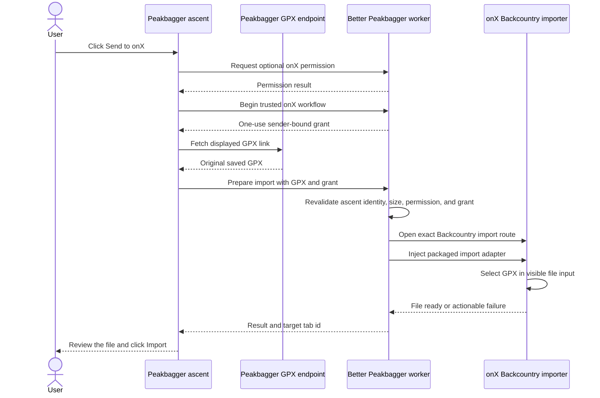

# onX Backcountry saved-GPX handoff

Better Peakbagger's **Send to onX** button supplies the exact GPX attached to a
saved Peakbagger ascent to onX Backcountry's visible import page. The extension
stops when onX shows the file ready to import. The user reviews the file and
clicks **Import**.

onX documents three relevant limits for Web Map imports: the file must be GPX
or KML, must be under 4 MB, and requires a Premium or Elite membership. See
[onX Backcountry: Importing and Exporting Markups](https://onxbackcountry.zendesk.com/hc/en-us/articles/360057195972-Importing-and-Exporting-Markups-Waypoints-Routes-Lines-Shapes-and-Tracks).

## User workflow

1. Open a saved Peakbagger ascent that has a GPX download.
2. Click **Send to onX** beside the native GPX link.
3. Grant one-time access to `webmap.onxmaps.com`, if the browser asks.
4. Sign in to onX if prompted, return to Peakbagger, and click the button again.
5. Review the selected file in onX and click **Import**.

## Runtime sequence

## Security and privacy boundaries

- The source must be the exact `GPXFile.aspx?aid=...` link for the current
  saved ascent. Analyzer data and captured-provider tracks are not accepted.
- onX's 4 MB limit is enforced before the worker opens or injects the target
  tab and again inside the adapter.
- Optional access is limited to `https://webmap.onxmaps.com/*`. Better
  Peakbagger does not request access to onX's identity service, read passwords,
  or inspect unrelated onX tabs.
- A trusted click is exchanged for a sender-bound workflow grant that the
  worker consumes once.
- The GPX remains in memory while it passes from Peakbagger to the selected
  file input. It is never written to extension storage.
- The adapter dispatches the file input's `change` event and waits until onX
  shows one file and enables its Import button. It never clicks that button.
- If a file was supplied but readiness cannot be confirmed, the onX button
  becomes **Check onX** and suppresses a blind retry.

## Maintainer contract

The current adapter validates the exact origin and
`/backcountry/map/content/import` path, one empty
`#add-files-input[type=file]`, no existing `[data-test="file-item"]`, and one
enabled `[data-test="import-card-import-button"]` after selection. A present
`[data-test="upgrade-now-button"]` returns a membership-required result before
any file crosses the boundary.

Focused coverage lives in `test/onx/`, `test/background/onx-routes.test.mjs`,
and `test/ascent/ascent-gaia.test.mjs`. `npm run verify:map-handoffs` loads the
real unpacked extension in hidden Chrome for Testing against masked HTTPS
fixtures. It proves exact file transfer, manual final confirmation, placement,
failure gates, storage exclusion, and light/dark rendering. It does not inspect
the browser's native permission prompt or the live signed-in onX service.
