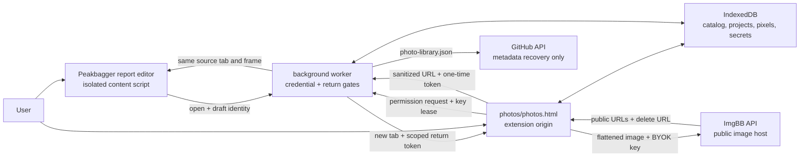

# Photo topo editor, ImgBB upload, and local library

This is the maintained design for Better Peakbagger's photo topo workflow. It
covers the extension-owned editor, direct bring-your-own-key ImgBB upload, the
device-local catalog, trip-report insertion, and the optional metadata-only
GitHub recovery document.

ImgBB's documented v1 API exposes image upload by binary file, base64 value, or
image URL. Its rejection states the size ceiling applicable to the user's key;
Better Peakbagger does not guess or replace that provider-owned limit. ImgBB
does not document an account-gallery listing endpoint, so Better Peakbagger
treats its own local catalog as the upload history and never promises that an
API upload will appear in an ImgBB profile. See the
[ImgBB API v1 documentation](https://api.imgbb.com/).

## User workflow

From the report editor's image popover, the user can:

- keep the existing direct-URL workflow; or
- choose **Upload a photo…** to open the photo tab.

There is deliberately one photo action rather than two. *Upload and edit…*
beside *Choose from library…* read as two different features when they are one
page with two tabs, and neither name said the library is this browser's own
record rather than an ImgBB gallery or the GitHub backup. Reuse lives on that
page's **Library** tab, which is where it belongs. The popover's direct-URL path
now also names its two requirements — a link to the image file itself, from a
host that permits embedding — because Google Photos, Drive, iCloud, and Dropbox
share links fail both and fail silently in a saved report.

`photos/guide.html` is the user-facing explanation of the whole workflow: where
an ImgBB key comes from, what the library is, what a backup holds, what the
symbols mean, why local removal is not remote deletion, and what makes a pasted
link work. It is a packaged page so it works offline and follows the extension's
theme, and it is listed in `web_accessible_resources` for Peakbagger so the
popover — a content script — can link to it. Its symbol legend is painted from
`photo-renderer`, so what it teaches cannot drift from what the export draws.

The extension opens `photos/photos.html` in a normal extension tab. A new
project starts when the user chooses, drags, or pastes a browser-decodable image
no larger than 64 megapixels or 16,384 pixels on either side and edits it with
the route and climbing-symbol tools. Drag and paste are accepted only while the
editor is empty, so an incidental gesture cannot replace an open project. A
title is required — it is filled from the file name when available — and the
alt text describing the image is optional. Drafts autosave to the browser
profile.
Nothing leaves the device until the user chooses **Upload and insert**.

On upload, Better Peakbagger:

1. flattens the original and annotations into a fresh JPEG or PNG;
2. hashes and validates the export and records its encoded size;
3. requests the optional ImgBB API permission if it is not already granted;
4. leases the device-local API key to the extension page for this request;
5. posts the exported bytes directly to ImgBB, which applies the upload limit
   for that key;
6. commits the provider response and delete URL to IndexedDB; and
7. inserts the public HTTPS URL into the originating rich-text report when a
   valid one-time return context exists.

The uploaded library record remains successful if step 7 fails. The user can
copy or insert its URL later. GitHub recovery also runs after, not inside, the
upload transaction and cannot roll the upload back.

## Runtime and trust boundaries



The boundaries are deliberate:

1. The editor is extension-owned. It does not inject an editing application or
   an API key into Peakbagger.
2. The ImgBB request goes directly from the extension page to ImgBB. Better
   Peakbagger has no relay or developer server.
3. The API key and ImgBB delete URL are device-local secrets. Neither may enter
   synchronized settings, a report, GitHub, logs, or exported project metadata.
   A manual settings-file export includes the API key with a keep-private
   warning; the delete URL remains excluded. The saved key is never exposed to
   Peakbagger, another website, or status UI.
   The background worker provides it only to Better Peakbagger's exact packaged
   photo page immediately before that page sends a direct upload to ImgBB.
4. The report return token is random, tab- and frame-bound, single-use, and
   expires after two hours. The worker validates both the extension-page sender
   and the public insertion fields before routing them.
5. IndexedDB is authoritative. GitHub can reconstruct catalog metadata and
   annotation projects, but not original pixels, thumbnails, or deletion
   capability.

## Editor and project model

`src/photos/photo-project.js` owns the versioned, pure project schema. A project
records source dimensions and SHA-256 identity, export format, viewport state,
and an ordered list of annotation objects. Supported objects are:

- routes made of points, with a smooth-curve intent;
- bolts, anchors, pitons, rappels, belays, and pitch markers; and
- text labels.

Every object has a stable local id, bounded geometry, style, scale, opacity, and
z-order. Opacity is bounded to 0.1–1 and defaults to fully opaque, so projects
written before it existed are unchanged; the floor exists because a mark below
it looks lost rather than translucent, and the user cannot find it again to fix
it. The cleaner caps projects at 500 objects, 2,000 points per route, and 5,000
points overall. It rejects malformed or oversized documents rather than
partially accepting them.

A route's curve is an intent on its style, not handles the page maintains. The
editor exposes no control-point UI, so storing the handles meant every point
added after the curve silently straightened the route; the cleaner now derives
clamped controls from the route's own points whenever `smooth` is set and no
handles were supplied. A project written before the field infers its intent from
the handles it already stored, and a project carrying real handles keeps them.

The page owns selection, dragging, route drawing, styling, undo/redo, keyboard
deletion and nudging, and viewport fit. History is in-memory UI state; the
current clean project is the persisted state. Placement tools stay armed until
the user leaves them — Escape steps out of the route, then the tool, then the
selection — and a new object inherits the last style chosen. The route being
drawn renders its first point and rubber-bands the next segment through a
preview group that is never part of the project and never exports.

`src/photos/photo-renderer.js` is the export boundary. It serializes a clean SVG
representation, decodes that into Canvas, and exports a newly encoded image.
Opacity rides on each object's own group, which dims a route's referenced
arrowhead marker and a label's contrast plate along with the mark;
`stroke-opacity` would have left both at full strength, which is the
beta-hiding case the control exists for.

The marker geometry follows climbing-guidebook convention. There is no single
universal legend — the UIAA publishes a recommended set and publishers extend it
— so the symbols follow shapes climbers read without a key: a circle is a bolt,
a bolted anchor is two of them slung to a master point, a piton is a bladed peg
with an eye, a rappel station is a ring with the rope running down out of it,
and a belay is the stance bar the leader stops on. (The shipped anchor was
previously a nautical anchor and the belay a circled X.) `markerSymbolSvg`
exports the same geometry as a standalone glyph, which is what the tool rail and
the guide's legend paint, so a symbol the user is taught cannot disagree with the
one the export draws.
The exported file contains flattened pixels only: no original EXIF, source file
name, delete URL, API key, catalog record, project JSON, or report identity.
The upload control resolves to effective `{ mime, quality }` settings in the
project: **Follow original format** keeps a JPEG or PNG source in that format,
**PNG** uses a lossless re-encode, and **JPEG** exposes a 10–100% quality
control. A browser-decodable source outside the two encoded project formats
cannot honestly follow its original format after the annotations are
flattened, so that choice is disabled and the editor selects JPEG explicitly.

The renderer produces the full-resolution encoded blob after a short debounce
and reports that blob's byte length as the upload estimate. Annotation, format,
quality, undo/redo, and geometry changes invalidate the cached blob. Upload
reuses a current cached encoding and only then computes its SHA-256, avoiding a
second full-resolution encode in the usual path. When the synced
`enableGithubBackup` ascent-backup gate is on, an estimate above 5 MiB warns
that GitHub may not show the external image in its rendered `report.md`. The
warning updates live with the setting and is not an upload gate; ImgBB still
decides the account's actual size limit.

The explicit **Download project** action first warns that the original file and
any metadata it contains will leave browser storage. `src/photos/photo-archive.js`
writes the original plus `project.json` and `photo.json` as a bounded,
uncompressed ZIP32 archive. It is a small CSP-safe writer; no runtime
compression library or dynamic code-generation shim enters the extension
bundle. Project download and import share an exact 40 MiB ceiling. The writer
measures the stored archive before it reads the original bytes or allocates the
ZIP, so it cannot download a bundle the reader would reject. Editing and upload
remain available when a large original makes project download unavailable; the
remedy is to create a new topo from a smaller or cropped source.

The same module reads that bundle back, which is the library's **Import
project…** action and the only path back to an original image after a profile is
cleared. It accepts stored entries only — supporting deflate would mean bundling
a decompressor, and a bundle this extension did not write is not one it can
promise to reopen — and verifies every entry's CRC so a corrupt original cannot
import as if it were the real photo. Import validates the project and catalog
record through the same cleaners as any other write, and requires the original's
SHA-256 and decoded dimensions to match both. The project schema bounds decoded
images to 64 megapixels and 16,384 pixels per side, the store repeats the
project/catalog dimension invariant, and the renderer checks the decoded source
again before it allocates a canvas. A bundle whose local id is still free keeps
that id, which
is how a GitHub-restored record, its report references, and its public URL find
their pixels again; a bundle whose id is already present lands as a new draft,
because two records claiming one published ImgBB asset could each be removed
independently and the second removal would look like it had freed something it
had not. `photo-store.putBundle` performs that write for any catalog state and
clears any tombstone; `putDraft` is the same transaction with the editor's
stricter pre-upload gate.

Editing an uploaded image creates a new local project whose
`lineage.parentLocalId` points to the prior record. It never overwrites the
published ImgBB asset or breaks an old report URL.

## Local IndexedDB ownership

The `betterPeakbaggerPhotos` database is versioned independently from
`storage.sync` and `storage.local`. `src/photos/photo-store.js` owns these
stores:

| Store | Contents | Backup eligibility |
| --- | --- | --- |
| `photos` | Clean catalog records, status, hashes, remote public URLs, references, lineage, asset-retention flags | Metadata fields only |
| `projects` | Versioned annotation project | Yes |
| `originals` | User-selected source image blob | Never |
| `thumbnails` | Local library preview blob | Never |
| `operations` | In-flight upload journal | Never |
| `secrets` | Per-photo ImgBB delete URL | Never |
| `tombstones` | Stable local id and deletion time | Yes |

Creating a draft writes its catalog record, project, original, and thumbnail in
one transaction. Completing an upload writes the uploaded catalog record and
delete URL in one transaction. Restore applies reconstructed records and
tombstones through one store-owned transaction.

The library can search titles, alt text, source file names, and recorded report
identities. Its filters distinguish local drafts, uploaded images, images not
yet inserted, backup-pending entries, and states needing attention. Public
image reachability is advisory; an unreachable check never destroys local
metadata. Catalog searches are debounced, and the grid reads thumbnails and
renders at most 48 cards at a time. Expired Recently Deleted assets are pruned
in bounded background batches instead of blocking the visible library.

## ImgBB credential and upload protocol

ImgBB access is bring-your-own-key. `https://api.imgbb.com/*` is an optional
host permission, requested from the editor when an upload needs it and from
Settings when the user saves a key there. The key is validated and stored under
the dedicated `bpbImgbbAuth` record in device-local `storage.local`, never
synchronized storage. The saved key remains in device-local extension storage.
It is never exposed to Peakbagger, another website, GitHub, browser sync, or
status UI. An explicit manual settings-file export includes it, warns the user
to keep the file private, and can restore it on another browser. The background
worker otherwise provides it only to Better Peakbagger's exact packaged photo
page immediately before that page sends a direct upload to ImgBB. Removing the
key clears the credential but does not alter prior uploads.

Two extension-owned surfaces can configure that credential — the photo editor
and **Settings → Activity creation → Trip report photos** — and the worker
gates them on the exact packaged page path, so an arbitrary extension page or
content script fails closed. That gate compares protocol, host, and pathname
outright: only special schemes are specified to produce a URL `origin`, so an
extension URL's origin is browser-defined and serializes as `"null"` in a
spec-strict parser, and comparing it alone would have admitted another
extension's identically-pathed page. `PHOTO_IMGBB_STATUS` answers only whether
a key exists; `PHOTO_IMGBB_LEASE_KEY` provides the value only to that photo
page immediately before its direct upload.

`src/photos/imgbb-client.js` uses `POST` with `multipart/form-data`, a binary
`image` part, and the optional name. It requires:

- a nonempty valid key;
- a nonempty `image/*` blob; ImgBB states any key-specific size refusal;
- an HTTPS ImgBB response with success status;
- validated public image, display, viewer, thumbnail, optional medium, and
  delete URLs; and
- coherent provider metadata before the catalog can become `uploaded`.

The client does not retry. A clear request rejection returns the record to a
local draft. A network interruption or other case where ImgBB may have accepted
the body becomes `outcome-unknown`; automatic retry would risk creating a
duplicate public image. The user must review and decide what to do.

## Crash consistency and failure states

An operation journal makes request boundaries explicit:

```text
request-started -> response-received -> catalog-committed -> removed
```

- If startup finds `request-started` beside an `uploading` record, it marks the
  result `outcome-unknown`.
- If it finds a validated `response-received`, it can finish the local catalog
  commit without issuing another network request.
- If the provider accepted the image but a later local operation fails, the UI
  preserves and offers the public URL when available.
- An insertion failure leaves the uploaded catalog record intact.
- GitHub failure changes only backup status.

The catalog's remote states are `draft`, `uploading`, `outcome-unknown`,
`uploaded`, and `unreachable`. Backup states are independently `off`,
`pending`, `current`, `failed`, and `restored`. Keeping those dimensions
separate prevents a recovery-service problem from masquerading as an upload
failure.

## Report-editor handoff

`src/reports/report-editor.js` keeps direct URL insertion as the lightweight
path. The two photo-library actions are available only in Rich mode, where the
editor can insert a validated image node without rewriting unsupported native
markup.

The worker records the source tab, source frame, draft identity, editor tab,
creation time, and expiry under a random return token. A returned result is
accepted only when:

- the sender is the exact packaged photo page in the recorded editor tab;
- the token is fresh and unconsumed;
- the public URL is credential-free HTTPS;
- the local photo id is valid and the alt text — which may be empty — is within
  its bound; and
- an optional `displayWidth` is a width-only report dimension accepted by the
  shared report-markup sanitizer; and
- the original content script acknowledges insertion.

While that return context exists, Editor and Library show the same
**Size in report** control: Small (320 px), Medium (480 px), Large (640 px,
default), or Original. The shared synced `reportImageWidth` preference keeps
the choice for future report insertions; `null` represents Original. A fixed
choice is capped to the exported source width before handoff, and the report
editor validates it again before writing a width-only image node. The stage
uses the same cap for its live CSS preview, but `photo-renderer.js`, the stored
export metadata, and the ImgBB blob remain full resolution.

The worker consumes the token before delivery, so a replay cannot insert the
same result again. Closing either tab removes its pending context. The catalog
stores a bounded reference to the ascent or ascent draft only after insertion
succeeds.

## Local deletion and remote retention

Removing a library item is a local action. It does not remove the image from
ImgBB or from an already saved Peakbagger report. The item enters **Recently
Deleted** with a tombstone and can be restored locally.

After 30 days, local original, project, and thumbnail assets are eligible for
pruning. The tombstone remains so a later recovery merge does not resurrect an
older remote record. Remote deletion is intentionally not automated: the
provider delete URL is a sensitive capability, and the shipped workflow does
not yet have enough verified provider behavior to make permanent remote
deletion a safe product action.

## GitHub metadata recovery

Photo recovery shares the existing user-selected GitHub repository and worker
write queue, but it is independent from ascent, settings, and favorites backup.
The fixed root file is `photo-library.json`, schema version 1, with an 8 MiB
size ceiling.

It contains:

- clean catalog metadata and public ImgBB URLs;
- the sanitized source file name plus source and exported dimensions, MIME
  types, byte sizes, and SHA-256 hashes;
- titles, alt text, lineage, and report references;
- retained annotation projects; and
- tombstones.

It excludes:

- the ImgBB API key and every ImgBB delete URL;
- source image and thumbnail bytes;
- upload operation journals and transient UI history;
- the selected GitHub token/repository credential; and
- any ability to delete an ImgBB asset.

**Settings → Backup & sync → Photo library backup** owns the full controls, beside
every other GitHub backup: manual backup, preview-first restore, and the
automatic option. The library page keeps only **Back up now**, which is the
action worth having while looking at photos, and links to Settings for the rest.
Status, backup, restore preview, and restore therefore accept either
extension-owned surface; announcing a catalog change stays with the photo page,
which is the only page that writes the catalog.

Manual backup reads the current IndexedDB snapshot in the worker, reads the
current remote root file, semantically merges by stable `localId`, and commits
through `github-client.updateRootFile()`. A non-fast-forward ref conflict causes
the client to reread the latest branch head and rerun that semantic merge; it
does not replay stale serialized JSON.

Automatic photo recovery is a separate, default-off setting. A local catalog
change arms a one-minute trailing-edge alarm. Content signatures skip unchanged
writes, failure retries are bounded, and a semantic conflict stops instead of
guessing. The manual action is the visible recovery path.

Restore is always explicit and preview-first:

1. the worker rereads and validates `photo-library.json`;
2. the page shows remote record, tombstone, update, and conflict counts;
3. confirmation states that pixels and delete capability cannot be restored;
4. the worker rereads the file and requires the previewed signature; and
5. conflicts either stop or, after the user's explicit choice, keep the local
   version while nonconflicting records are restored.

Restored records are marked as metadata recovery. A project remains editable
only when its original image is still on the current device and its source hash
matches. Recovery never fabricates missing pixels or claims a remote deletion
capability it does not possess.

## Verification boundaries

Pure and DOM tests cover schema rejection, upload-format resolution, the shared
estimate/export encoding path, JPEG quality and size-estimate interactions,
rendering and export metadata,
project-archive readability,
IndexedDB transactions, upload response validation, ambiguous outcomes,
permission and sender gates, one-time report insertion, library behavior,
backup serialization/merge/tombstones, semantic GitHub conflict retry, settings
validation, and packaged bundle/manifest wiring.

The real packaged extension has been exercised in hidden Chrome for Testing and
Firefox profiles. Those checks load the actual manifest, open the photo page,
decode a PNG, autosave to IndexedDB, draw a route, and assert desktop and narrow
layout boundaries. The Firefox check additionally covers what only a browser can
answer for the drawing surface: that the route's first click renders its point,
that the smooth curve and the armed tool survive the next click, that an opacity
reaches both the painted group and the persisted project, that Gecko rasterizes
the overlay into an untainted canvas, that a project bundle imports back under
its own record, and that the guide's legend paints from the renderer. They prove packaged runtime and
DOM behavior, not the native permission prompt, browser focus/window placement,
or toolbar chrome.

A live ImgBB upload with a real user key and a scratch GitHub repository write
remain manual release checks. Stubbed fetch and repository tests do not prove
provider retention, account-profile behavior, or a live remote merge.
