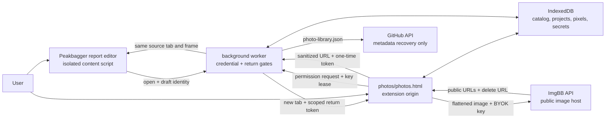

# Photo topo editor, ImgBB upload, and local library

This is the maintained design for Better Peakbagger's photo topo workflow. It
covers the extension-owned editor, direct bring-your-own-key ImgBB upload, the
device-local catalog, trip-report insertion, and the optional metadata-only
GitHub recovery document.

ImgBB's documented v1 API exposes image upload and accepts a binary file,
base64 value, or image URL up to 32 MB. It does not document an account-gallery
listing endpoint. Better Peakbagger therefore treats its own local catalog as
the upload history and never promises that an API upload will appear in an
ImgBB profile. See the [ImgBB API v1 documentation](https://api.imgbb.com/).

## User workflow

From the report editor's image popover, the user can:

- keep the existing direct-URL workflow;
- choose **Upload and edit…** to open a new local project; or
- choose **Choose from library…** to reuse an earlier uploaded image.

The extension opens `photos/photos.html` in a normal extension tab. A new
project starts when the user chooses a browser-decodable image no larger than
32 MiB, supplies meaningful alt text or marks it decorative, and edits it with
the route and climbing-symbol tools. Drafts autosave to the browser profile.
Nothing leaves the device until the user chooses **Upload and insert**.

On upload, Better Peakbagger:

1. flattens the original and annotations into a fresh JPEG or PNG;
2. hashes and validates that export and refuses it if it exceeds 32 MiB;
3. requests the optional ImgBB API permission if it is not already granted;
4. leases the device-local API key to the extension page for this request;
5. posts the exported bytes directly to ImgBB;
6. commits the provider response and delete URL to IndexedDB; and
7. inserts the public HTTPS URL into the originating rich-text report when a
   valid one-time return context exists.

The uploaded library record remains successful if step 7 fails. The user can
copy or insert its URL later. GitHub recovery also runs after, not inside, the
upload transaction and cannot roll the upload back.

## Runtime and trust boundaries



The boundaries are deliberate:

1. The editor is extension-owned. It does not inject an editing application or
   an API key into Peakbagger.
2. The ImgBB request goes directly from the extension page to ImgBB. Better
   Peakbagger has no relay or developer server.
3. The API key and ImgBB delete URL are device-local secrets. Neither may enter
   synchronized settings, a report, GitHub, logs, or exported project metadata.
4. The report return token is random, tab- and frame-bound, single-use, and
   expires after two hours. The worker validates both the extension-page sender
   and the public insertion fields before routing them.
5. IndexedDB is authoritative. GitHub can reconstruct catalog metadata and
   annotation projects, but not original pixels, thumbnails, or deletion
   capability.

## Editor and project model

`src/photos/photo-project.js` owns the versioned, pure project schema. A project
records source dimensions and SHA-256 identity, export format, viewport state,
and an ordered list of annotation objects. Supported objects are:

- routes made of points, with optional Bezier control points;
- anchors, pitons, rappels, belays, and pitch markers; and
- text labels.

Every object has a stable local id, bounded geometry, style, scale, and z-order.
The cleaner caps projects at 500 objects, 2,000 points per route, and 5,000
points overall. It rejects malformed or oversized documents rather than
partially accepting them.

The page owns selection, dragging, route drawing, curve controls, styling,
undo/redo, keyboard deletion and nudging, and viewport fit. History is
in-memory UI state; the current clean project is the persisted state.

`src/photos/photo-renderer.js` is the export boundary. It serializes a clean SVG
representation, decodes that into Canvas, and exports a newly encoded image.
The exported file contains flattened pixels only: no original EXIF, source file
name, delete URL, API key, catalog record, project JSON, or report identity.
JPEG quality and PNG selection belong to the project. The renderer also
computes SHA-256 metadata for source and export identity.

The explicit **Download project** action first warns that the original file and
any metadata it contains will leave browser storage. `src/photos/photo-archive.js`
writes the original plus `project.json` and `photo.json` as a bounded,
uncompressed ZIP32 archive. It is a small CSP-safe writer; no runtime
compression library or dynamic code-generation shim enters the extension
bundle.

Editing an uploaded image creates a new local project whose
`lineage.parentLocalId` points to the prior record. It never overwrites the
published ImgBB asset or breaks an old report URL.

## Local IndexedDB ownership

The `betterPeakbaggerPhotos` database is versioned independently from
`storage.sync` and `storage.local`. `src/photos/photo-store.js` owns these
stores:

| Store | Contents | Backup eligibility |
| --- | --- | --- |
| `photos` | Clean catalog records, status, hashes, remote public URLs, references, lineage, asset-retention flags | Metadata fields only |
| `projects` | Versioned annotation project | Yes |
| `originals` | User-selected source image blob | Never |
| `thumbnails` | Local library preview blob | Never |
| `operations` | In-flight upload journal | Never |
| `secrets` | Per-photo ImgBB delete URL | Never |
| `tombstones` | Stable local id and deletion time | Yes |

Creating a draft writes its catalog record, project, original, and thumbnail in
one transaction. Completing an upload writes the uploaded catalog record and
delete URL in one transaction. Restore applies reconstructed records and
tombstones through one store-owned transaction.

The library can search titles, alt text, source file names, and recorded report
identities. Its filters distinguish local drafts, uploaded images, images not
yet inserted, backup-pending entries, and states needing attention. Public
image reachability is advisory; an unreachable check never destroys local
metadata.

## ImgBB credential and upload protocol

ImgBB access is bring-your-own-key. `https://api.imgbb.com/*` is an optional
host permission and is requested only from the editor when an upload needs it.
The key is validated and stored under the dedicated `bpbImgbbAuth` record in
device-local `storage.local`, never synchronized storage. The background worker
returns it only to the exact packaged photo-page path; arbitrary extension
pages and content scripts fail closed. Removing the key clears the credential
but does not alter prior uploads.

`src/photos/imgbb-client.js` uses `POST` with `multipart/form-data`, a binary
`image` part, and the optional name. It requires:

- a nonempty valid key;
- an `image/*` blob from 1 byte through exactly 32 MiB;
- an HTTPS ImgBB response with success status;
- validated public image, display, viewer, thumbnail, optional medium, and
  delete URLs; and
- coherent provider metadata before the catalog can become `uploaded`.

The client does not retry. A clear request rejection returns the record to a
local draft. A network interruption or other case where ImgBB may have accepted
the body becomes `outcome-unknown`; automatic retry would risk creating a
duplicate public image. The user must review and decide what to do.

## Crash consistency and failure states

An operation journal makes request boundaries explicit:

```text
request-started -> response-received -> catalog-committed -> removed
```

- If startup finds `request-started` beside an `uploading` record, it marks the
  result `outcome-unknown`.
- If it finds a validated `response-received`, it can finish the local catalog
  commit without issuing another network request.
- If the provider accepted the image but a later local operation fails, the UI
  preserves and offers the public URL when available.
- An insertion failure leaves the uploaded catalog record intact.
- GitHub failure changes only backup status.

The catalog's remote states are `draft`, `uploading`, `outcome-unknown`,
`uploaded`, and `unreachable`. Backup states are independently `off`,
`pending`, `current`, `failed`, and `restored`. Keeping those dimensions
separate prevents a recovery-service problem from masquerading as an upload
failure.

## Report-editor handoff

`src/reports/report-editor.js` keeps direct URL insertion as the lightweight
path. The two photo-library actions are available only in Rich mode, where the
editor can insert a validated image node without rewriting unsupported native
markup.

The worker records the source tab, source frame, draft identity, editor tab,
creation time, and expiry under a random return token. A returned result is
accepted only when:

- the sender is the exact packaged photo page in the recorded editor tab;
- the token is fresh and unconsumed;
- the public URL is credential-free HTTPS;
- the local photo id, decorative flag, and alt text are valid; and
- the original content script acknowledges insertion.

The worker consumes the token before delivery, so a replay cannot insert the
same result again. Closing either tab removes its pending context. The catalog
stores a bounded reference to the ascent or ascent draft only after insertion
succeeds.

## Local deletion and remote retention

Removing a library item is a local action. It does not remove the image from
ImgBB or from an already saved Peakbagger report. The item enters **Recently
Deleted** with a tombstone and can be restored locally.

After 30 days, local original, project, and thumbnail assets are eligible for
pruning. The tombstone remains so a later recovery merge does not resurrect an
older remote record. Remote deletion is intentionally not automated: the
provider delete URL is a sensitive capability, and the shipped workflow does
not yet have enough verified provider behavior to make permanent remote
deletion a safe product action.

## GitHub metadata recovery

Photo recovery shares the existing user-selected GitHub repository and worker
write queue, but it is independent from ascent, settings, and favorites backup.
The fixed root file is `photo-library.json`, schema version 1, with an 8 MiB
size ceiling.

It contains:

- clean catalog metadata and public ImgBB URLs;
- the sanitized source file name plus source and exported dimensions, MIME
  types, byte sizes, and SHA-256 hashes;
- titles, alt/decorative state, lineage, and report references;
- retained annotation projects; and
- tombstones.

It excludes:

- the ImgBB API key and every ImgBB delete URL;
- source image and thumbnail bytes;
- upload operation journals and transient UI history;
- the selected GitHub token/repository credential; and
- any ability to delete an ImgBB asset.

Manual backup reads the current IndexedDB snapshot in the worker, reads the
current remote root file, semantically merges by stable `localId`, and commits
through `github-client.updateRootFile()`. A non-fast-forward ref conflict causes
the client to reread the latest branch head and rerun that semantic merge; it
does not replay stale serialized JSON.

Automatic photo recovery is a separate, default-off setting. A local catalog
change arms a one-minute trailing-edge alarm. Content signatures skip unchanged
writes, failure retries are bounded, and a semantic conflict stops instead of
guessing. The manual action is the visible recovery path.

Restore is always explicit and preview-first:

1. the worker rereads and validates `photo-library.json`;
2. the page shows remote record, tombstone, update, and conflict counts;
3. confirmation states that pixels and delete capability cannot be restored;
4. the worker rereads the file and requires the previewed signature; and
5. conflicts either stop or, after the user's explicit choice, keep the local
   version while nonconflicting records are restored.

Restored records are marked as metadata recovery. A project remains editable
only when its original image is still on the current device and its source hash
matches. Recovery never fabricates missing pixels or claims a remote deletion
capability it does not possess.

## Verification boundaries

Pure and DOM tests cover schema rejection, rendering and export metadata,
project-archive readability,
IndexedDB transactions, upload response validation, ambiguous outcomes,
permission and sender gates, one-time report insertion, library behavior,
backup serialization/merge/tombstones, semantic GitHub conflict retry, settings
validation, and packaged bundle/manifest wiring.

The real packaged extension has been exercised in hidden Chrome for Testing and
Firefox profiles. Those checks load the actual manifest, open the photo page,
decode a PNG, autosave to IndexedDB, draw and export a route in Chrome, and
assert desktop and narrow layout boundaries. They prove packaged runtime and
DOM behavior, not the native permission prompt, browser focus/window placement,
or toolbar chrome.

A live ImgBB upload with a real user key and a scratch GitHub repository write
remain manual release checks. Stubbed fetch and repository tests do not prove
provider retention, account-profile behavior, or a live remote merge.
