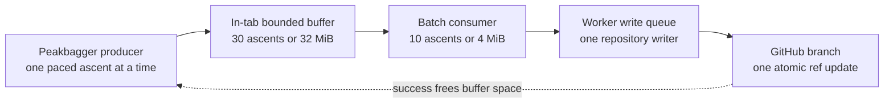

# Full-profile backup pipeline: batching, backpressure, and Git concurrency

Full-profile backup moves private, variably sized data between two unrelated
services with very different behavior:

- Peakbagger is read through the signed-in page session and may insert a human
  challenge during a long sweep.
- GitHub is written through an optimistic Git object protocol whose final
  operation moves one shared branch reference.
- A profile may contain hundreds of ascents, and any ascent may add a GPX file
  much larger than its form fields and report.

The first implementation handled one ascent end to end before starting the
next. That was simple, but it coupled Peakbagger latency to GitHub latency and
created one branch update per ascent. The current implementation is a bounded
producer/consumer pipeline: Peakbagger reads ahead while GitHub commits groups
of ascents, without allowing either memory or concurrent branch writers to
grow without control.

## Why the original loop was expensive

For ascent `i`, let `Pᵢ` be the time to fetch and parse its edit form and
optional GPX, and let `Gᵢ` be the time to create its GitHub commit. The original
loop was approximately:

```text
Tserial ≈ Σ(Pᵢ + Gᵢ + pacing)
```

A Git Data commit also needed several API mutations: two or three file blobs,
a tree, a commit, and a branch update. Across 162 ascents that is roughly
810–972 mutating requests and 162 branch pushes, before retries. GitHub's
current guidance recommends serial API requests, pauses during sustained
mutations, and a repository push rate no higher than six per minute. Its
secondary limits also include content-generation limits that can change over
time. See GitHub's [REST API best practices][github-best-practices],
[REST API rate limits][github-rate-limits], and [repository activity
limits][github-repository-limits].

The pipeline changes the steady-state model toward:

```text
Tpipeline ≈ startup + max(total Peakbagger production, total GitHub consumption)
```

It also reduces each ordinary ten-ascent GitHub batch to three mutations: one
tree, one commit, and one branch update.

## Runtime topology



The page content script owns the producer, buffer, and multi-minute lifecycle
because it has the authenticated same-origin Peakbagger session. The MV3
background worker owns the GitHub token and the repository-wide write queue.
No token crosses into the page.

## What the producer reads from Peakbagger

For each ascent the producer fetches the edit form (`AscentEdit.aspx?aid=<aid>`)
for the snapshot fields and, when the list row carries the GPS-track marker, the
stored track. The ascent-page analyzer and the per-save backup locate the track
by scraping the download link's text on the live page, so they followed
Peakbagger's endpoint renames automatically. The profile producer has no ascent
page to scrape — only the list row — so it builds the track URL itself, and is
the one surface that must be kept in step by hand. It mirrors the site's own
ascent-page link, `GPXFile.aspx?aid=<aid>&sep=1` (the earlier `GetAscentGPX.aspx`
name was retired and now redirects to a 200 HTML error page), so the backup
stores byte-for-byte what a user clicking that link gets and what the analyzer
reads.

Every fetched body is classified before it is buffered — `<gpx` for a track, the
`Form1` fields for the edit form — so a 200 whose body is actually an error page
is rejected rather than committed. Because a rejected ascent commits no folder, a
later run refetches exactly those ascents; the failure message reports what the
body was (for example, an error page reached through a redirect), not the
misleading `HTTP 200` status.

## Bounds and flush rules

| Control | Default | Purpose |
| --- | ---: | --- |
| Peakbagger pacing | 2 seconds between ascents | Avoid an aggressive same-origin sweep |
| Batch ascent limit | 10 | Keep commits understandable and below the worker's validation limit |
| Batch payload target | 4 MiB | Flush GPX-heavy work before ten ascents |
| Buffer ascent limit | 30 | Bound object-count growth while GitHub is slow |
| Buffer payload limit | 32 MiB | Bound retained snapshot and GPX text |
| Inline file limit | 1 MiB | Keep normal files in the tree request; use the blob API for an unusually large individual file |
| GitHub conflict delays | 0.5, 2, and 5 seconds | Absorb short ref races and repository propagation windows without looping forever |

The consumer flushes when it has ten ascents, reaches the 4 MiB batch target,
or the producer finishes and leaves a smaller final batch. The batch currently
being uploaded remains in the buffer until GitHub advances the branch, so it
counts against both buffer limits.

The byte bound is necessarily checked after one ascent finishes downloading:
the producer does not know the GPX response size in advance. One unusually
large ascent can therefore take the buffer over 32 MiB, but the producer will
not start another ascent until space is freed. Enforcing a strict pre-fetch
byte cap would require knowing Peakbagger's response length reliably or
streaming the GPX into durable storage, neither of which the current privacy
and lifecycle model assumes.

## Backpressure

When the buffer reaches either limit:

1. The producer stops before issuing the next Peakbagger request.
2. The GitHub consumer continues its in-flight commit or retry.
3. The UI reports how many ascents are ready and says that reading will resume
   automatically.
4. A successful commit removes that batch from the front of the buffer and
   wakes the producer.

This is a wait, not a failure. Under healthy conditions a ten-ascent consumer
should normally keep up with the paced producer. The bound matters precisely
when GitHub is unavailable or slow; that is also when unlimited read-ahead
would be least safe.

An unlimited in-memory queue was deliberately rejected. It would retain every
remaining report and GPX during a long GitHub outage, provide no durability if
the tab closed, and keep requesting Peakbagger data even though the destination
could not make progress. A durable unlimited producer would require IndexedDB
or extension storage, retention and cleanup rules, quota handling, and a
privacy-contract change for locally persisted reports and tracks.

## One batch commit, not concurrent commits

There is only one GitHub consumer. Ten ascents are combined into one tree and
one commit; they are not sent as ten concurrent ref updates.

For each attempt, `src/github-client.js`:

1. Resolves the repository and reads the latest branch head, commit, and root
   tree.
2. Builds every folder addition/update and every owned stale-path removal for
   the batch against that base.
3. Places ordinary file `content` directly in the Create Tree request. GitHub
   writes the corresponding blobs as part of that operation. Files over the
   inline threshold use the explicit blob endpoint first. See the official
   [Git Trees API][github-trees].
4. Creates one commit whose parent is the head read in step 1.
5. Updates the branch with `force: false`.

None of the ascents becomes visible on the branch before step 5. If any earlier
operation fails, or the ref update rejects the commit, the buffer still owns
the entire batch.

Manual, automatic-after-save, legacy single-profile, and new profile-batch
writes all pass through one promise queue in the background worker. This
removes races produced by different extension tabs in the same browser
profile. A separate browser, GitHub's web UI, or another integration can still
change the branch externally, so optimistic-concurrency handling remains
necessary.

## Conflict and failure semantics

GitHub can return `409 Conflict` for more than a literal competing writer; its
Git Database documentation also uses 409 for an empty or temporarily
unavailable repository. A non-fast-forward ref update may instead be a 422.
See GitHub's [Git Database guide][github-git-database].

For a retryable conflict, the client waits for the bounded delay, then reruns
the whole attempt: it rereads the head, rebuilds the tree against the new base,
creates a new commit, and tries the non-forced ref update again. Reusing the old
commit would not solve a changed parent. After the final retry, the UI pauses
with the batch intact. Resume retries the same buffered data without fetching
those ascents from Peakbagger again.

That reread is only trustworthy if it observes the *live* head, and the browser
HTTP cache silently broke that invariant. GitHub serves authenticated ref GETs
with `Cache-Control: private, max-age=60`, so under the default `cache` mode the
browser would replay a cached ref for up to a minute without revalidating.
Browsers evict a cached entry when an unsafe method succeeds on the same URL,
but the client reads the head through the singular `/git/ref/heads/…` endpoint
while the ref update PATCHes the plural `/git/refs/heads/…` — different cache
keys, so our own successful push never evicts its cached read. Profile backup is
the one feature that lands batch commits back-to-back on one branch, so the next
batch could read the pre-push sha, commit on the stale parent, and fail the
non-forced update as a non-fast-forward. The bounded retries all fell inside the
same 60-second freshness window (a cache hit does not reset an entry's age), so
every reread returned the identical stale sha and the schedule exhausted
deterministically. `src/github-client.js` therefore sets `cache: 'no-store'` on
every request, so a reread always observes the live head.

Authentication, authorization, branch protection, validation, network, and
rate-limit errors remain typed separately. They are not blindly retried as
conflicts. During the bounded conflict retries the producer may continue until
the buffer fills; once the writer returns a persistent error, both stages pause
with every prepared ascent retained.

## Pause, challenge, cancel, and tab closure

- **Pause:** stops both loops at their next safe asynchronous boundary. Already
  prepared ascents remain in memory and Resume continues them.
- **Peakbagger challenge:** stops production on the challenged ascent. Resume
  reprobes that URL before continuing; the ascent is not skipped.
- **GitHub failure:** retains the entire rejected batch and any later prepared
  ascents. Nothing in that batch counts as backed up.
- **Cancel during a Peakbagger fetch:** discards that response before it can
  enter a GitHub batch.
- **Cancel during a GitHub commit:** cannot retract an already issued atomic
  Git operation; that in-flight batch may finish, but no later batch starts.
- **Tab closure or refresh:** discards the in-memory buffer. This loses no
  repository data. A later run diffs the root backup folders and refetches only
  ascents that never reached the branch.
- **Worker restart:** there is no durable worker-side batch queue. An active
  runtime message keeps the worker involved for that commit; if the page/tab
  disappears, repository state remains the resumability checkpoint.

## Correctness invariants

The design depends on these invariants:

1. Peakbagger requests are sequential and identity-checked before buffering.
2. The buffer owns an ascent until its entire batch is visible on the branch.
3. Completed progress advances by the batch size only after a successful ref
   update.
4. At most one extension-owned GitHub write resolves and mutates a branch at a
   time.
5. External ref races rebuild against a newly read head; the client never
   force-pushes.
6. Only Better Peakbagger's known files are removed during refresh/rename;
   user-added files survive.
7. The repository tree, not local memory, is the durable checkpoint.

Focused tests pin batch atomicity, inline versus large-file blob behavior,
worker serialization, buffer backpressure, ten-item and final partial batches,
challenge handling, cancellation before the write boundary, and retrying a
failed batch without a second Peakbagger fetch. Real-extension verification is
still required because jsdom cannot prove the shipped manifest, worker
lifecycle, or separately loaded content-script order.

[github-best-practices]: https://docs.github.com/en/rest/using-the-rest-api/best-practices-for-using-the-rest-api
[github-rate-limits]: https://docs.github.com/en/rest/using-the-rest-api/rate-limits-for-the-rest-api
[github-repository-limits]: https://docs.github.com/en/repositories/creating-and-managing-repositories/repository-limits
[github-trees]: https://docs.github.com/en/rest/git/trees
[github-git-database]: https://docs.github.com/en/rest/guides/using-the-rest-api-to-interact-with-your-git-database
